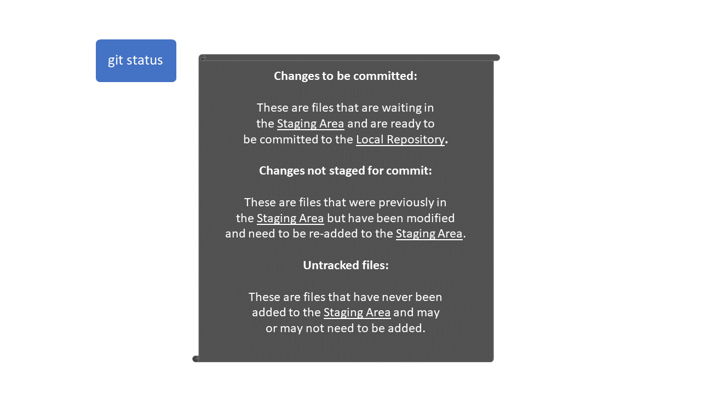

```{r setup, include=FALSE}
knitr::opts_chunk$set(echo = TRUE)

library(tidyverse)
library(learnr)
library(flair)
library(gradethis)
library(sortable)
gradethis::gradethis_setup()
# library(palmerpenguins)
```


## Introduction

In this module, we are going to go through git and version control.


## What is version control and GitHub?

Written by Mariam Walaa.

### Introduction

In this lesson, you will learn how to:

- Understand version control
- Understand GitHub and Git

Prerequisite skills include:

- Navigating and working with your local folder directory

Highlights:

- Git behaves for folders similar to how AutoSave behaves for Microsoft Word.
- You can use Git within RStudio or from the command line, like Git Bash.

### Overview

You may use Microsoft Word, PowerPoint, or Excel and turn on AutoSave to track your
progress. Version control works similarly for your folder directory.

You may have a folder directory where you store files that may contain text, code,
etcetera, and you want to track the changes you make to these files. Git helps you do this
by tracking changes the make to your files in a few steps.

Just like turning on AutoSave in a Microsoft Word file, you need to tell Git that you want
a file to be tracked. Using Git, this is a two-step process:

1. First, you need to tell Git that you want to start tracking a file.
2. Next, you need to tell Git that you want the progress made to the file to be captured
at that specific point.

This is a two-step process rather than a single step in order to allow you to make as many
changes as you want before you _commit_ to the point that you would like to have the file
captured at. To be more specific, you can repeat step 1 as many times as you want before
you move on to step 2.

#### Visualizing Git

Let's take a closer look at the different aspects of Git.

When using Git, the first thing you want to do is create a repository _within_ a folder
directory on your local computer. This is done using the `git init` command. When you run
this command, Git won't know which files you'd like to track, but it'll at least know that
you want some files in the directory in which you're running the command to be tracked.

```{r version-control-image-1, echo = FALSE, fig.height = 4, fig.width = 6}

```

Once you have a local repository as a result of running the previous command, the next
thing you'll want to do is maintain this local repository. In other words, you'll want to
tell Git about the state of your files as you make progress on them. You do this using
these 3 commands: `git add`, `git commit`, and `git push`. The last command, `git push`,
is typically needed when you're working with team mates and you want to push your local
work to the remote repository.

```{r version-control-image-2, echo = FALSE, fig.height = 4, fig.width = 6}

```

The last command is `git status`. This is a command that you want to use as you work on
your project and make progress in your directory in order to tell you what you currently
have tracked and what you currently don't have tracked. There are several components to
the output of this command that you'll need to know how to interpret:

```{r version-control-image-3, echo = FALSE, fig.height = 4, fig.width = 6}

```

### Next Steps

If you would like to learn more about Git, here are some additional resources you may find
helpful:

- [Pro Git: **Git Basics** Chapter](https://git-scm.com/book/en/v2)
- [Happy Git With R](https://happygitwithr.com/)


## Git: pull, status, add, commit, push

Written by Mariam Walaa.

### Introduction

In this lesson, you will learn how to:

- Create a local repository in a folder
- Make changes to a remote repository
- Maintain a local repository

Prerequisites include:

- Creating a [GitHub account](https://github.com/join)
- Downloading [Git Bash](https://git-scm.com/downloads)

Highlights:

- You can start tracking a folder of your work locally using Git.
- You can share a local repository with team mates using GitHub.

### Overview

There are two common scenarios for getting you and your team mates set up to use Git and
GitHub:

1. Your team hasn't started the project yet, so one of your team mates needs to create a
Git repository which you can clone and start pushing files to and pulling files from.
2. You've already started working on the project locally and want to share it with your
team mates so they can add their own work.

Both of these scenarios are described in great detail by Jenny Bryan from RStudio. You can
find and follow those instructions here:

- Scenario #1: [Happy Git With R: Chapter 15 - New project, GitHub
first](https://happygitwithr.com/new-github-first.html#new-github-first)
- Scenario #2: [Happy Git With R: Chapter 17 - Existing project, GitHub
last](https://happygitwithr.com/existing-github-last.html#existing-github-last)

### Videos


### Exercises

In this section, we'll go through exercises that help you understand the process of
tracking and committing files within a local repository using Git.

We will begin by opening Git Bash, creating a new folder directory, and creating a new
file as follows:

1. Create a new folder directory: ``mkdir DoSS-Toolkit-Git-Demo``
2. Go to the folder directory: ``cd DoSS-Toolkit-Git-Demo``
3. Create a new file: ``touch README.md``

We now have a folder directory with a README file.

#### Exercise 1

```{r git-exercise-1, echo = FALSE}
question("We want to initialize the local repository. Which is the correct command?",
         answer("git init", correct = TRUE),
         answer("init"),
         allow_retry = TRUE,
         random_answer_order = TRUE)
```

If you've done this correctly, you should now have a local repository in your folder.

#### Exercise 2

```{r git-exercise-2, echo = FALSE}
question("We want to start tracking this file. Which is the correct command?",
         answer("git add README.md", correct = TRUE),
         answer("add README.md"),
         answer("git add README"),
         allow_retry = TRUE,
         random_answer_order = TRUE)
```

If you've done this correctly, you should now have started tracking README.md. You can
check the status using `git status`.

#### Exercise 3

```{r git-exercise-3, echo = FALSE}
question(paste("We started tracking README.md and want to commit this file. ",
               "Which is the correct command?"),
         answer("git commit -m 'Add README.md to the local repository'",
                correct = TRUE),
         answer("git commit 'Add README.md to the local repository' -m"),
         answer("git 'Add README.md to the local repository' -m commit"),
         allow_retry = TRUE,
         random_answer_order = TRUE)
```

If you've done this correctly, you should now have a committed README.md file in your
folder (i.e., Git knows about this file and has stored a version of it that you've decided
to commit).

If you want to share this folder with your team mates, you would have to create a remote
repository on GitHub. To do this, you can follow [these
instructions](https://happygitwithr.com/existing-github-last.html#existing-github-last)
from Happy With Git R.

#### Exercise 4

```{r git-exercise-4, echo = FALSE}
order <- c("git add README.md",
           "git commit -m 'add updated README.md'",
           "git push")

question_rank(paste("We made changes to README.md _locally_ and we want to push ",
                    "these changes. In which order should we run the commands?"),
              answer(order, correct = TRUE),
              answer(rev(order), correct = FALSE),
              allow_retry = TRUE)
```

#### Exercise 5

```{r git-exercise-5, echo = FALSE}
question(paste("Someone made changes to README.me in the _remote_ repository and we ",
               "want to pull those changes. Which is the correct command?"),
         answer("git pull", correct = TRUE),
         answer("git push"),
         answer("git status"))
```

#### Exercise 6

```{r git-true-statements, echo = FALSE}
question("Which of these are true? Check all true statements.",
          answer(paste("You can run `git status` before you run `git init` to see ",
          "which files are already being tracked."), 
          message = paste("Running `git status` before initializing the local Git ",
          "repository will give you an error. A Git repository needs to be ",
          "initialized first in order to check the status of it.")),
          answer(paste("Once you initialize a Git repository within a folder, ",
          "all files in that folder automatically become tracked."),
          message = paste("Initializing a Git repository within a folder does ",
                          "not tell Git which files in that folder to track.")),
          answer(paste("When a file is committed, the file becomes shared",
                       "with everyone who has access to the remote repository."),
                 message = paste("A file is committed to the _local_ Git repository ",
                                 "and not the remote Git repository.")),
          answer(paste("Running `git push` pushes all committed files to the ",
                       "remote repository which can be accessed by others."),
                 correct = TRUE),
          answer(paste("Running `git pull` pulls all new files from the remote ",
                       "repository to your local repository."), correct = TRUE),
          allow_retry = TRUE,
          random_answer_order = TRUE)
```

### Common Mistakes & Errors

Below are some common mistakes and errors that you may come across while using Git:

- You try to run `git commit` after making changes to a file but you aren't currently
tracking that file, so you need run `git add` first.

- You run `git status` and see that a file is listed under both `Changes to be committed` 
and `Changes not staged for commit`. This happens when you start tracking a file and make
more changes to it before you commit it. Now, the initial version is tracked and the most 
recently updated version is still untracked, so they appear under both sections.

- You try to run `git push` to push your updates to the remote repository while there are
some new updates in the remote repository, likely from another team mate, that you don't
already have. The error you get will likely be something like:
  + `error: Your local changes to the following files would be overwritten by merge: ...
  Please commit your changes or stash them before you merge.`.
  
  This is an issue for Git because Git has your team mate's new updates, and now you're
  telling Git to add your own updates without your team mate's updates, so Git doesn't
  know what to do. The best way to avoid this issue is to always run `git pull` before you
  start working on your files locally. However, there's a better explanation on what to do
  if you run into this issue by Jenny Bryan from RStudio in [this
  section](https://happygitwithr.com/pull-tricky.html) from Happy Git With R.

### Next Steps

If you would like to learn more about Git, here are some additional resources you may find
helpful:

- [Pro Git: **Git Basics** Chapter](https://git-scm.com/book/en/v2)
- [Happy Git With R](https://happygitwithr.com/)

If you've completed this tutorial successfully and would like to learn how to use Git
within RStudio, there is a helpful
[section](https://happygitwithr.com/rstudio-git-github.html) in Happy Git With R about
connecting RStudio to Git and GitHub.


## Branches in GitHub

Written by Matthew Wankiewicz.

### Introduction

In this lesson, you will learn:

- What a branch of a GitHub repository is.
- How to create a branch of a GitHub repository.
- How to update a GitHub repository from your branched repository.

Prerequisite skills include:

- Familiarity with GitHub repositories.
- Have Git installed on your computer.
- A GitHub account!

Highlights:

- Branching allows multiple people to work on the same project and update the GitHub repository individually.
- Branching allows you to take a copy of the main repo and work on it on your own before you make any changes to the main repo.

### The content

#### About Branches

When you work in groups using GitHub projects, it becomes annoying to have one person add all of the code to the repo by themselves, copying and pasting code from group members. This is where branches come in handy. 
  - Branching allows you to take a copy of the current GitHub repo and make changes on your own computer. Once you and your group have made changes to the code, you can add the changes back into your initial repo.
  - Branching can also be used when you want to work on one part of a project separately from the other areas.
  
#### How to Create a Branch

To make a branch from a GitHub repo, go to the main repo you plan to work on and click on the drop down menu that should say main. It should look like the image below.


Once you press on that menu, GitHub will have a text-box that says "Find or create a branch...", type a new name for your branch, something like 'newbranch1'. Since that branch does not exist, GitHub will ask you if you want to create a branch called 'newbranch1'. Click on "Create branch: newbranch1" and it will create the new branch for you, this is shown in the image below.


#### How to make a pull request

A pull request allows the owner of the GitHub repo to look over your changes to make sure that it will fit in with the current repo and also to make sure that it doesn't create any conflicts in your repo. 

To make a pull request from your branch, you first need to make a change to your branched repo. Once you make a change to the branch there will be a yellow bar on your screen asking if you want to make a pull request. As you can see in the image below, there will be a green button, and once you click on that you can create a pull request.


Once you press the button, GitHub will tell you if there are any issues with merging that branch to your main repo. If there aren't any issues, GitHub will have a checkmark and will say "Able to merge". You can then add a title and comment to your pull request to tell the owner of the repo what you did. Once you've filled out a comment and title, you can press "Create a pull request". Once you do this, it will send a notification to the owner of the repo, telling them that your edits are ready to be reviewed.

After you've sent your pull request, the owner of the GitHub repo can go to the repo's page and click on the "Pull Requests" tab. This page will contain a list of pull requests, this is where the owner can select your request. Once the owner gets to the page of your pull request, they will see a button that says "Merge pull request" (similar to the image below).


Once the owner clicks on the green button, they will be asked again if they want to make that change, once they press it again, the change will be merged onto the main branch and they will see something similar to the image below..


#### Forks

Forks are similar to branches. Forks take a clone of the main GitHub repo and allows multiple people to work on a GitHub project.

#### Updating a Branched (or Forked) Repo

If someone in your group makes a change to the master repo, there is a way to update your branch so you can see the changes they made. When a change is made, the webpage for the branched repo will say that your repo is "1 commit behind main". This means that there has been 1 change between what your branch looks like compared to what the master repo looks like.

If you want to update your branch, press on the "Changes" button. You will then be brought to a page that will say "main is up to date with all commits from branch. Try switching the base". Click on "switching the base". It will then tell you if you are able to merge your branch and if you are, you can click on "Create pull request" (title and comment your request) and submit a pull request.

Now, click on "Merge pull request", then "Confirm merge" and your branch will be updated!

### Questions

Video explaining how to make a branch: https://youtu.be/eSd-Ib14fFk

Video explaining how to make a pull request: https://youtu.be/Wpz6ynJwqUg

Video explaining how to update a branch: https://youtu.be/c3btGlDxPNg

### Exercises

```{r question1Branches, echo=FALSE}
question("True or False, making a change on a GitHub branch makes a change on the main repository?",
         answer("TRUE",),
         answer("FALSE", correct = TRUE))
```


```{r question2Branches, echo=FALSE}
question("What are some benefits to using a branched repo? (Select all that apply)",
         answer("Lets multiple people work on the project at once", correct = T),
         answer("No benefits"),
         answer("Allows you to test out changes that you don't want to make on your main branch", 
                correct = T),
         answer("Branching lets the owner of the repo to make sure there aren't any issues before making any changes", correct = T))
```


```{r question3Branches, echo=FALSE}
steps <- c("Create a GitHub Repository", "Find the dropdown menu for branches", "Type in the name for your new branch", "Make edits to the new branch")
question_rank(
  "What is the order of creating a branch for a GitHub repository?",
  answer(steps, correct = TRUE),
  answer(rev(steps), correct = FALSE, message = "Other direction!"),
  allow_retry = TRUE
)
```

```{r question4Branches, echo=FALSE}
steps2 <- c("Make a change on branched repo", "Click on the Compare & Pull Request button", 
            "Title and comment your pull request", "Submit Pull Request",
            "Wait for repository owner to accept request")
question_rank(
  "What steps should I take if I want to make a pull request?",
  answer(steps2, correct = TRUE),
  answer(rev(steps2), correct = FALSE, message = "Other direction!"),
  allow_retry = TRUE
)
```

```{r question5Branches, echo=FALSE}
steps3 <- c("Select 'changes' on the branch's webpage", "Switch the base", 
            "Check that you are able to merge the master to your branch", 
            "Create a pull request from the Master to your Branch", "Merge the pull request",
            "Enjoy your updated repo")
question_rank(
  "How do you update a branch?",
  answer(steps3, correct = TRUE),
  answer(rev(steps3), correct = FALSE, message = "Other direction!"),
  allow_retry = TRUE
)
```

### Common Mistakes & Errors

Sometimes you can encounter issues in GitHub such as two people attempting to change the same file in their pull request. These conflicts will be discussed in the next module, "Dealing with Conflicts".

### Next Steps

Now that you have some experience with branching GitHub repos, some next steps include:

- Learning about creating branches through terminal: https://thenewstack.io/dont-mess-with-the-master-working-with-branches-in-git-and-github/

- GitHub documents about branches and forks: https://docs.github.com/en/free-pro-team@latest/github/collaborating-with-issues-and-pull-requests/about-branches

- Learning how to fork a GitHub repo: https://docs.github.com/en/free-pro-team@latest/github/getting-started-with-github/fork-a-repo


## Dealing with Conflicts

Written by Matthew Wankiewicz.

### Introduction

In this lesson, you will learn how to:

- Deal with conflicts that arise when working with GitHub.
- Deal with merge conflicts in GitHub.

Prerequisite skills include:

- Familiarity with GitHub.
- Git installed on your computer.
- Having a GitHub account.

Highlights:

- Merge conflicts occur when a user with a non-updated branch attempts to make a change to the main repository, causing there to be two different versions of the same repository.
- When merge conflicts occur, the owner of the repository must review the error and make a proper change to the main branch.
- **Always** pull before you push.

### The content

When you begin to work with GitHub, whether it is on personal projects or group assignments for school, you must always be careful of conflicts with GitHub. Conflicts usually arise when different version of the same file are being pushed into the main repository and GitHub does not know which one to use. 

The two main conflicts that can arise when using GitHub are conflicts with updating your personal GitHub repo (not pulling for pushing) or having multiple people change the same file in their pull requests when working in groups.

#### Conflicts from Pushing before Pulling

If you decide to change something quickly on the GitHub website while you're also working on the project using R, you run the risk of creating a conflict. This conflict could be as simple as changing a typo in your README and you forgot to update that change in your R project. This is where pulling before pushing comes in handy because if you pull, your R project will be updated with the changes present on the website and if you don't, GitHub will have record of two different changes and will be unsure of which one to use.

#### Conflicts from Having an Issue with a Pull Request

Sometimes, you may make a change on the main repository that someone else may have made in their branch/forked repository and when they make a pull request, GitHub will notice that there is an issue. Again, this could be something as simple as two people updating the README in different ways, causing GitHub to flag that there is an issue. When these conflicts occur, the owner of the GitHub repo will have to decide how to fix the conflict.

#### Solving Conflicts

Sometimes, the easiest thing to do when there is a conflict is just delete the file (or even the repo) but save all of the important information. Then, you can create a new repo and add back in all of the files. Obviously you don't want to do this because it is time consuming and fairly simple to fix. These fixes will be described below.

**Pushing before pulling**

When you make a change on your GitHub repo and there is a conflict, when you commit your change, R will tell you that your version is ahead of the main repository. When you see this, it means that there is a difference between the files. If you attempt to pull and there is an issue, GitHub will tell you something along the lines of "**Updates were rejected because the remote contains work that you do not have locally. This is usually caused by another repository pushing to the same ref**". If that message appears, GitHub will recommend that you pull from your main repo to find the error. When you pull, GitHub will give an error saying "**CONFLICT (content): Merge conflict in [File]. Automatic merge failed; fix conflicts and then commit the result**. 

The file with the issue will then be opened up on you RStudio and will show you the error that it found. It will show you what the change you made is and what the difference is on the main branch (your changes will be shown under "<<<<<<< HEAD", the main branch's content will be shown below). What you will have to do is fix the error between the two versions, either keep what GitHub has already or make the change to fit what you wanted to do. Once you are satisfied with your change, go to the Terminal (this is located in R, a tab over from the console). In the terminal type "git add [filename]", press enter and then head back over to the Git tab on the top right of your RStudio window. Select the file that had the error and then commit and push and your error will be fixed. There will be a video explaining this on the next page.

**Merge conflicts**

If you have multiple people working on the same GitHub repo or you are just using a branch, there is the possibility that a merge conflict will occur. Merge conflicts occur when there are changes made to the main repo and a branch which do not match. Once a pull request is made, the owner of the repo will have to manually look over the issue instead of automatically merging the changes. When using branches, before the pull request is made, GitHub will say that it "Can't automatically merge" but it will still allow you to send the pull request (giving the option for you or the repo owner to do more work). If you decide to send the pull request, the owner of the repo won't be able to press the green button saying merge, instead they will see something saying "This branch has conflicts that must be resolved". To the right of that message there is a button saying "Resolve conflicts". 

Once you click on the "Resolve conflicts" button, it brings you to a page which looks similar to when you have an error with Pushing and Pulling. It will show the proposed changes from the branch and what that change looks like in the main repo. At this point, the owner can make their changes and then click on "Mark as resolved" and then "commit merge". Finally, you the owner will have to click "Merge pull request" and then "commit merge" to solidify the change into the main repo.

### Questions

Link to video explaining how to fix pull/push issues: https://youtu.be/hNmZ81poNkQ

Link to video explaining how to fix merge conflicts: https://youtu.be/SjjqBnmRP64

### Exercises

```{r q1Conflicts, echo=FALSE}
question("What should you do to first to avoid conflicts in R?",
         answer("Pull then Push", correct = T),
         answer("Push then Pull"))
```

```{r q2Conflicts, echo=FALSE}
order <- c("Make changes in R", "Stage the changes", "Commit the changes", 
           "Pull from your main branch", "Push the changes to your main branch")
question_rank("What is the proper order to change your GitHub repo from R",
              answer(order, correct = TRUE),
              answer(rev(order), correct = FALSE, message = "Wrong direction!"),
              allow_retry = TRUE)
```

```{r q3Conflicts, echo=FALSE}
question(
  "What is the command you should write in Terminal when you encounter a conflict?",
  answer("git add [filename]", correct = TRUE),
  answer("git remove [filename]"),
  answer("git replace [filename]"),
  answer("git rid of [filename]")
)
```

```{r q4Conflicts, echo=FALSE}
error <- c("After error message, pull from the main repo", "Open up the file with the issue",
           "Edit the error", "Use the 'git add' command", "Commit the change", 
           "Pull from the main repo", "Push the changes to the main repo")
question_rank(
  "When you encounter a conflict, what should you do?", 
  answer(error, correct = TRUE),
  answer(rev(error), correct = FALSE, message = "Wrong direction!"),
  allow_retry = TRUE)
```

```{r q5Conflicts, echo=FALSE}
question(
  "True or false, merge conflicts occur when there are different commits for the same file?",
  answer("TRUE",
         correct = TRUE),
  answer("FALSE")
)
```


### Next Steps

For further information on how to deal with conflicts in GitHub, check out:

- GitHub documents about merge conflicts: https://docs.github.com/en/free-pro-team@latest/github/collaborating-with-issues-and-pull-requests/addressing-merge-conflicts


## Putting (G)it All together in RStudio

Written by Matthew Wankiewicz.

### Introduction

Now that you have learned about the different GitHub operations and processes that you will need for future projects, we can now look at how to use these commands in RStudio. Using the commands in RStudio is a much better alternative because you will have all of your work located in one place. This lesson will look at how to push, pull, fork and do other GitHub operations using RStudio.

Before beginning, make sure you have Git downloaded onto your computer or else these commands will not work.

### Bringing the Repo into R

Before working with a GitHub repository in RStudio, make sure you have a GitHub repository you are ready to work with.  

Now that you have created the repo, you can click the green button to get a link which will help you clone the repository. To open this in R, open up R then click on the cube with a plus over it to create a new project, click version control and then Git. Now, paste in the url you copied earlier and create the project. Now you have a project in R which is connected to GitHub. Now you can create new files and upload them to GitHub so others can see. 

### Explaining the buttons/commands

Looking in the top right pane (depending on how your RStudio is configured) you will have tabs that say "Environment", "History"..., select the one that says "Git" to take a look at the Git commands. In this panel, you can decide which files to upload/delete, commit any changes, pull from the main repo, push to the main repo, review any changes that you've made and lastly create/switch between branches. We will now look at what each command/button does.

- **Diff:** Clicking on Diff will open up a new window in R. The window will show all of the files which have been changed (relative to what the main repo looks like) and will also show you the changes you have made. You can also use this window to commit changes you have made and push/pull from the main repo. 

- **Commit:** Using commit in the smaller window is similar to using it in the "Diff" window, you just need to select files you want to send to the repo and then commit your changes.

- **Pull:** Pull is fairly self-explanatory, it will pull files from your GitHub repo. It's important to pull files before pushing, to make sure you avoid any possible conflicts with files overlapping. 

- **Push:** Push will push your files to the GitHub repo. This will be used when you have finished making changes with your file(s) and are ready to have it uploaded so other people can look at the new files. The order for uploading these files would be to commit your changes, pull from the repo and then push to the repo.

- **History:** The next icon is a small clock which represents the history of your work. It shows you past commits including what was changed in each commit.

- **Revert, Ignore and Shell:** These commands are located in a dropdown menu after you click on the gear beside the clock. Revert allows you to undo any changes you have made, Ignore allows you to set up a gitignore (useful for blocking any files you don't want to be uploaded) and Shell will open up your terminal allowing you to use git commands there. 

- **Branching:** The next symbol represent branches. When you click on this symbol, it will ask if you want to create a new branch. As you learned in the branches module of the toolkit, branches are useful for testing out changes you want to make without impacting your main branch, in case an error occurs. You can use the dropdown menu to the right of the branches symbol to move between your branches.

- **Terminal (Optional):** While you can use the RStudio commands to conduct these GitHub commands, you can also use the terminal in R to do the same thing. All of the GitHub commands will be in the form of "git _____" and you can find them by typing "git" into your terminal, this will return a list of git commands. This does the same thing as the R panel does but if you are more familiar with writing git commands in terminal this may work better for you. 

#### Making an R project into a GitHub repo

Sometimes you may be working on a project in R and you forgot to make a GitHub repo for it. If this happens, the `usethis` package can help you create a repo from RStudio. The function `usethis::use_git` will let you turn your current project into a GitHub repo so you can upload your files. 
  - If you run this function for the first time it will likely encounter an error because you need to get a token from GitHub to do this. After running `usethis::browse_github_token` a new window will open asking you to log into your GitHub account. Once you log in you can set permissions from the token and then you can copy it. Once you copy it call `usethis::edit_r_environ()` and store your token as "GITHUB_PAT=token". 

Once your token is set and your R is reset you can use `use_git` and it will ask you if it's okay to commit your files so they can go to GitHub. Once you say yes, it will ask you to restart your RStudio window to bring in the Git pane, to upload your files. Once your RStudio is restarted use the "Diff" button to commit your changed files (if any). Now, use the `usethis::use_github` to send your files to a GitHub repository. 
  - `use_github` will ask if you have ssh keys set up, you probably will not so select "https". It will then ask if your title and description are acceptable, if they are, you can say yes and upload it to GitHub!

### Live Demonstration 

- A video explaining the basics of GitHub in RStudio:

<iframe width="560" height="315" src="https://www.youtube.com/embed/lCWu3aL1WQ0" frameborder="0" allow="accelerometer; autoplay; clipboard-write; encrypted-media; gyroscope; picture-in-picture" allowfullscreen></iframe>

### Test Your Understanding

```{r github-rstudio-mc1, echo=F}
question("True or False, you can use the terminal OR the git pane in RStudio to use git commands?",
         answer("True", correct = T),
         answer("False"),
         allow_retry = T)
```

```{r github-rstudio-mc2, echo=F}
question("Which package allows you to create GitHub repositories from R projects?",
         answer("`usethis`", correct = T),
         answer("`githubcreate`"),
         answer("`tidyverse`"),
         answer("`dplyr`"),
         random_answer_order = T,
         allow_retry = T)
```

```{r github-rstudio-mc3, echo=F}
question("How do you avoid GitHub conflicts in R (this was also asked in a previous lesson)?",
         answer("Conflicts don't happen in R"),
         answer("Push then Pull"),
         answer("Pull then Push", correct = T),
         answer("What's a conflict?"),
         allow_retry = T)
```

```{r github-rstudio-mc4, echo=F}
question("Which does the pull command do?",
         answer("Updates your local files from your repository", correct = T),
         answer("Updates your repository from your local files"),
         answer("Creates a new branch"),
         answer("Opens up the terminal"),
         random_answer_order = T,
         allow_retry = T)
```

```{r github-rstudio-mc5, echo=F}
question("Which does the push command do?",
         answer("Updates your local files from your repository"),
         answer("Updates your repository from your local files", correct = T),
         answer("Creates a new branch"),
         answer("Opens up the terminal"),
         random_answer_order = T,
         allow_retry = T)
```


```{r github-rstudio-rank, echo=F}
order <- c("Make changes in file", "commit changes",
           "pull from the main repo", "push to the repo")

question_rank("What is the workflow for uploading a file to a GitHub repo from R? (SORT first -> last)",
              answer(order, correct = T),
              answer(rev(order), message = "Other way!"),
         allow_retry = T)
```

### Common Mistakes and Errors

The most common error that will occur when working with GitHub in R are conflicts. Conflicts occur when you attempt to make a change on a file and when you upload the file to GitHub it doesn't match its records. The previous module called "Dealing with Conflicts" explains what to do when these errors occur.
  
### Next Steps

For more information about using GitHub in RStudio, check out the following links:

  - This blog post shows how to use git in RStudio and highlights the terminal commands: https://resources.github.com/whitepapers/github-and-rstudio/


## Summary, and next steps


In this level, we touched on some useful data manipulation methods that you'll come across fairly often.


You can start the next lesson by running:

```{r, eval = FALSE}
learnr::run_tutorial("git_outta_here", package = "DoSStoolkit")
```


