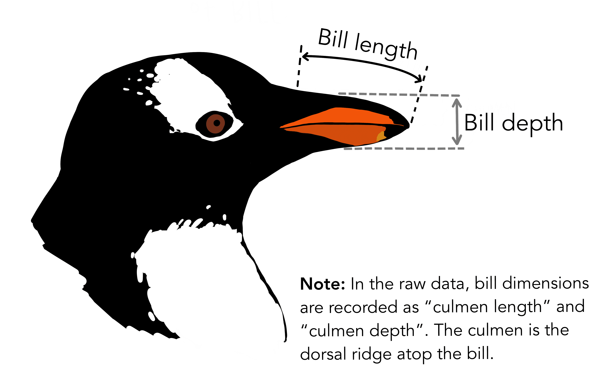

```{r setup, include=FALSE}
knitr::opts_chunk$set(echo = TRUE)

library(tidyverse)
library(learnr)
library(flair)
library(gradethis)
gradethis::gradethis_setup()
library(palmerpenguins)
```


## Introduction

The `tidyverse` is a package that loads a whole bunch of other packages. These allow you to write R in a certain way, called 'tidy'. This is kind of like speaking a dialect of a spoken language. It's still the same language, but it's also different.

The key package within the `tidyverse` is called `dplyr`, which is pronounced 'dee-plier', hence the horrible pun in the title. We're going to cover a lot of different functions here, and it may be a bit overwhelming, but just try to apply them to something that you're interested in, be that [stochastic convergence rates](https://github.com/awstringer1/aghq), [baseball](https://www.hodgettsp.com/posts/baseball-a-defensive-critique/), or [DMC embroidery floss colour](https://sharlagelfand.github.io/dmc/).


<iframe width="560" height="315" src="https://www.youtube.com/embed/l15xQTf1m4A" frameborder="0" allow="accelerometer; autoplay; clipboard-write; encrypted-media; gyroscope; picture-in-picture" allowfullscreen></iframe>


## What is the tidyverse?

*Coming soon*


## The pipe: %>%

Written by Mariam Walaa.


### Introduction

In this lesson, you will learn how to:

- Load the package required to use the pipe `%>%`
- Use the pipe `%>%`

Prerequisite skills include:

- Loading packages

Highlights:

- The pipe `%>%` is used to keep code clean and concise.
- The pipe `%>%` works by "piping" data into a function.
- The pipe `%>%` can "pipe" data into functions repeatedly.

### Overview

The pipe is helpful for keeping your code clean when you have to apply multiple
transformations to your data.

You can start using the pipe after you've loaded the `magrittr` package. The `magrittr`
package is also part of `tidyverse`, so if you've already loaded `tidyverse` then you'll
be able to start using the pipe.

In this tutorial, we'll be using the `penguins` data to present the uses of the pipe. This
data contains records on measurements for penguin species, including their size, sex, and
where they live. There are 344 rows and 8 columns in this data set.

```{r pipe-image-1, echo = FALSE, out.width="90%"}
knitr::include_graphics("images/32_penguins.png")
```

Figure: The Palmer Penguins
Credits: Allison Horst

Here's a simple example using base R's `summary()` without the pipe.

```{r pipe}
summary(penguins)
```

Here's the same code using the pipe.

```{r pipe-1}
penguins %>% summary()
```

As you can see, the pipe `%>%` operator takes the `penguins` data frame and pipes it into
the `summary()` function, so you don't need to pass `penguins` as a parameter to
`summary()`.

In this simple example, it's hard to see why using the pipe makes the code clean and
concise, but when you have multiple transformations that you want to apply to your data,
it becomes clearer why using the pipe makes your code cleaner, more concise, and easier to
read.

Here's a similar example without the pipe, but this time we'll filter the data before we
summarize.

```{r pipe-2}
adelie <- filter(penguins, species == "Adelie")
summary(adelie)
```

Here's the same example using the pipe.

```{r pipe-3}
penguins %>%
  filter(species == "Adelie") %>%
  summary()
```

The code looks a lot cleaner, and we didn't have to separate the process into two
different steps or assign the filtered data to a new data frame object.

### Exercises

You can learn more about the penguins through this illustration.

```{r pipe-image-2, echo = FALSE, out.width="90%"}

```

Figure: The Palmer Penguins
Credits: Allison Horst

#### Exercise 1

Here is some code that filters the data by species and sex, and summarizes the data.

```{r pipe-4}
adelie <- filter(penguins, species == "Adelie")
female_adelie <- filter(adelie, species == "female")
summary(female_adelie)
```

Convert this into equivalent code using the pipe.

```{r pipe-exercise-1, exercise = TRUE}

```

```{r pipe-exercise-1-hint-1}
# You don't have to assign it to an object
```
```{r pipe-exercise-1-hint-2}
# You can filter multiple times within filter()
```

```{r pipe-5, echo = FALSE}
ex1_sol <- penguins %>% 
  filter(species == "Adelie",
         species == "female") %>%
  summary()
```
```{r pipe-exercise-1-check}
grade_result(pass_if(~identical(.result, ex1_sol)))
```

#### Exercise 2

Here is some code that filters the data by sex and year of study, and counts the number of
penguins.

```{r pipe-6}
females <- filter(penguins, sex == "female")
females_2007 <- filter(females, year == "2007")
count(females_2007)
```

Convert this into equivalent code using the pipe.

```{r pipe-exercise-2, exercise = TRUE}

```

```{r pipe-exercise-2-hint-1}
# You don't have to assign it to an object
```

```{r pipe-7, echo = FALSE}
ex2_sol <- penguins %>% 
  filter(sex == "female",
         year == "2007") %>%
  count()
```
```{r pipe-exercise-2-check}
grade_result(pass_if(~identical(.result, ex2_sol)))
```

#### Exercise 3

```{r pipe-exercise-3, echo = FALSE}
question("Which of these are true? Check all true statements.",
         answer(paste("The pipe is not a required operator in your code, but it's helpful",
         " to have because it makes code cleaner."), correct = TRUE),
         answer(paste("The pipe makes your code look cleaner by expressing multiple ",
         "transformations in one line of code."), correct = TRUE),
         answer(paste("The pipe can take 'pipe' both data frames and functions into ",
         "other functions."), message = "The pipe only 'pipes' data into functions."),
         allow_retry = TRUE,
         random_answer_order = TRUE)
```

### Common Mistakes & Errors

Below are some common mistakes and errors you may come across:

- You might type the wrong operator. The pipe operator is as follows: `%>%`
- You might try to pipe something into a function other than data. 

### Next Steps

If you would like to read more about the pipe operator, here are some additional
resources you may find helpful:

- [R For Data Science: Chapter 18 - Pipes](https://r4ds.had.co.nz/pipes.html)


## select()

Written by Yena Joo.

### Introduction

#### What is `select()`?

In this lesson, we will learn how to use the `select` function.  


When you're working with data, you find there are way too many variables in it, and some would wonder, how do I select only the variables I want to use for the analysis? Well, there is a super easy way to see the variables you choose by referring to variables based on the name of the column, with just one simple function.  

`select()` is a function that keeps only the variables you specify.  

The output of the function is a subset of the input data (columns), potentially with a different order. However, the function `select()` does not mutate the original dataset/columns. So if you want to use the new columns you selected, you will have to assign the value to a new variable.  

#### Prerequisite skills include  
- You should have a good understanding of data (column, row, variable), and how to import data.  
- You also have to know how to use pipe (`%>%`) 

#### Basic setup

```{r}
library(tidyverse)
```


### Video

<iframe width="560" height="315" src="https://www.youtube.com/embed/4_8QnnKuO0M" frameborder="0" allow="accelerometer; autoplay; clipboard-write; encrypted-media; gyroscope; picture-in-picture" allowfullscreen></iframe>


### Basics

Here is a simple dataset that has average temperatures for each season. As you can see in the outcome, there are 3 observations(rows) and 4 variables(columns) in the dataset.

```{r echo = F}
temperature_data <- tibble(spring = c(3, 5, 10), 
                  summer = c(23, 27, 25), 
                  fall = c(19, 17, 14), 
                  winter = c(2, -1, -8)) 
temperature_data
```

Now, let's say we want to only see temperatures in the Spring. To do so, select variables you would like to keep by putting the variable name in the parameter with the function `select`.  
Here, I would like to just see the `spring` column by writing the code as below:

```{r}
select(temperature_data, spring)
```

However, it is important to know that the data in `temperature_data` did not change as you can see. The function does not mutate the original dataset.

```{r}
temperature_data
```


If you want to use the new dataset with the variable `spring`, you would have to assign the selected column(s) to a new variable:

```{r}
new_data = select(temperature_data, spring)
new_data
```


### Operators 

Now, we know how to use the function `select` bare minimum. There are various ways to use the function with some operators.  


**1. You can select multiple variables using commas. Order of the input matters!**    

```{r}
select(temperature_data, winter, summer)
```


**2. Another way of selecting multiple variables is to use the operator `c()`.**  
`c()` is a function that returns a vector(a one-dimensional array). Order of the input also matters.  

```{r}
temperature_data %>%
select(c(winter, fall))
```
  
  

**3. The `!` operator negates a selection, `&` operator means "and"(intersection), whereas `|` takes the union of the selections (or).**

```{r}
temperature_data %>%
select(!winter)
select(temperature_data, !winter & !summer)
```

`select(temperature_data, winter & summer)` would incur an error because there cannot exist a variable that is both winter and summer.    


**4. The `:` operator selects a range of consecutive variables, starting from the variable you put on the left of the colon to the variable you put on the right of the colon.**  

```{r}
temperature_data %>% 
  select(summer:winter)
```


**5. The `-` operator excludes a column.**  

If you would like to choose most of the columns in the dataset, and exclude a few columns, there is an easier way. You can just put `-` in front of the name of the column you would like to exclude. For example, I would like to exclude columns `summer` and `winter`, then I would just put a `-` in front of the columns:    

```{r}
temperature_data %>% 
  select(-summer, -winter)
```

### Advanced uses

Some would wonder how they could select the columns based on the data types, since most of the statistical analyses use quantitative data rather than qualitative data. In that case, you can use the following:  

`select(which(sapply(., is.numeric)))`  

Instead of `is.numeric`, you can put `is.character` and `is.double` depending on what type of variables you would like to select in the dataset. 
Let's look at some examples. Here is a dataset that contains information about Sakura blooming in Japan, and it has various data types such as `<int>`(integer), `<chr>`(character), `<dbl>`(double). 

```{r}
japanese_blooming <- read.csv("https://raw.githubusercontent.com/tacookson/data/master/sakura-flowering/temperatures-modern.csv")
head(japanese_blooming)
```

Using the `which(sapply(., is.character))`, we can select the variables that have a data type character `<chr>`.  

```{r}
japanese_blooming %>% select(which(sapply(.,is.character)))
```

If you want to select quantitative/numeric data, you can put `is.numeric` instead.  

```{r}
japanese_blooming %>% select(which(sapply(.,is.numeric)))
```

  

Another way to perform, is the following using `select_if` with whichever data type you would like to select, such as `is.double`, `is.integer`, `is.double` and `is.character`:

```{r}
japanese_blooming %>% select_if(is.double)
```

Selecting variables depending on the data type will come in handy when the dataset has hundreds of variables and you would like to select only quantitative variables for your data analysis/building a statistical model. 


### Exercises

Based on the material we have learned, now let's do some exercises.  


#### Question 1

Modify this code so that we can only see from second to fourth column.

```{r q1_select, exercise.eval = TRUE, exercise=TRUE}
temperature_data <- tibble(spring = c(3, 5, 10), 
                  summer = c(23, 27, 25), 
                  fall = c(19, 17, 14), 
                  winter = c(2, -1, -8)) 

select(temperature_data, 4:4)
```
```{r q1_select-solution}
select(temperature_data, 2:4)
```

The outcome should be: 
```{r q1_select-a, echo = F}
select(temperature_data, 2:4)
```
  

#### Question 2 

Modify this code so that we can only see the columns "winter" and "summer" respectively, using `|` operator. 

```{r q2_select, exercise.eval = TRUE, exercise=TRUE}
select(temperature_data, spring)
```
```{r q2_select-solution}
select(temperature_data, winter|summer)
```

The correct answer should have a result like: 

```{r echo = F}
select(temperature_data, winter|spring)
```


#### Question 3

```{r q3_select, echo=F}
question_checkbox(
  "There are variables 'id', 'gpa', 'age', 'height', 'weight' are in a dataset 'data'. You would like to select only variables 'id', 'height', and 'weight'. What should I write? (Select all that apply) ",
  answer("data %>% select(id, height, weight)", correct = T),
  answer("data %>% select(id & height & weight)", message = "When is the `&` operator used? Check the 'Operations' section."),
  answer("data %>% select(id | height | weight)", correct = T),
  answer("data %>% select(id | height:weight)", correct = T),
  allow_retry = T,
  random_answer_order = T,
  incorrect = "Try again. You got this!"
)
```

#### Question 4

Here is the dataset about ratings of children's books called `child_book_data`. 
```{r echo = F}
#x <- getURL("https://raw.githubusercontent.com/tacookson/data/master/childrens-book-ratings/childrens-books-normalized-ratings.txt")
child_book_data <- read.delim("https://raw.githubusercontent.com/tacookson/data/master/childrens-book-ratings/childrens-books-normalized-ratings.txt")
head(child_book_data)
```

Select the columns that only are type `<dbl>` or if the column has a name `isbn`.

```{r q4_select, exercise.eval = TRUE, exercise=TRUE}
child_book_data %>% select(isbn)
```

```{r q4_select-solution}
child_book_data %>% select(isbn|which(sapply(.,is.double)))
```


### Common Mistakes & Errors

- If you don't have package "dplyr" or "tidyverse" installed and called in the library, the function would not work. Download either package using `install.packages("dplyr")`, and set it up in the library at the start of your code using `library(dplyr)`.  
- Make sure you typed in the correct variable/column name. Always check if your code contains any typo.  
- If you would like to use the new data frame using the variables you have selected, make sure to assign the selected variables to a new data frame.  
- Make sure you understand the differences between the operator `&` and `|`. They can be confusing.  


### Next Steps & See also 

In the tidyverse essentials, there are a ton of other functions you could mix & match with. After learning other functions such as `filter()`, `group_by()`, `arrange()`, `mutate()`, etc. you could easily modify the dataset according to your taste. 
  
### Summary

- package `tidyverse` or `dplyr` is needed.   
- `select()` keeps only the variables you mention.   
- There are some operators that can come in handy.  
  1. `|`: OR operator  
  2. `&`: AND operator  
  3. `c()`: a function that returns a vector, it is for choosing multiple columns. 
  4. `!`: to negate a statement or a column  
  5. `-`: to exclude a column   
  6. `:`: to select a range of consecutive variables  
- If you want to select columns with a specific data type, use `which(sapply(.,is.DATATYPE))` or use `select_if(is.DATATYPE)`  
  


## filter()

Written by Shirley Deng.


### What is `dplyr::filter()` for?

The `dplyr::filter()` function is used to extract rows from a given dataframe following given criteria, and any rows that do not meet this criteria are dropped.

This criteria is written in the form of logical conditions that can be evaluated. For example, if a dataframe `ToothGrowth` has a variable called `len` for lengths, we can extract all of the rows such that `len` is equal to 22.0 with the expression `len == 22.0`. We can have one single condition, or several conditions.

Some useful functions and operators include the following:

*  `==`, `>`, `<`, `>=`, `<=`
* `&`, `|`, `!`, `xor()`
* `is.na()`

`dplyr::filter()` is similar to extracting a subset of rows with square brackets in base R, `[]`. However, in the case that evaluating our conditions on a row results in `NA`s, `dplyr::filter()` drops these rows whereas `[]` would continue to extract them. For this reason, `dplyr::filter()` may be preferred when there may be `NA`s.


### What arguments does `dplyr::filter()` take?

* `.data`: the dataframe we're working with
* `...`: the conditions for the rows we want to extract
* `.preserve`: whether or not we want to preserve the grouping of the `.data` dataframe

### What value does `dplyr::filter()` return?

`dplyr::filter()` returns a dataframe retaining all of the same characteristics as the `.data` argument, except only a subset of the rows, based on the conditions or criteria we used to extract this subset. Namely, this means that the columns are unmodified, and the order of the rows remains the same.

### Practice 

How can we check if 2+2 is greater than or equal to 2*2? Try coding it below.

```{r two-plus-two, exercise=TRUE}

```

```{r two-plus-two-hint}
2+2 >= 2*2
```

### Coding Examples

#### The following is code similar to that from the video lesson in the previous section.

First, we begin by installing the `dplyr` package:

```{r video-installing, eval = FALSE}
install.packages("dplyr", repos = "http://cran.us.r-project.org")
```

Next, we load the `dplyr` package:

```{r video-package}
library(dplyr)
```

#### Now, we want to prepare a dataframe for us to work with. We will make use of the `ToothGrowth` dataset built into R. 

We can take a look at what this dataset is about:

```{r video-ToothGrowth-info}
?ToothGrowth
```

And take a look at the first few rows of observations:

```{r video-ToothGrowth-head}
head(ToothGrowth)
```

#### We want to add an additional variable for the colour of the guinea pigs.

We need to set a seed to ensure we get the same results every time the code is run. We chose the number `123`:

```{r video-seed}
set.seed(123)
```

Now, we create our colour variable by taking a sample of guinea pig fur colours. We use the `sample()` function for this:

```{r video-sample}
colour <- sample(x=c("black", "brown", "grey", "cream", "white", "multi"),
                 size=nrow(ToothGrowth),
                 replace=TRUE)
colour
```

And now we create a new dataframe that combines `ToothGrowth` with our `colour` variable using `data.frame()`. We'll also take a look at the frist few observations.

```{r video-df}
guineas <- data.frame(ToothGrowth, colour)
head(guineas)
```

We notice that it looks the same as the original `ToothGrowth` dataframe, but with our added `colour` variable.

#### We can now move onto trying out the `dplyr::filter()` function!

First, we try extracting a subset of rows using only one condition: that the guinea pigs are brown in colour.

```{r video-1}
brown_guineas <- filter(guineas, colour == "brown")
brown_guineas
```

Next, we try using two conditions: that the guinea pigs are white in colour, and received a supplement dosage of 1.0 mg/day.

```{r video-2}
white_1_guineas <- guineas %>% filter(colour == "white", dose == 1.0)
white_1_guineas
```

#### Now, we want to see what happens when our conditions evaluate as `NA`s.

First, we try a condition that evaluates all of the rows as `NA`s with `dplyr::filter()`:

```{r video-NAs-filter}
no_guineas <- guineas %>% filter(dose/0 == 2)
no_guineas
```

And now with the square brackets `[]` in base R:

```{r video-NAs-square}
some_guineas <- guineas[guineas$dose /0 == 2]
some_guineas
```

We notice that using `dplyr::filter()` we extracted no rows, whereas using the square brackets we extracted all of the rows but no columns.

#### Lastly, we want to see how `dplyr::filter()` works on grouped dataframes.

We begin by greating a grouped version of our `guineas` dataframe, through grouping by colour:

```{r video-grouping}
grouped_guineas <- guineas %>% group_by(colour)
grouped_guineas
```

And then we try filtering by receiving orange juice as the supplement, while preserving the grouping:
```{r video-preserve}
orange_grouped_guineas <- grouped_guineas %>% filter(supp == "OJ", preserve=TRUE)
orange_grouped_guineas
```


### Exercises

Let's go over some common mistakes, and then try using the filter() function ourselves.

Make sure you're using `==` instead of `=`. Try changing the `==` to `=` below:
```{r equal-mistake, exercise=TRUE}
filter(guineas, colour == "brown")
```

Make sure you're using quotation marks for strings, or R will read them as variable names. Try removing the quotation marks around `brown` below:
```{r string-mistake, exercise=TRUE}
filter(guineas, colour == "brown")
```

Onto the exercises!

Extract all guinea pigs that were given the ascorbic acid Vitamin C supplement.

```{r vc, exercise=TRUE}

```

``` {r vc-hint}
guineas %>% filter(supp=="VC")
```

Extract all guinea pigs that were given the orange juice supplement at a dose of 0.5 mg/day.

```{r oj-half, exercise=TRUE}

```

``` {r oj-half-hint}
guineas %>% filter(supp=="OJ", dose==0.5)
```


### Additional Resources

* [`dplyr:filter()` reference page](https://dplyr.tidyverse.org/reference/filter.html)


## group_by() and ungroup()

Written by Matthew Wankiewicz.


### Introduction

In this lesson, you will learn how to:

- Use the `group_by()` function in R
- Use the `group_by()` function with other functions in R.

Prerequisite skills include:

- Having R installed on your computer/Having RStudio Cloud.
- Having `tidyverse` installed on R.

Highlights:

- The `group_by` function allows you to group datasets by variables you choose.
- `group_by` works best when paired with other dplyr functions, either counting the number of items in a group or making new variables from groups.

{width=400 height=300}

### The content

A major part of data analysis is seeing how your data looks using particular groups and the `group_by` function is very helpful with this. The `group_by` function takes a data frame and allows you to use other functions to get an idea of what these groups look like. 

The `group_by` function is useful for conducting operations on your dataset when you want to break up the points by group. For example, if you have a data frame with the heights and weights of different animals, the `group_by` function is useful for finding things like the mean weight of each type of animal in the data frame. The function `ungroup` is used to remove the grouping done by the `group_by` function.

Normally, the `group_by` function is paired with other dplyr functions in order to conduct your analysis.

The `ungroup` function takes one argument, a grouped data frame that you want to ungroup. This is useful for ungrouping your data after you have run your analysis and want to work with the whole data frame again.

Brief Overview of the `group_by()` and `ungroup()` functions:

<iframe width="560" height="315" src="https://www.youtube.com/embed/011h7uREXAU" frameborder="0" allow="accelerometer; autoplay; clipboard-write; encrypted-media; gyroscope; picture-in-picture" allowfullscreen></iframe>

### Arguments

- **`group_by()`**: The two main arguments for `group_by` are the data you plan to analyze and variables you want to group. When you enter in the data you plan to analyze, it will be the first argument. You can either write the name of the dataset as the first argument or pipe it into the `group_by()` function. Once you have your dataset in the function, you then have to write in the variable names you plan to group. You can write as many variables as you want when using `group_by()`.

- **`ungroup()`**: The `ungroup()` function takes one argument, the grouped data that you want to ungroup. This is useful for ungrouping your data after you have run your analysis and want to work with the whole data frame again.


### Other Optional Arguments

- **`group_by()`**: The two optional arguments are .add and .drop. .add determines whether or not the function makes new groups in the data. .drop drops groups that were formed before-hand which we may not see in the data.

### Questions

```{r example_1Groupby, exercise = T}
penguins_grouped <- penguins %>% 
  group_by(species)
head(penguins_grouped)
```

As you can see above, using the `group_by` function does not appear to do anything when it is done on its own. When you have a grouped data frame, you usually pair it with another function to get the data you want.

```{r example_2Groupby, exercise = T}
penguins %>% 
  count()
```

The chunk above takes the penguins data frame and counts how many observations are included. The output is only one number which represent all of the penguins. In the chunk below, we will use the `group_by` function to see the number of penguins of each species present in the data frame.

```{r example_3Groupby, exercise=T}
penguins %>% 
  group_by(species) %>% 
  count()
```

In the chunk above, I used the grouped data frame that was created in the chunk before and ran it with the `count` function. This allows us to see how many penguins of each species are present in the data frame.


```{r example_4Groupby, exercise=T}
penguins %>% 
  group_by(species) %>% 
  # use na.rm to remove missing values
  summarise(average_weight = mean(body_mass_g, na.rm = T))
```

This chunk shows how we can use the `group_by` function with the `summarise` function to get summary statistics for each species. To do this, you can either take the grouped data frame and pipe it into the `summarise` function or you can use the `group_by` function on the initial data frame and then pipe that into the `summarise` function.


```{r example_5Groupby, exercise=T}
penguins %>% 
  group_by(species) %>% 
  summarise(average_weight = mean(body_mass_g, na.rm = T),
            average_flipper_length = mean(flipper_length_mm, na.rm = T))
```

This is an example of using the `group_by` function and the `summarise` function after piping in your initial data frame. As you can see, there is another column present in the output, compared to the chart above. This was done by adding in another argument to the `summarise` function which now gives us the average flipper length of each species of penguin.

```{r example_6Groupby, exercise=T}
penguins %>% 
  group_by(species, sex) %>% 
  summarise(average_weight = mean(body_mass_g, na.rm = T))
```
The `group_by` function can also be used with multiple variables. This is an example of using two variables to group our data, this time we will use species and sex. Once again, we can see that visually, the data doesn't look different but when we apply other functions to it, the data will appear differently. 

```{r example_7Groupby, exercise=T}
penguins %>% 
  group_by(species, sex, year) %>% 
  summarise(average_weight = mean(body_mass_g, na.rm = T))
```

This output shows us the average weights of the penguins, when grouped by species and sex. We can see that there are levels for each of the three species (Adelie, Chinstrap and Gentoo) and the three gender levels present (Male, Female and NA).

```{r example_8Groupby, exercise=T}
penguins %>% 
  group_by(species, sex) %>% 
  filter(body_mass_g == max(body_mass_g))
```

The `group_by` function also works with the `filter` function. The chunk above gives us the penguins with the largest body mass for each of the groups we created. 

```{r example_9Groupby, exercise=T}
penguins %>% 
  group_by(species) %>% 
  count()

penguins %>% 
  group_by(species) %>% 
  ungroup() %>% 
  count()
```

This chunk demonstrates the `ungroup` function. The output of the first code is the same as one of the previous examples, it gives us the number of penguins present for each species. 

The second group of code shows us what `ungroup` does. The `ungroup` function was placed just before the `count` function so instead of giving us the number of penguins in each species, we get the number of penguins in the whole data frame.

**Brief Overview of the `group_by()` and `ungroup()` functions**:

<iframe width="560" height="315" src="https://www.youtube.com/embed/011h7uREXAU" frameborder="0" allow="accelerometer; autoplay; clipboard-write; encrypted-media; gyroscope; picture-in-picture" allowfullscreen></iframe>

### Exercises

**1.** Use the group_by function to count how many penguins were studied each year and also group them by their sex. Remember the data frame is called "penguins" and the year variable is called "year", sex is called "sex".
```{r worked-example1Groupby, exercise=TRUE}
penguins %>% 
```

```{r worked-example1Groupby-solution}
## FINAL SOLUTION ## 
penguins %>% 
  group_by(year, sex) %>% 
  count()

## OR ##

penguins %>% 
  group_by(year, sex) %>% 
  summarise(n = n())
```

**2.** Using the penguins data frame, group by both island, sex and species and give the average bill length (bill_length_mm), average bill depth and the difference between average bill length and average bill depths.
```{r worked-example2Groupby, exercise=TRUE}
penguins %>% 
```

```{r worked-example2Groupby-solution}
## FINAL SOLUTION ## 
penguins %>% 
  group_by(island, sex, species) %>% 
  summarise(avg_length = mean(bill_length_mm, na.rm = T),
            avg_depth = mean(bill_depth_mm, na.rm = T),
            diff_depth = mean(bill_length_mm) - mean(bill_depth_mm))
# na.rm = T is optional, safer to use it if you're unsure if 
# your data contains NA's
```

```{r worked-example2Groupby-hint-1}
penguins %>% 
```

```{r worked-example2Groupby-hint-2}
penguins %>% 
  group_by(...)
```

```{r worked-example2Groupby-hint-3}
penguins %>% 
  group_by(island, sex, species) %>%
  summarise(...)
```

```{r worked-example2Groupby-hint-4}
penguins %>% 
  group_by(sex, species) %>% 
  summarise(avg_length = mean(bill_length_mm, na.rm = T))
```

Solution to Exercise 1:

<iframe width="560" height="315" src="https://www.youtube.com/embed/pTuGhkNCTnc" frameborder="0" allow="accelerometer; autoplay; clipboard-write; encrypted-media; gyroscope; picture-in-picture" allowfullscreen></iframe>

Solution to Exercise 2:

<iframe width="560" height="315" src="https://www.youtube.com/embed/Dr4b18O-aGo" frameborder="0" allow="accelerometer; autoplay; clipboard-write; encrypted-media; gyroscope; picture-in-picture" allowfullscreen></iframe>

### Common Mistakes & Errors

Sometimes, you will encounter some errors in the `group_by` function. In this section, we'll cover what you should do when some of the common errors occur.

1. Error: Must group by variables found in `.data`

When this occurs, you are probably trying to group your data frame by a variable that isn't in the data frame. Often times, this happens because of a typo in the variable you want to select.

2. Error in eval(lhs, parent, parent) : object 'totally_real_data_frame' not found

When this error occurs, R is telling us that the data frame we are trying to make groups from does not exist. Once again, this is usually because of a typo.

3. Error in group_by(data) : could not find function "group_by"

When this occurs, it means that R can't find the `group_by` function. To fix this, you should try to load the `tidyverse` library in.

Some mistakes that you may run into when using `group_by` and `ungroup`:

* Calling for variables that are not in the data frame you plan to analyze (usually typos).

* Not calling in the tidyverse/dplyr library in R.

* Sometimes you can encounter difficulties with other functions, usually, typos will be the biggest issue.

### Next Steps

Now that you have got some experience with the `group_by` and `ungroup` functions, these links are useful resources to expand your understanding.

R for Data Science contains the `group_by` function with other dplyr functions: https://r4ds.had.co.nz/transform.html

Section 6.11 of OHI Data Science Training looks at the `group_by` function: https://ohi-science.org/data-science-training/dplyr.html#group_by-operates-on-groups)


## summarise()

Written by Mariam Walaa.


### Introduction

In this lesson, you will learn how to:

- Summarize a variable using `summarise()`
- Summarize groups of observations within a variable using `group_by()`
- Summarize groups of observations within multiple variables using `across()`

Prerequisite skills include:

- Using `group_by()`
- Using summary functions like `sum()`, `min()`, `max()`

Highlights:

- `summarise()` is often used with `group_by()`
- There are many summary functions you can use within `summarise()`
- You can even create your own functions to use within `summarise()`

{#id
.class width=750 height=500px}

### Arguments

The `summarise()` function takes the following as arguments:

| Argument         | Parameter        | Details                                                    |
|------------------|------------------|------------------------------------------------------------|
| .data            | data frame       | a data frame containing variables we want to summarize     |
| name-value pairs | name-value pairs | this takes the name of the column and the summary function |

You can read more about the arguments in the `summarise()` function's documentation
[here](https://www.rdocumentation.org/packages/dplyr/versions/0.7.8/topics/summarise).

### Overview

This section will demonstrate how to use the `summarise()` function to summarize variables
and groups within a variable in a data set.

We will be looking at a data set of Broadway shows with variables about the performances,
attendance, and revenue for theaters that are part of The Broadway League. You can learn
more about the data set provided by Alex Cookson in this [Git
repository](https://github.com/tacookson/data) as well as this corresponding [blog
post](https://www.alexcookson.com/post/most-successful-broadway-show-of-all-time/).

```{r summarise, include = FALSE}
broadway <- read_csv(
  "https://raw.githubusercontent.com/tacookson/data/master/broadway-grosses/grosses.csv",
  guess_max = 10000)

broadway <- broadway %>%
  select(week_ending,
         show,
         theatre,
         weekly_gross,
         avg_ticket_price,
         top_ticket_price,
         performances,
         previews)
```

```{r summarise-1}
glimpse(broadway)
```

You'll notice that there are 47,524 rows and 8 columns. Each row uniquely represents a
show that occurred on a specific week. Each column, then, contains information about a
show on some particular week in some particular theatre.

#### Question 1

How many performances occurred in total?

```{r summarise-2}
broadway %>%
  summarise(total_performances = sum(performances))
```

#### Question 2

How many performances occurred per week?

```{r summarise-3}
broadway %>%
  group_by(week_ending) %>%
  summarise(total_num_performances = sum(performances), 
            .groups = 'drop')
```

#### Question 3

How many performances _and_ previews occurred per week?

```{r summarise-4}
broadway %>%
  group_by(week_ending) %>%
  summarise(total_num_performances = sum(performances),
            total_num_previews = sum(previews),
            .groups = 'drop')
```

#### Question 4

How many performances occurred _per theatre_ within each week?

```{r summarise-groups-drop, include = FALSE}
broadway %>%
  group_by(week_ending, theatre) %>%
  summarise(total_num_performances = sum(performances),
            .groups = 'drop')
```
```{r summarise-5, echo = FALSE}
decorate("summarise-groups-drop") %>%
  flair(".groups = 'drop'", color = "red") %>%
  knit_print.with_flair()
```

Notice that we include the `.groups` argument within each `summarise()` function call
(highlighted in red). We mostly do this to keep the output clean, but you can learn more
about this argument by running`?summarise` in your console.

#### Bonus: Using `across()`

What is the minimum and maximum number of performances _and_ previews per week?

Strategy: Use `across()` to select specific columns to summarize them with multiple
summary functions.

```{r summarise-across-fcn, include = FALSE}
broadway %>%
  group_by(week_ending) %>%
  summarise(across(.cols = c("performances", "previews"),
                   .fns = list(min = min, max = max)),
            .groups = 'drop')
```
```{r summarise-6, echo = FALSE}
decorate("summarise-across-fcn") %>%
  flair("across", color = "blue") %>%
  flair(".cols", color = "deeppink") %>%
  flair(".fns", color = "orange") %>%
  knit_print.with_flair()
```

Here's what this chunk of code does:

* Groups the data by week using `group_by()` 
* Selects columns to summarize by passing a vector to `.cols` in `across()` (Highlighted in pink) 
* Defines summary functions by passing a list to `.fns` in `across()` (Highlighted in orange)

You can learn more about `across()` by running `?across` in your console.

#### Bonus: Using `across()` with `where()`

We can provide a numeric summary for every show happening in a particular week.

```{r summarise-7}
broadway %>%
  group_by(week_ending, show) %>%
  summarise(across(where(is.numeric), mean, na.rm = TRUE),
            .groups = 'drop')
```

This chunk of code summarizes every show happening in some particular week by every
numeric variable that is available in the data set. This helps us easily see things like
the average ticket price and the number of performances each show had in a particular
week.

### Exercises

This section will ask you to complete exercises based on what you've learned from the
previous section.

#### Exercise 1

How many theaters do we have in this data set?

```{r summarise-exercise-1, exercise = TRUE}

```

```{r summarise-exercise-1-hint-1}
n_distinct()
```
```{r summarise-exercise-1-hint-2}
# Try naming it something useful, like n_theatres
```

```{r summarise-8, echo = FALSE}
ex1_sol <- broadway %>%
  summarise(n_theatres = n_distinct(theatre))
```
```{r summarise-exercise-1-check}
grade_result(pass_if(~identical(.result, ex1_sol)))
```

#### Exercise 2

How many shows occurred per week?

```{r summarise-exercise-2, exercise = TRUE}

```

```{r summarise-exercise-2-hint-1}
n_distinct()
```
```{r summarise-exercise-2-hint-2}
# Try naming it something brief, like n_shows
```

```{r summarise-9, echo = FALSE}
ex2_sol <- broadway %>%
  group_by(week_ending) %>%
  summarise(n_shows = n_distinct(show), .groups = 'drop')
```
```{r summarise-exercise-2-check}
grade_result(pass_if(~identical(.result, ex2_sol)))
```

#### Exercise 3

What is the average number of performances across all theatres per week?

```{r summarise-exercise-3, exercise = TRUE}

```

```{r summarise-exercise-3-hint-1}
# Try naming it something descriptive, like avg_num_performances
```

```{r summarise-10, echo = FALSE}
ex3_sol <- broadway %>%
  group_by(week_ending) %>%
  summarise(avg_num_performances = mean(performances), .groups = 'drop')
```
```{r summarise-exercise-3-check}
grade_result(pass_if(~identical(.result, ex3_sol)))
```

#### Exercise 4

What is the minimum and maximum number of performances per week?

```{r summarise-exercise-4, exercise = TRUE}

```

```{r summarise-exercise-4-hint-1}
across()
```

```{r summarise-11, echo = FALSE}
ex4_sol <- broadway %>%
  group_by(week_ending) %>%
  summarise(across(.cols = "performances", 
                   .fns = list(min = min, max = max)), .groups = 'drop')
```
```{r summarise-exercise-4-check}
grade_result(pass_if(~identical(.result, ex4_sol)))
```

#### Exercise 5

What is the average top ticket price? 

```{r summarise-exercise-5, exercise = TRUE}

```

```{r summarise-exercise-5-hint-1}
na.rm = TRUE
```

```{r summarise-12, echo = FALSE}
ex5_sol <- broadway %>%
  summarise(avg_top_price = mean(top_ticket_price, na.rm = TRUE),
            .groups = 'drop')
```
```{r summarise-exercise-5-check}
grade_result(pass_if(~identical(.result, ex5_sol)))
```

#### Exercise 6

Which weeks did shows have no performances or previews?

```{r summarise-exercise-6, exercise = TRUE}

```

```{r summarise-exercise-6-hint-1}
arrange()
```

```{r summarise-13, echo = FALSE}
ex6_sol <- broadway %>%
  group_by(show, week_ending) %>%
  summarise(appearances = performances + previews, .groups = 'drop') %>%
  arrange(appearances)
```
```{r summarise-exercise-6-check}
grade_result(pass_if(~identical(.result, ex6_sol)))
```

#### Exercise 7

Select all the true statements about the `summarise()` function from dplyr.

```{r summarise-exercise-7, echo = FALSE}
question("Which of these are true? Check all true statements.",
         answer("summarise() can be used to summarize a variable into a single number.",
                correct = TRUE),
         answer("summarise() can only use the same statistics as summary().",
                message = paste("summarise() does NOT use the same statistics as summary().",
                "We can use many more summary functions, and we can even define our own!")),
         answer("summarise() can be applied on a group-level using group_by().",
                correct = TRUE),
         answer("summarise() and summarize() are two different functions.",
                message = "summarise() and summarize() are the same function within dplyr."),
         answer("summarise() can only use summary functions that output a single number.",
                message = paste("summarise() cannot only output a single number summary.",
                "We can use functions like quantile() which outputs multiple numbers.")),
         allow_retry = TRUE,
         random_answer_order = TRUE)
```

### Common Mistakes & Errors

Below are some common mistakes and errors you may come across:

* You try to summarize a column that has NA values. Remember to include `na.rm = TRUE`.
* You try to summarize a column that is not available in the data set (i.e., you
misspelled the column name, or it's simply not in the data set).

### Next Steps

If you would like to read more about the `summarise()` function, here are some additional
resources you may find helpful:

- [R 4 Data Science: **Chapter 5.6** Grouped summaries with
summarise](https://r4ds.had.co.nz/transform.html#grouped-summaries-with-summarise).
- [R 4 Data Science: 5.6.4 Useful summary functions](https://r4ds.had.co.nz/transform.html#summarise-funs)


## arrange()

Written by Isaac Ehrlich.


### Introduction

Sometimes, you may want to view a dataset in a specific order. Data sets will often be displayed in the order the data were input, but you may want to view it sorted by a different variable. You can use the tidyverse `arrange()` function, to order a data set by a specific column.

### arrange()

The `arrange()` function takes in a data frame and columns to sort by as its input, and will output the re-ordered data frame. `arrange()` does not modify any values in your data, it only changes the presentation.

Let's take a look at a simple example using R's `mtcars` data set:

```{r}
head(mtcars)
```

There's a lot of information in this data, like miles per gallon, number of cylinders, and displacement, but it doesn't seem to be ordered in any way.

Supposing we want to order the data frame by miles per gallon (i.e. see cars with lowest mpg at the top and highest mpg at the bottom), we can pass the following function:

```{r}
head(arrange(mtcars, mtcars$mpg))
```

Note, `arrange()` by default sorts in ascending order. If we want to sort in descending order, we can pass `desc()` to the column names:

```{r}
head(arrange(mtcars, desc(mtcars$mpg)))
```

### Additional Examples

#### Characters

`arrange()` can also sort by character vectors. In this case, `arrange()` by default will sort alphabetically. Let's take a look at R's `HairEyeColor` data set ordered by hair color:

```{r}
HairEyeColor <- data.frame(HairEyeColor)
head(arrange(HairEyeColor, HairEyeColor$Hair))
```

#### Multiple Arguments

If you pass multiple columns into arrange, it will order by columns in the order they are passed. For example, in the code below, we order the `HairEyeColor` first by hair color and then by frequency.

```{r}
head(arrange(HairEyeColor, HairEyeColor$Hair, HairEyeColor$Freq))
```

We can see that the data was first ordered alphabetically by hair color, followed by frequency.


### Practice Questions

For the following questions, please refer to R's `quakes` data set:

```{r}
head(quakes)
```

```{r arrangeq1, echo = FALSE}
question("arrange() by default sorts in descending order",
answer("True"),
answer("False", correct = TRUE),
allow_retry = TRUE)
```

```{r arrangeq2, echo = FALSE}
question("Select the correct code to sort 'quakes' by magnitude in descending order",
answer("arrange(quakes, quakes$mag)",
       message = "Remember the default!"),
answer("arrange(quakes, quakes$stations, desc(quakes$mag))",
       message = "Keep in mind what you want to sort by!"),
answer("arrange(quakes, desc(quakes$mag)", correct = TRUE),
answer("arrange(desc(quakes), quakes$mag)",
       message = "Remember what you apply 'desc()' to!"),
allow_retry = TRUE)
```

```{r arrangeq3, echo = FALSE}
question("Select the correct code to sort 'quakes' by magnitude and then by depth",
answer("arrange(quakes, quakes$mag, quakes$depth)", correct = TRUE),
answer("arrange(quakes, quakes$depth, quakes$mag))",
       message = "Keep in mind the order you want to sort by!"),
answer("arrange(quakes$mag, quakes$depth)",
       message = "Don't forget the first argument!"),
answer("arrange(quakes, c(quakes$mag, quakes$depth))",
       message = "Keep in mind how to pass multiple arguments!"),
allow_retry = TRUE)
```

### Practice Coding

The following questions will ask you to use the arrange function on your own.
For these questions, please refer to R's `quakes` data set:

```{r}
head(quakes)
```

1. Arrange the data in quakes so that it is ordered by magnitude and then by stations, both in descending order

```{r arrangeq4, exercise = TRUE}

```

### Special Cases and Common Errors

#### NA Values

Regardless of if you are sorting in ascending or descending order, NA values will be sent to the bottom of your reordered data frame.

#### Common Errors

1. The first input to arrange must be of type "data.frame," it cannot be applied to objects that are tables or matrices. Make sure to convert to a data frame using `as.data.frame()` if needed.

2. Make sure you are properly calling your column names to order by. There are several ways to do this - the expressions below all output the same result.
* `arrange(quakes, quakes$mag)`
* `arrange(quakes, col = mag)`
* `quakes %>% arrange(mag)`

Other errors are bound to pop up. Remember that Stack Overflow is your best friend!

### Overview

`arrange()` is a useful function for reorganizing the structure of your data set. While it does not change any values, it may be useful if you need to order you data by a certain variable, or even just for easier viewing.

The following video summarizes what we have gone over in this tutorial: 


## mutate()

Written by Haoluan Chen.


### Introduction

{width=400 height=300}

mutate() is a function in the dplyr library. It is used to create new variables in your dataset while keeping the existing variables. 

### Examples 

I generated a dataset contains student test scores and their student id for a course. 

```{r mutateexample1,  exercise=TRUE}
scores <- tibble(student_ID = c("1", "2", "3", "4", "5", "6"),
               test_one_score = c(87, 76, 61, 80, 72, 69),
               test_two_score = c(79, 85, 52, 72, 65, 75),
               test_three_score = c(92,79, 45, 85, 76, 73))

scores
```

Q1: What is the average test score for each student? 

we can use mutate to calculate the average test score for each student and store it as a new variable called avg_test_score,

```{r mutateQ1, exercise=TRUE}
avg <- scores %>% mutate(avg_test_score = (test_one_score + test_two_score + test_three_score)/3)
avg
```

Here, we have a expression for the new variable: 

avg_test_score = (test_one_score + test_two_score + test_three_score)/3 

The left side of the expression specifies the name of the new variable and the right side of the expression specifies how to calculate the new variable.  

Now, Lets assume the following weights for this course:

* 10% for test one
* 30% for test two 
* 60% for test three

Q2: What is the final grade for each student?

```{r mutateQ2, exercise=TRUE}
final <- scores %>% mutate(final_grade = 0.1*test_one_score + 0.3*test_two_score + 0.6*test_three_score)
final
```

Here, we calculate the final grade by summing the value of each test score times its weight. Then, we store the final grade it as final_grade. 

Q3: Who received the highest final grade in this course?

**Note: rank() produces a vector that contains the rank of the values in the vector that was evaluated such that the lowest value would have a rank of 1 and the second-lowest value would have a rank of 2.**

**desc() transform a vector into a format that will be sorted in descending order. **

```{r mutateQ3, exercise=TRUE}
final %>% mutate(rank = rank(desc(final_grade)))
```

Here, we created a new variable called rank and specify its value using rank() and desc(). The rank() function produces the rank of the student final grade, but it assigns rank from lowest to largest(lowest final grade will assign to 1). So, we have to use desc() to get the rank from largest to lowest(largest final grade will assign to 1)

Therefore, student 1 received the highest final grade in this course. 

Q4: Did all student pass the class?

```{r mutateQ4, exercise=TRUE}
final %>% mutate(pass = ifelse(final_grade>=50, TRUE, FALSE))
```

Here, we created a new variable called pass, which is a logical variable that is TRUE when student received final grade higher or equal to 50(FALSE otherwise). 

We used another function ifelse(), it is equivalent to if...else statement in R. It takes in 3 parameters(test_expression, x, y). If the test_expression is true, it will return x, if the test_expression is not true, it will return y. 

In this case, When the final_grade is greater or equal to 50, the pass variable will assign to TRUE. And when the final_grade is less than 50, the pass variable will assign to FALSE.

Unfortunately, student 3 failed the course :(

**Note: this question can also be done using case_when function. **


### Concept Maps 


### Common mistakes 

* Make sure you download dplyr and called library(dplyr) before using mutate()
* Incorrect spelling of the name of the dataset or variables
* the name of new variable should not contain space or other special symbols such as / or " 
* Make sure your expression is mathematically correct and avoid division by 0


### Exercise

#### Question 1 

Now, due to the COVID-19 the weight of this course has been changed. Consider the following weight:

* 20% for test one
* 50% for test two 
* 30% for test three

Please use the dataset(scores) to calculate the final score for each of the students and store it as new_final_score.

```{r mutatedata}
scores <- tibble(student_ID = c("1", "2", "3", "4", "5", "6"),
               test_one_score = c(87, 76, 61, 80, 72, 69),
               test_two_score = c(79, 85, 52, 72, 65, 75),
               test_three_score = c(92,79, 45, 85, 76, 73))


```


```{r mutateex1, exercise=TRUE, exercise.lines = 10}
scores


```

#### Question 2

Did everyone pass the course under this new marking scheme in Q1?
Please create a new logical variable called pass to identify if any student did not pass the course.
*Note: You may want to copy your code in Question 1 here *

```{r mutateex2, exercise=TRUE, exercise.lines = 5}

```

#### Question 3 

Please create a new variable called rank that assigns student with highest new_final_score as 1, second highest new_final_score as 2 and so on. 
*Note: You may want to copy your code in Question 1 here *

```{r mutateex3, exercise=TRUE, exercise.lines = 5}

```


#### Video Solution


### Next steps

Now you may use other functions in dplyr to generate variables in your dataset. For example

```{r include=FALSE}
final <- scores %>% mutate(final_grade = 0.1*test_one_score + 0.3*test_two_score + 0.6*test_three_score)
final %>% mutate(pass = ifelse(final_grade>=50, TRUE, FALSE))
```

```{r next}
final %>% select(student_ID, final_grade) %>% 
  filter(final_grade>80) %>% 
  mutate(letter_grade = "A",
         reward = TRUE)
```
*As you can see you can create multiple variables within one function call by separate them using comma *

#### Other resources

R for Data Science: https://r4ds.had.co.nz/transform.html (Chapter 5.5 covers mutate() and 5.5.1 contains useful creation function)

Documentation for mutate() https://dplyr.tidyverse.org/reference/mutate.html

Vignettes(demonstration of how to use functions in dplyr including mutate()) for dplyr: https://cran.r-project.org/web/packages/dplyr/vignettes/dplyr.html


## pivot_wider() and pivot_longer()

Written by Annie Collins.


### Introduction

In this lesson, you will learn how to:

- Use the function `pivot_wider()` to manipulate a data frame or tibble.
- Use the function `pivot_longer()` to manipulate a data frame or tibble.

This lesson is a yellow level skill and is part of "Tidyverse Essentials". Prerequisite skills include:

- Installing packages
- Calling libraries
- Importing data

### pivot_longer()

`pivot_longer()` takes the inputted dataset and makes it **longer** by rearranging its data to **increase the number of rows** and **decrease the number of columns**. Here, we consider "longer" in the vertical sense -- a "longer" dataset has a larger number of cells from top to bottom than a "shorter" dataset.

#### Introductory Example

This dataset (called `games`) contains a list of NBA teams and their win/loss record over the course of 10 games.

```{r games data, echo=FALSE}
games <- data.frame()

# Add team names as first column
teams <- c("Toronto Raptors", "Los Angeles Lakers", "Boston Celtics", 
           "Golden State Warriors", "Miami Heat")
games <- cbind(teams)

# Randomly create a wins and losses for each team and each game
set.seed(100)
gm1 <- sample(c("w", "l"), size=5, replace=TRUE, prob=c(50,50))
gm2 <- sample(c("w", "l"), size=5, replace=TRUE, prob=c(50,50))
gm3 <- sample(c("w", "l"), size=5, replace=TRUE, prob=c(50,50))
gm4 <- sample(c("w", "l"), size=5, replace=TRUE, prob=c(50,50))
gm5 <- sample(c("w", "l"), size=5, replace=TRUE, prob=c(50,50))

games <- cbind(games, gm1, gm2, gm3, gm4, gm5)

games <- as.data.frame(games)
games
```

Run the code below and observe the effect it has on the dataset. Take note of the difference in the number of rows and columns between the two tables. This will be visualized and explained in greater detail in the following step.

```{r first_example, echo=FALSE, exercise=TRUE}
pivot_longer(games, cols = c(gm1, gm2, gm3, gm4, gm5), names_to = "game number", values_to = "status")
```

### Visualizing pivot_longer()

This video will guide you through the changes that occur when applying `pivot_longer()` to our dataset.

<iframe width="560" height="315" src="https://www.youtube.com/embed/OBsQA0vyxNA" frameborder="0" allow="accelerometer; autoplay; clipboard-write; encrypted-media; gyroscope; picture-in-picture" allowfullscreen></iframe>

### pivot_longer() Arguments

Now let's get a bit more specific. 

You just executed the command `pivot_longer(data = games, cols = c(gm1, gm2, gm3, gm4, gm5), names_to = "game number", values_to = "status")`. What do each of the arguments within the brackets mean?

- **data**: the name of our dataframe, in this case `games`.

- **cols**: the names of the columns that will be "pivoting" or changing into a longer format. *In our example, we select all columns representing a single game, which are columns "gm1" through "gm5". We could have also written `!teams` (all columns except "teams") or `starts_with("gm")` (all the columns with a name that starts with "gm")*.

- **names_to**: a new name for the column that will be created from the former column names in **cols**. After pivoting, the former distinct columns are now all stored within one column themselves, and this argument lets you give this adjusted column a descriptive new name. If left blank, the new column name will automatically be set to "names". *In our example, we named the column "game number" since it contains "gm1" through "gm5"*.

- **values_to**: similar to **names_to**, this represents a new name for the column created for the data that was originally stored in each individual cell. If left blank, the new column name will automatically be set to "values". *In our example, we set the name to "status" since the column contains information representing each team's win or loss outcome for a given game*.


### pivot_wider()

`pivot_wider()` takes the inputted dataset and makes it **wider** by rearranging its data to **decrease the number of rows** and **increase the number of columns**. `pivot_wider()` is essentially the inverse of `pivot_longer()` - the two transformations can be used to switch a data frame back and forth between its "longer" and "wider" forms.

#### Introductory Example

This is a dataset called `games_long`, a "longer" version of `games` (the result of applying `pivot_longer()` to the original data frame).

```{r wider-dataframe, echo=FALSE}
games_long <- pivot_longer(games, cols = c(gm1, gm2, gm3, gm4, gm5), names_to = "game number", values_to = "status")
games_long
```

Run the code below and observe the effect it has on the dataset. Take note of the difference in the number of rows and columns between the two tables.

```{r wider-first-example, echo=FALSE, exercise=TRUE}
pivot_wider(data = games_long, names_from = "game number", values_from = status)
```

### Visualizing pivot_wider()

This video will guide you through the changes that occur when applying `pivot_wider()` to our data frame.

<iframe width="560" height="315" src="https://www.youtube.com/embed/PycHf7Og-sY" frameborder="0" allow="accelerometer; autoplay; clipboard-write; encrypted-media; gyroscope; picture-in-picture" allowfullscreen></iframe>


### pivot_wider() Arguments

You just executed the command `pivot_wider(data = games, names_from = "game number", values_from = status)`. What do each of the arguments within the brackets mean?

- **data**: the name of our dataframe, in this case `games`.

- **names_from**: the column containing the names which will be given to the new columns once the data frame is pivoted. *In our example, we use "game number" since we want each column to contain information for a specific game*.

- **values_from**: the name (or names, in a vector) of the column containing values that will be stored at the cell level within each new column once the data frame is pivoted. *In our example, we use "status" since we want each team's win or loss results recorded in the appropriate game's column and the appropriate team's row*.

### Other Optional Arguments

#### pivot_longer()
- **names_prefix = "..."**: Removes a the stated common prefix from the beginning of each pivoted column name.
- **values_drop_na = TRUE**: If TRUE, this will remove rows containing only missing (NA) values in the **values_to** column.

#### pivot_wider()
- **names_prefix = "..."**: Adds the stated string to the beginning of each new column name from `names from` argument. This may be useful if the data contained in `names_from` is numeric and you wish to add a descriptive prefix.

- **values_fill = "..."**: replaces any missing or NA values in `values_from` with the inputted string or value.

- **names_sort = TRUE**: sorts the columns by name instead of in order of appearance.

- **names_sep = "..."**: if `names_from` or `values_from` contains multiple variables (in the form of a vector), `names_sep` allows you to state a specific string that will be used to join their names together into a single string as a column name (for example, "." or "_").


### Questions

Please reference this dataframe representing different pizza topping combinations for the following three questions:
```{r questionframe1, echo=FALSE}
type <- c("classic", "hawaiian", "veggie")
top1 <- c("cheese", "ham", "mushrooms")
top2 <- c("pepperoni", "pineapple", "peppers")
pizza <- cbind(type, top1, top2)
pizza <- as.data.frame(pizza)
pizza
```

```{r longerq1, echo=FALSE}
question("If `pivot_longer()` was applied to this dataframe on columns 'top1' and 'top2', how many rows would the output have (not including the header)?",
answer("2"),
answer("3"),
answer("6", correct=TRUE),
answer("9")
)
```

```{r longerq2, echo=FALSE}
question("If `pivot_longer()` was applied to this dataframe on columns 'top1' and 'top2', how many times would the word 'pineapple' appear in the outputted dataframe?",
answer("1", correct=TRUE),
answer("2"),
answer("3"),
answer("0")
)
```

```{r longerq3, echo=FALSE}
question("If `pivot_longer()` was applied to this dataframe on columns 'top1' and 'top2', what would the fourth row (not including header) of the outputted dataframe contain?",
answer("veggie, top1, mushrooms"),
answer("veggie, top2, peppers"),
answer("hawaiian, top1, ham"),
answer("hawaiian, top2, pineapple", correct = TRUE)
)
```


Please reference this dataframe representing different pizza topping combinations for the following three questions:
```{r questionframe2, echo=FALSE}
pivot_longer(pizza, cols=starts_with("top"), names_to = "number", values_to = "topping")
```
```{r widerq1, echo=FALSE}
question("If `pivot_wider()` was applied to this dataframe with names from \"number\" and values from \"topping\", how many columns would the output have?",
answer("2"),
answer("3", correct=TRUE),
answer("6"),
answer("9")
)
```

```{r widerq2, echo=FALSE}
question("If `pivot_wider()` was applied to this dataframe with names from \"number\" and values from \"topping\", how many times would the type \"classic\" appear in the output?",
answer("1", correct = TRUE),
answer("2"),
answer("3"),
answer("0")
)
```

```{r widerq3, echo=FALSE}
question("If `pivot_wider()` was applied to this dataframe with names from \"number\" and values from \"topping\", what would the column names be?",
answer("type, top1, top2", correct = TRUE),
answer("classic, hawaiian, veggie"),
answer("type, number, topping"),
answer("classic, cheese, pepperoni")
)
```

### Exercises

#### pivot_longer()

Original `games` data, for reference.

```{r gamesref, echo=FALSE}
games
```

**Hint**: Unless specified, there are multiple ways to select the columns you wish to pivot.

1. Pivot the data stored in all columns except "teams". Map column names to a new column called "top five" and data from pivoted columns to a new column called "outcome".

```{r longerexample1, exercise=TRUE}

```
```{r longerexample1-solution}
pivot_longer(games, cols = !teams, names_to = "top five", values_to = "outcome")
```


2. The code in the window below replaces all "l" values in "games" with NA. Run this code, then pivot this table to make it longer while removing all rows with NA values. Assign columns their default names.

```{r longerexample2, exercise=TRUE}
games[games=="l"] <- NA
games
```
```{r longerexample2-solution}
pivot_longer(data = games, cols = c(gm1, gm2, gm3, gm4, gm5), values_drop_na = TRUE)
```


#### pivot_wider()

Original `games_long` data, for reference.

```{r games_longref, echo=FALSE}
games_long
```

1. Manipulate `games_long` to look like the original `games` data frame at the top of this page.

```{r widerexample1, exercise=TRUE}

```
```{r widerexample1-solution}
pivot_wider(data = games_long, names_from = "game number", values_from = "status")
```

### Common Mistakes & Errors

- If you want to keep your dataframe in its longer or wider version, make sure to assign or reassign it to a variable when you execute `pivot_longer()`. For example, if you wish "games" to now represent the longer version of games instead of the original, you must write `games <- pivot_longer(data=games, ...)`


*Error in UseMethod("pivot_longer") : 
  no applicable method for 'pivot_longer' applied to an object of class "c('matrix', 'array', 'character')"*

- pivot_longer() only works on **dataframes** (not lists, character vectors, etc.). If you are working with something that isn't a dataframe, you can use the function `as.data.frame()` to turn your data from its original format into a dataframe.

### Next Steps

- Try more complicated pivots, like pivoting into multiple new columns at once or combining boolean statements.
- Switch your dataframe between formats using `pivot_longer()` and `pivot_wider()` as inverse functions.


## rename()

Written by Mariam Walaa.


### Introduction

In this lesson, you will learn how to:

- Rename columns in a data frame

Prerequisite skills include:

- Using the pipe operator

Highlights:

- We can rename multiple columns at once using `rename()`.
- It's helpful to rename columns into something simpler.

### Arguments

The `rename()` function takes the following as arguments:

| Argument | Parameter | Details                                                           |
|----------|-----------|-------------------------------------------------------------------|
| x        | object    | this is the data with variables to rename (typically a data frame)|
| replace  | vector    | this takes a vector as c(new_name = old_name)                     |

You can read more about the arguments in the `rename()` function's documentation
[here](https://www.rdocumentation.org/packages/plyr/versions/1.8.6/topics/rename).

### Overview

Sometimes we have to work with data sets with columns that are difficult to understand or
work with. In this case, we can rename the columns using the `rename()` function.

In this tutorial, we'll be using a data set about fictional character personalities for
reference. This data set already consists of simple, clear, and well-named variables, but
we are going to try to simplify them even further using `rename()`.

```{r rename, echo = FALSE, message = FALSE}
personalities <- read_tsv(
  "https://raw.githubusercontent.com/tacookson/data/master/fictional-character-personalities/personalities.txt")
```

```{r rename-1}
glimpse(personalities)
```

This data consists of 213,600 rows, each representing a fictional character, and 11
columns describing the character and their personality.

We can see that the first three columns are about the character's unique ID, the fictional
work that they are from, and their name. We'll rename each of these to a single word.

```{r rename-2}
personalities <- personalities %>%
  rename(id = character_code,
         work = fictional_work,
         name = character_name)
```

We've renamed 3 columns in the data frame and re-assigned it to `personalities`.

```{r rename-3}
glimpse(personalities)
```

Now we have a data frame with renamed columns.

### Exercises

#### Exercise 1

Rename the `personalities` data back to its original column names.

```{r rename-exercise-1, exercise = TRUE}

```

```{r rename-exercise-1-hint-1}
# You don't have to assign it to an object
```

```{r rename-4, echo = FALSE}
ex1_sol <- personalities %>%
  rename(character_code = id,
         fictional_work = work,
         character_name = name)
```
```{r rename-exercise-1-check}
grade_result(pass_if(~identical(.result, ex1_sol)))
```

#### Exercise 2

```{r rename-exercise-2, echo = FALSE}
question("Which of these are true? Check all true statements.",
         answer("You can rename multiple columns using `rename()`.", correct = TRUE),
         answer(paste("When you use `rename()`, you pass column name pairs as follows: ",
         "`c(old_name = new_name)`"), message = "You pass the new column name first."),
         answer("The `rename()` function is used to rename data frames.",
                message = "The `rename()` function is used to rename columns in a data frame."),
         answer("The `rename()` function renames columns by name.", correct = TRUE),
         allow_retry = TRUE,
         random_answer_order = TRUE)
```

### Common Mistakes & Errors

Below are some common mistakes and errors you may come across:

- You pass the old name first instead of the new name.

### Next Steps

If you would like to read more about the `rename()` function, here are some additional
resources you may find helpful:

- [R Documentation for
`rename()`](https://www.rdocumentation.org/packages/plyr/versions/1.8.6/topics/rename)


## count() and uncount()


Written by Annie Collins.


### Introduction

In this lesson, you will learn how to:

- Use `count()` to summarize a data set.
- Use `uncount()` to produce a full data set from a table containing values and counts.

This lesson is a yellow level skill and is part of "Tidyverse Essentials". Prerequisite skills include:

- Installing packages
- Calling libraries
- Importing data

### Video Tutorial

<iframe width="560" height="315" src="https://www.youtube.com/embed/zPqeJPjYc48" frameborder="0" allow="accelerometer; autoplay; clipboard-write; encrypted-media; gyroscope; picture-in-picture" allowfullscreen></iframe>


### count()

`count()` is a function that can be used to summarize a data set in terms of the number of unique values of a certain variable or combination of variables.

Using `count()` on a data set produces a new table including each unique value or combination of values along with an integer value representing the number of times it appears in the data.

### Using count()

The data set below (`starwars`) contains information on characters in the the *Star Wars* film franchise. There are 30 unique characters in the data with five characteristics/measurements recorded for each.

```{r starwars}
starwars <- starwars %>% select(name, hair_color, skin_color, eye_color, homeworld, species)
starwars <- filter(starwars, homeworld %in% c("Naboo", "Tatooine", "Alderaan", "Coruscant", "Kamino"))
starwars
```
Although each character is unique and only appears once in the data, there are several variables where multiple characters have the same characteristic, and we may want to know how many characters share each characteristic.

For example, we may want to examine how many characters came from each home world.

```{r count-example1, echo=TRUE}
count(starwars, homeworld)
```

We can also sort this table to see which home worlds appear in the data most frequently.

```{r count-example2, echo=TRUE}
count(starwars, homeworld, sort=TRUE)
```
Here, we see that Naboo is the most common home world, with 11 characters in the data set from this world.

If we wish to get even more specific, we could look at unique species-homeworld combinations amongst characters in the data.

```{r count-example3, echo=TRUE}
count(starwars, species, homeworld, sort=TRUE)
```
The outputted table shows that there are eight characters in the `starwars` data set that are humans from Tatooine, five that are humans from Naboo, and so on.

### count() Arguments

`count(data, variables, sort = FALSE, name = NULL)`

- **data**: the data frame you are counting from.
- **variables**: the variables in **data** you are counting, inputted by individual column name. This could be one or multiple variables to be counted in combination. If none are entered, `count()` will return a count of the total number of rows in **data**.
- **sort = ...**: FALSE by default (if omitted). If sort = TRUE, `count()` will sort the outputted table in descending order of the count column, otherwise it will be sorted in alphabetical order by the first column (with NA values last).
- **name = "..."**: NULL (empty) by default. This argument indicates the name you wish to give the column containing the count values, inputted in the form of a string. If omitted, the count column will be titled **n**.

### uncount()

`uncount()` is a function that can be used to produce a full length table from a table containing variables and counts (for example, one that was produced using the `count()` function). The function duplicates each unique variable according to the value in the count column indicated. You may think of it as the inverse of `count()`.

#### Arguments

`uncount()` takes two required arguments and two optional arguments:

`uncount(data, weights, .remove = TRUE, .id = NULL)`

- **data**: the data frame containing variables and counts.
- **weights**: the name of the column in **data** containing the counts for each variable(s). You can also use a constant or expression if you wish all variables to be duplicated the same number of times, or if an appropriate column does not exist in **data**.

**Optional**:

- **.remove = ...**: TRUE by default. If **weights** is a column in **data**, this argument indicates whether or not you want the **weights** values to remain in the outputted table. If .remove = TRUE (default), the outputted table will only contain the duplicated variables. If .return = FALSE, the outputted table will contain the duplicated variables along with their total count present in an additional column. If **weights** is a value or expression, then **.remove** does not apply and the column containing counts (if it exists) will be included in the outputted table.
- **.id = "..."**: NULL (empty) by default. This argument allows you to input a string as the title for a new column that will automatically generate a unique ID for each duplicated variable. This may be useful if you still want to distinguish between variables once they have been repeated.

### Using uncount()

To help visualize the use of `uncount()`, we will use this small data set called `colours`.

```{r colours}
colours <- data.frame()
colour <- c("red", "yellow", "blue")
n <- c(1, 2, 3)
colours <- cbind(colour, n)
colours <- as.data.frame(colours)
colours$n <- as.numeric(colours$n)
colours
```
 `colours` indicates that red occurs once, yellow occurs twice, and blue occurs three times in some data, for a total of six observations.

If we want to observe all the data in its uncounted form, we can use `uncount()`.

```{r uncount-example1, echo=TRUE}
uncount(colours, n)
```
Our output includes only one column (no count values) with each colour repeated the number of times indicated in the **n** column in `colours`. `uncount()` also automatically generates a new version of the row number according to the number of times each row was duplicated.

If we wish to duplicate each colour (regardless of the value in column **n**), we can substitute **2** in place of **n** in the function. Note that in the outputted table, the values from **n** are still present since we did not input a column for the **weights** argument.

```{r uncount-example2, echo=TRUE}
uncount(colours, 2)
```
Using the optional arguments **.remove** and **.id**, we can uncount `colours` according to column **n** while still keeping the values from **n** in the output *and* assign a unique ID number to each repeated colour.

```{r uncount-example3, echo=TRUE}
uncount(colours, n, .remove = FALSE, .id = "id")
```
Now we can distinguish between different yellow and blue rows in the column (for instance, yellow 1 and yellow 2 according to the **id** column).

Note that this does not change if there are multiple combinations of variables in `colours` we wish to uncount.

Updated `colours`:
```{r colours-meaning}
temp <- c("warm","warm", "cool")
colours <- cbind(colour, temp, n)
colours <- as.data.frame(colours)
colours$n <- as.numeric(colours$n)
colours
```
```{r uncount-example4, echo=TRUE}
uncount(colours, n, .remove = FALSE, .id = "id")
```
### Questions & Exercises

#### Exercises

For the following two exercises, manipulate the `starwars` data set to match the output displayed. The original is included below for reference.

```{r starwars2}
starwars
```

**Exercise 1**

```{r countexercise1-reference}
count(starwars, skin_color, eye_color, sort=TRUE)
```
```{r countexercise1, exercise=TRUE}

```
```{r countexercise1-solution}
count(starwars, skin_color, eye_color, sort=TRUE)
```

**Exercise 2**

```{r countexercise2-reference}
count(starwars, name, name="unique")
```
```{r countexercise2, exercise=TRUE}

```
```{r countexercise2-solution}
count(starwars, name, name="unique")
```

#### Questions

Below is the first five rows of output from **Exercise 1**, assigned the name `features`. Please use this data set as reference for the following questions.

```{r features}
features <- count(starwars, skin_color, eye_color, sort=TRUE) %>% slice(1:5)
features
```

```{r uncount-question1}
question("In the output of `uncount(features, n)`, how many times will the word \"brown\" appear?",
answer("2"),
answer("3"),
answer("7"),
answer("12", correct=TRUE)
)
```

```{r uncount-question2}
question("How many rows does the output of `uncount(features, 2)` have (not including the header)?",
answer("5"),
answer("10", correct=TRUE),
answer("21"),
answer("42")
)
```

```{r uncount-question3}
question("How many columns does the output of `uncount(features, 2)` have?",
answer("1"),
answer("2"),
answer("3", correct=TRUE),
answer("4")
)
```


## slice()

Written by Annie Collins.


### Introduction

In this lesson, you will learn how to:

- Select rows in a data frame using the `slice()` function

This lesson is a yellow level skill and is part of "Tidyverse Essentials". Prerequisite skills include:

- Installing packages
- Calling libraries
- Importing data

### slice()

The `slice()` function is part of the R base package (the functions that come with R) with several additional variations in the `dplyr` package.

`slice()` allows you to select rows from your data by their location in the data frame. This can be done by inputting specific row numbers, ranges of row numbers, or by choosing rows to omit from the data. The `slice()` function does not manipulate the original data frame, but rather outputs a *copy* of the original data frame including only the selected rows.

The syntax for using slice is as follows:

\center `slice(data, row number(s) of row(s) to be kept/removed)` \center

This will be further explained in the following sections.

### Video Overview

<iframe width="560" height="315" src="https://www.youtube.com/embed/Ob3hZJ0EUXM" frameborder="0" allow="accelerometer; autoplay; clipboard-write; encrypted-media; gyroscope; picture-in-picture" allowfullscreen></iframe>

### Selecting Rows

We will be slicing the data frame below (named `pizza`) which includes data on different pizza types and their toppings. For the purposes of visualizing the `slice()` function, the row numbers have been indicated next to each pizza type.
```{r pizza}
type <- c("(1) classic", "(2) hawaiian", "(3) veggie", "(4) meat lovers", "(5) greek")
top1 <- c("cheese", "ham", "mushrooms", "sausage", "olives")
top2 <- c("pepperoni", "pineapple", "peppers", "bacon", "feta cheese")
pizza <- cbind(type, top1, top2)
pizza <- as.data.frame(pizza)
pizza
```

#### Single Row

If you wish to select a single row from your data frame, simply input the row's number into the `slice()` function following the name of your data.

The code below returns the information about a veggie pizza.
```{r slice-example1, echo=TRUE}
slice(pizza, 3)
```

#### Multiple Rows
There are several ways to slice multiple rows at once.

You may input several integers separated by commas, similar to the above example of selecting a single row. The code below returns information about classic, veggie, and greek pizzas.
```{r slice-example2, echo=TRUE}
slice(pizza, 1, 3, 5)
```

You can also input a vector of integers indicating the rows you wish to slice. This functions essentially the same as the previous method, but may be useful if you already have a numeric vector containing this information. The code below also returns information about classic, veggie, and greek pizzas.
```{r slice-example3, echo=TRUE}
nums <- c(1, 3, 5)
slice(pizza, nums)
```

If you wish to select information from multiple adjacent rows, you can input a numeric range instead of selecting rows individually. The syntax for this is "first row:last row". The code below outputs the first three rows of `pizza`.
```{r slice-example4, echo=TRUE}
slice(pizza, 1:3)
```

#### Omitting Rows
Another way of slicing rows is choosing which rows to *omit* or *remove* from the data frame. You can use any of the above methods to remove individual or multiple rows from a data frame by placing "**-**" before the inputted row number(s). The `slice()` function will then return all the rows in the data frame *except* the rows indicated. Uncomment each line of code below to observe the output.
```{r slice-example5, exercise = TRUE}
# Return everything except row 3
slice(pizza, -3)

# Return only rows 2 and 4
# slice(pizza, -1, -3, -5)
# OR
# nums <- c(1, 3, 5)
# slice(pizza, -nums)

# Return only the last two rows (4:5)
# slice(pizza, -1:-3)
```
Note that when using `slice()`, positive and negative numbers cannot be combined. All row number values must be either positive or negative, including in vectors and ranges.

It is also possible to combine selection methods, for instance by indicating a range of rows followed by another individual row (`slice(pizza, 1:3, 5)` will return everything except row 4).

### Questions & Exercises

Please use the dataset `olympics`, representing medal counts from the 2016 summer Olympics in Rio de Janeiro, for the following questions and exercises.
```{r olympics}
country <- c("United States", "Great Britain", "China", "Russia", "Germany", "Japan", "France", "South Korea")
gold <- c(46, 27, 26, 19, 17, 12, 10, 9)
silver <- c(37, 23, 18, 17, 10, 8, 18, 3)
bronze <- c(38, 17, 26, 20, 15, 21, 14, 9)
olympics <- cbind(country, gold, silver, bronze)
olympics <- as.data.frame(olympics)
olympics
```

#### Questions

```{r slice-q1}
question("Which of the following is **not** equivalent to `slice(olympics, 1:2)?`",
answer("slice(olympics, 1, 2)"),
answer("slice(olympics, c(1, 2))"),
answer("slice(olympics, -3:-8)"),
answer("slice(olympics, 3:8)", correct=TRUE)
)
```
```{r slice-q2}
question("Which of the following will return data for all countries in `olympics`?",
answer("slice(olympics, 1:8)", correct=TRUE),
answer("slice(olympics, 8)"),
answer("slice(olympics, -1)"),
answer("slice(olympics, c(1, 8))")
)
```

#### Exercises

1. Using `slice()` and a numeric vector, extract information for Russia, Germany, and Japan from `olympics`. 
```{r sliceexercise1, exercise=TRUE}

```

```{r sliceexercise1-solution}
vector <- c(4, 5, 6)
slice(olympics, vector)
```

2. Using `slice()`, show information for all countries in `olympics` except for Great Britain and France.
```{r sliceexercise2, exercise=TRUE}

```

```{r sliceexercise2-solution}
slice(olympics, -2, -7)
```

3. Using `slice()`, show only the top three gold medal winners from the 2016 Olympic games.
```{r sliceexercise3, exercise=TRUE}

```

```{r sliceexercise3-solution}
slice(olympics, 1:3)
```


### Common Mistakes

- **Slicing rows that do not exist**: Ensure you are always inputting row numbers that exist in your data. If you input row numbers that do not exist in your data (for example, `slice(pizza, 6)` when `pizza` only has 5 rows), the function will return *<0 rows> (or 0-length row.names)* which is an empty data frame. To check the number of rows in your data, you can use the function `nrow()`. You can also use `n()` to represent the number of the last row of your data regardless of length (ie. 1:n() would slice every row of a data frame).
- **Combining Positive and Negative Indexes**: As mentioned previously, all row number values must be either positive or negative when using `slice()`, including in vectors and ranges. If you combine positive and negative values, you may get the following message: *Error: \`slice()\` expressions should return either all positive or all negative.*.
- **"Losing" your sliced data frame**: When you use the `slice()` function, you are not directly changing your original data. If you want your data frame to be saved in its "sliced" form, you must reassign the name of your data frame to the output of the `slice()` function. For example, if I wanted to permanently remove the last two rows of `pizza`, I would execute the code `pizza <- slice(pizza, -4:-5)`.


### Next Steps

There are several functions that act as variations of `slice()` with similar syntax in the `dplyr` package. These include:

- `slice_head()` and `slice_tail()`, to select a number of first or last rows
- `slice_sample()`, to randomly select rows from a data frame
- `slice_min()` and `slice_max()`, to select rows with the highest or lowest value(s) of a specified variable.


## Summary, and next steps


In this level, we covered many of the fundational verbs that will be a large part of your R life. You'll use these again and again. But don't worry if you can't remember everything initially. It'll all start to make sense eventually.

Great work! In the next level we fill in some base R programming functions.


