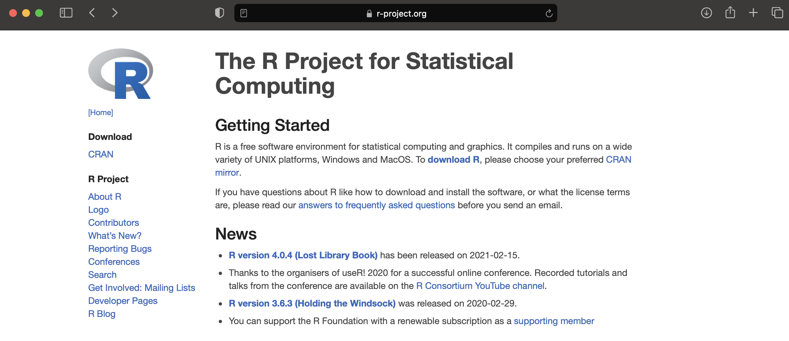
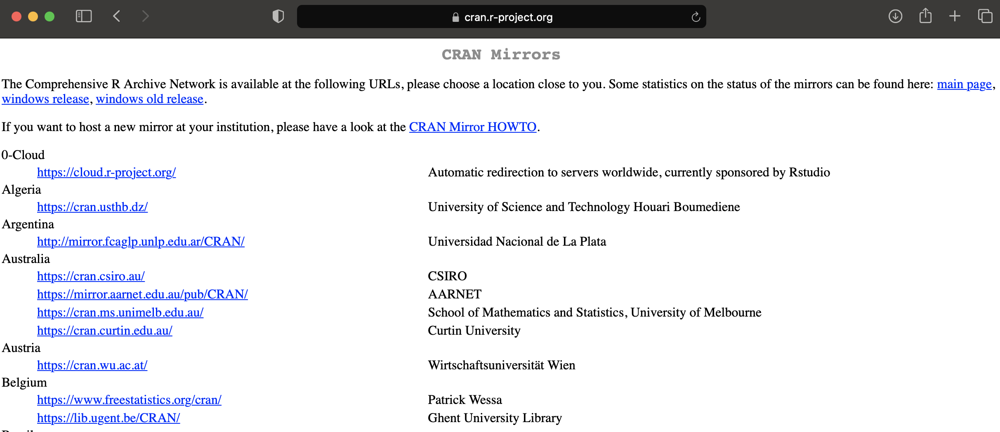
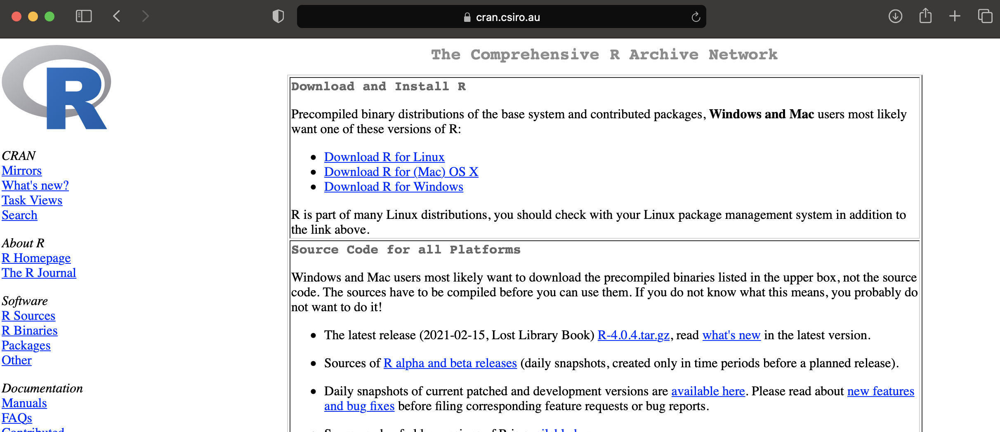
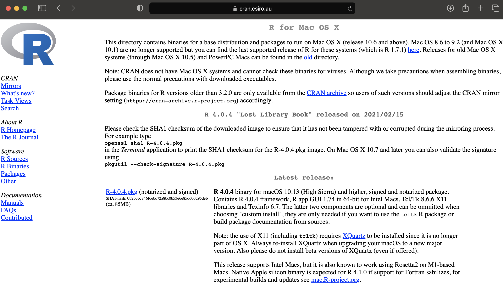
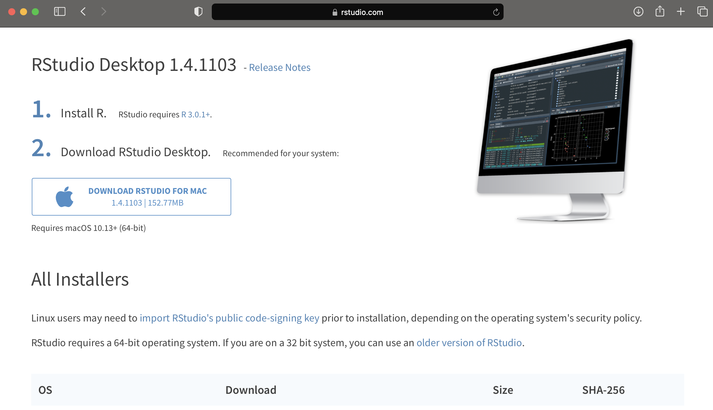

```{r setup, include=FALSE}
knitr::opts_chunk$set(echo = TRUE, warning = FALSE, error = FALSE)
library(learnr)
library(tidyverse)
```


## Introduction

Written by Rohan Alexander.

Welcome to the first module. In this module we focus on getting R and R Studio, and then showing you a couple of motivating examples that you'll soon have the skills to be able to write yourself.

Don't worry too much if the specifics of those examples leave you a little lost - that's normal. If you stick with it then it'll all make sense eventually.

Welcome aboard!

<iframe width="560" height="315" src="https://www.youtube.com/embed/PhljUEN996Y" frameborder="0" allow="accelerometer; autoplay; clipboard-write; encrypted-media; gyroscope; picture-in-picture" allowfullscreen></iframe>


## Getting and setting up R Studio

Written by Rohan Alexander.

### Introduction

In this lesson, you will learn how to:
- download R and R Studio; and 
- become familiar with the major aspects of it.


### Getting R

R can be downloaded for free from the R website: https://www.r-project.org. It's not the most user-friendly website ever built, so I've taken a series of screenshots to help explain things. For you need to click 'download R'. 


```{r, echo = FALSE, out.width="90%"}

```

Then you need to pick a mirror. This is done for largely historical reasons - when the internet was slow it could be faster to get it from a source that was closer. These days it doesn't really matter. Just pick a version from a place that you're familiar with, or if you don't know what to pick then you can use the one that I always use - https://cran.csiro.au/. 

```{r, echo = FALSE, out.width="90%"}

```


You then need to download the appropriate version for you depending on whether you've got Windows, Mac, or Linux. I'll pick Mac, but the next page looks very similar for all three. 

```{r, echo = FALSE, out.width="90%"}

```

At this point, you can click to do the actual download. This will differ depending on exactly when you are following these instructions, but you're looking for something like, 'R-4.0.4.pkg'.

```{r, echo = FALSE, out.width="90%"}

```


After that downloads you can install it on your computer like any other application.

### Getting R Studio

R is different to R Studio and you need to download both. My colleague, Liza Bolton, has a wonderful analogy, which if that R is like a car engine and R Studio is like the car. While it's possible to use a car engine directly, most of us find it helpful to use a car. So we're going to use R Studio to interface with R.

To get started, go to R Studio: https://rstudio.com. Then click on download. 


```{r, echo = FALSE, out.width="90%"}

```


You want R Studio Desktop, which is free. Click download and it should try to guess your operating system and provide the correction option for your set-up. In my case, this is Mac, so I can click 'Download', and then install it like any other application.

```{r, echo = FALSE, out.width="90%"}

```


### Opening R Studio

When you open R Studio, there will be four main panes. On the top left is space for you to write R scripts or R Markdown documents. On the bottom left is a Console where you could write a few lines of R code. On the top right is a Environment panel which will show which datasets and variables you have loaded and some of their key features. Finally, on the bottom right is a file manager. 


There are various options within each of these. Don't worry too much about everything that is going on. When a person steps into a plane cockpit for the first time it can be overwhelming and it's the same here - it's normal to not know where to look. Before too long you'll be navigating around R Studio comfortably.


### Next Steps

The best way to learn R is to use R. In the next lesson we're going to walk you through a couple of exercises of things that you could accomplish with R once you're a little more familiar with it. We hope that you find it motivating and exciting. 


## Hello World! 

Written by Annie Collins.

### Introduction

The purpose of this module is to give you an overview of a task you will be able to accomplish on your own once you gain some more experience using R. You do not need to understand the code; simply follow along and take note of any functions that seem interesting or useful to you!

In this scenario, let's assume we're working for Toronto Public Health and we're looking at data about COVID-19 cases in Toronto throughout the pandemic. Specifically, we want to look at daily case numbers from different sources of infection - community spread, travel, outbreaks, etc. We have data collected by our front-line colleagues at the individual level, but it is slightly messy and contains more information than is relevant for our purposes.

First we need to clean this data - make it as simple as possible and easy to work with - and then we can look into summarizing and examining different variables to draw conclusions about case numbers from different sources of infection.

### Video Walk Through

This video provides a quick walkthrough of the process outlined in the following steps.


The following pages give a closer look at the individual functions and logic behind the loading, cleaning, and summarizing steps taken.

### Load Data

Before we can even access our data, we need to load our R libraries You will learn more about what this actually means later, but for now, think of loading libraries as us telling the computer which tools we need for our upcoming tasks.

```{r libraries, warning = FALSE, message = FALSE}
library(tidyverse)
library(opendatatoronto)
```


Now we will load our data. Since our data is from Toronto Public Health, we are pulling it from the Toronto Open Data Portal and labeling it "covid_data". 

```{r load-data, eval = FALSE, include = TRUE}
covid_data <- 
  list_package_resources("https://open.toronto.ca/dataset/covid-19-cases-in-toronto/") %>% 
  get_resource()
```

```{r, eval = TRUE, include = FALSE}
covid_data <- read_csv(system.file("extdata", "covid_data.csv", package = "DoSStoolkit", mustWork = TRUE))
```

To get an initial idea of the variables (columns) we're working with, we can load the first 20 rows of data and examine its contents and parameters. In R, this takes a form similar to a spreadsheet.

```{r}
head(covid_data, 20)
```


Once all our data is loaded, we can start the cleaning process.

### Clean Existing Data

The first step we will take is changing the "Episode Date" and "Reported Date" columns to a date format instead of a character format. This will allow us to use functions and operations with this data as if it were a date instead of as a string of characters.
```{r date-cleaning}
covid_data$`Episode Date` <- as.Date(covid_data$`Episode Date`)
covid_data$`Reported Date` <- as.Date(covid_data$`Reported Date`)
```

Since we're looking at source of infection, we don't really care about the outcomes of individual cases. We also don't need the "Outbreak Associated" column, since this data is contained (with more detail) in the "Source of Infection" column. To remove these unnecessary rows from our data, we can select only the rows we wish to keep.

```{r remove-columns}
covid_data <- select(covid_data, `Age Group`:Outcome)
```


```{r sounces-infection}
unique(covid_data$`Source of Infection`)
```
If we look at the classifications (unique values) for "Source of Infection", we notice that "N/A - Outbreak associated" is a bit out of place given we have removed the "Outbreak Associated" column. We can replace this classification to more simply read "Outbreak associated".
```{r reassign-outbreak}
covid_data$`Source of Infection`[covid_data$`Source of Infection` == "N/A - Outbreak associated"] <- "Outbreak associated"
```


Given the nature of this data, it is likely that the most recent date's COVID-19 case data has not been recorded in its entirety and is inaccurate or an outlier to some extent, so we will also filter this data out of our data set.
```{r remove-last-date}
covid_data <- filter(covid_data, `Reported Date` < max(covid_data$`Reported Date`))
```


```{r}
head(covid_data, 20)
```

Looking at our data as a whole, we can see that we've restricted the data to only the variables we want to work with, have reassigned the date columns to have type `<date>`, and have renamed an awkward variable classification in "Source of Infection". Now we can summarize our data!

### Summarize Data

In our data, there are generally multiple cases reported per day, and we want to gain a better understanding of our variables across *all* cases reported on a given day. To do so, we will create a summary table from our original data listing the number of cases per source of infection, along with the total number of cases, for each day in our data.

```{r daily-sum}
covid_daily_stats <- 
  covid_data %>% 
  group_by(`Reported Date`) %>% 
  summarise(
    travel = sum(`Source of Infection` == "Travel"),
    healthcare = sum(`Source of Infection` == "Healthcare"),
    outbreak = sum(`Source of Infection` == "Outbreak associated"),
    contact = sum(`Source of Infection` == "Close contact"),
    community = sum(`Source of Infection` == "Community"),
    unknown = sum(`Source of Infection` == "Unknown/Missing"),
    institutional = sum(`Source of Infection` == "Institutional"),
    pending = sum(`Source of Infection` == "Pending"),
    total = n()
    )

head(covid_daily_stats, 30)
```

From this table, we can look at the daily summaries holistically or summarize further, for instance by looking at some summary statistics for daily COVID-19 case totals.

```{r summary-stats}
summary(covid_daily_stats$total)

sum(covid_daily_stats$total)

sum(covid_daily_stats$unknown)/sum(covid_daily_stats$total)
```

Now we know that the highest number of cases observed on a single day in the pandemic thus far is 1003, and that at least half of the recorded dates have seen over 135 cases. We can also see from the second and third calculations that there have been 64,725 in Toronto in total since the beginning of the pandemic, and that cases of unknown origin make up nearly 37 percent of all cases. If we wanted to, we could go on to create graphs from this summary, like total cases per day over time or number of cases per source of infection.

```{r plot}
colors <- c("Outbreak associated" = "red", "Close contact" = "blue", "Community spread" = "purple")
covid_daily_stats %>% 
  ggplot(aes(x=`Reported Date`)) + 
  geom_line(aes(y=outbreak, color = "Outbreak associated"), group=1) +
  geom_line(aes(y=contact, color = "Close contact"), group=1) +
  geom_line(aes(y=community, color = "Community spread"), group=1) +
  labs(x="Reported Date", y="Number of Cases", color="Source of Infection") +
  ggtitle("COVID-19 Cases in Toronto") +
  scale_color_manual(values = colors)
```

### Next Steps

This may all seem very complex and unattainable right now, but when it's broken down step by step (or function by function) it will gradually become easier to see how you can use R to produce your desired statistics, graphics, and analyses.

As you proceed through the following lessons, remember the process outlined here and take note of how powerful simple, individual functions can be when used together in the right context. You may also find it helpful to refer back to this module as an example of different functions used in context, or to see if you can use your new knowledge to reproduce the same results on your own. Good luck!


## Hello World, again! 

Written by Shirley Deng.

### Introduction

In our second scenario, let's assume we've been diligently following social distancing guidelines and staying home amid the pandemic. It's rough not being able to go out and grab food with friends and family, but we make do. As a result, we've been using the SuperNoms app more than usual... but how $much$ more? All the promo codes SuperNoms has been providing recently make for great incentives to order more takeout.

The Identispot music streaming service provides an analysis of users' listening habits at the end of every year, Identispot Unwrapped. We take inspiration from Identispot Unwrapped and track our SuperNoms orders for the month of January. We want to get a feel for our favourite restaurants, our favourite cuisine categories, and see if there are any patterns in our ordering habits - all things we can plot and graph visually.

### Data

Based on our goal, it seems natural that we'd want to take note of our orders' restaurants, cuisine categories, and total cost. With consideration of all the new promotions on the SuperNoms app, we also take note of any discounts applied.

For those unfamiliar with the SuperNoms app, each order can only be made from a single restaurant. Each restaurant is categorized under one style of cuisine, such as Fast Food, Indian, Pizza, or Desserts. Additionally, promotions offered on the app are \% discounts ranging from 10 to 40\% off.

We store this information in a dataframe called `orders`, with variables (columns) `restaurant`, `order_total`, `promo_percent`, and `category` for the information we're keeping track of.

```{r fake-data}
set.seed(334)
sample_size <- 9
order_total <- round(runif(n=sample_size, min=15, max=65), digits=2)
promo_percent <- sample(c(0, 10, 15, 20, 25, 30, 40), size=sample_size, replace=TRUE)
category <- sample(c("Fast Food", "Indian", "Pizza", "Burgers", "Middle Eastern",
                     "Desserts", "American", "Wings", "Bubble Tea", "Caribbean", 
                     "Portuguese", "Filipino", "Cantonese", "Tacos", "Pasta"), 
                   size=sample_size, replace=TRUE)
orders <- tibble(order_total, promo_percent, category)
restaurant <- c("Mystical Noodle", "Wings R Wild", "Mystical Noodle", 
                 "Splenda Marmalade", "Slice of Flames", "Rando's", 
                 "Guajillo", "SharingTea", "Zotto Zotto")
orders <- tibble(restaurant, orders)
orders
```

### Favourites

First, let's take a look at the restaurants we ordered from. We can visualize how many times we're eaten from each restaurant with a bar graph, and see which one was our favourite. There are a variety of ways to do this with R, but here we've made use of the `ggplot2` package's function `geom_bar()`. 

```{r restaurant}
orders %>% 
  ggplot(aes(x=restaurant)) +
  geom_bar(color = "#7570b3", fill = "#7570b3") +
  ggtitle("Restaurants") +
  theme(axis.text.x = element_text(angle = 90)) +
  xlab("Restaurant") + ylab("Count")
```

Looks like we ordered from Mystical Noodle twice as many times as any other restaurant! This doesn't mean much though, since we've only eaten at a total of eight restarants this month, and only once at every other one.

We can do the same with the restaurants' cuisine categories, too.

```{r category}
orders %>% 
  ggplot(aes(x=category)) +
  geom_bar(color = "#66a61e", fill = "#66a61e") +
  ggtitle("Cuisine Categories") +
  theme(axis.text.x = element_text(angle = 90)) +
  xlab("Category") + ylab("Count")
```

Our favourite cuisine category of the month so far seems to be Cantonese, although not by much.

### Patterns

We noted earlier that promo codes may infleunce our ordering habits. We can visualize the relationship between order totals and promo code % discounts with a scatterplot. Again, we make use of the `ggplot2` package, but this time using the function `geom_point()`.

```{r scatter}
scatter <- 
  orders %>% 
  ggplot(aes(x=order_total, y=promo_percent)) +
  geom_point(color = "#1b9e77", fill = "#1b9e77") +
  ggtitle("Promo Code Discount vs. Order Total") +
  theme(axis.text.x = element_text(angle = 90)) +
  xlab("Order Total") + ylab("Promo Code Discount")

scatter
```

At first glance, we don't see any obvious patterns.

But! We can also fit a straight line to the points to help us see any patterns. Here, we do so using the `geom_smooth()` function, again, from the `ggplot2` package.

```{r lm}
scatter + geom_smooth(method="lm")
```

We get a horizontal line, so it seems there isn't any relationship between promo code discounts and order totals. We've only ordered nine times so far, so we just may not have enough data to see a pattern yet. For the sake of data, looks like we're going to have to make more SuperNoms orders!


## The R community

Written by Annie Collins.


### Introduction

Once you've gotten a basic handle on coding in R, there are plenty of ways to extend your learning and practice beyond the classroom. R has a global network of users of all levels and backgrounds, and these users have established a myriad of outlets for connecting with each other and sharing their R expertise, projects, and discoveries.

In this module, we will look at three resources for participating in the R community: **R Weekly**, **R-Ladies**, and **R Meetups**.

### R Weekly

> "R is growing very quickly, and there are lots of great blogs, tutorials and other formats of resources coming out every day. R Weekly wants to keep track of these great things in the R community and make it more accessible to everyone."

R Weekly is a (you guessed it) weekly summary of all things R related: educational resources, new packages, videos, podcasts, examples of real world R use, and much more. All features are compiled and posted each Monday on [RWeekly.org](https://rweekly.org/) as well as delivered in the form of an e-newsletter to email subscribers. R Weekly is a great resource for keeping up to date with developments in the broader R community, as well as share your own projects with a large audience of R users of all levels.

#### Get Involved

- Check out the current and past iterations of R Weekly on their [website](https://rweekly.org/).
- Subscribe to the R Weekly [mailing list](https://feedburner.google.com/fb/a/mailverify?uri=rweekly&loc=en_US).
- Follow R Weekly on their various social media accounts: [Facebook](https://facebook.com/rweekly), [Twitter](https://twitter.com/rweekly_org), [YouTube](https://www.youtube.com/channel/UCVRffxCKJd2qQ6gDcoMPxJQ).

### R-Ladies

> "R-Ladies is a worldwide organization whose mission is to promote gender diversity in the R community."

R-Ladies focuses on increasing the proportion of underrepresented genders in the global R community through encouraging, inspiring, and empowering minority gender (cis/trans women, trans men, non binary, etc.) R users. Their efforts involve creating a global network of R leaders and learners via local meet ups, a directory of individual speaker profiles, and community and network-focused online communication channels (Twitter, Slack, Github, etc.).

#### Get Involved

- Follow @RLadiesGlobal on [Twitter](https://twitter.com/RLadiesGlobal).
- Find your [local R-Ladies chapter](https://www.meetup.com/pro/rladies/) and meet-ups ([R-Ladies Toronto](https://www.meetup.com/rladies-toronto/) is co-organized by the University of Toronto's own Monica Alexander!).
- Contribute to the R-Ladies Global [Github](https://github.com/rladies).
- Join the R-Ladies community [Slack channel](https://rladies-community-slack.herokuapp.com/).


### R Meetups

Online or in-person meet ups are a great way to meet like-minded individuals, exchange knowledge and experience, and develop your R skills and network. As mentioned previously, there are R-Ladies-specific meet ups, as well as a worldwide network of R User Groups, both of which have been sponsored by the R Consortium.

#### Get Involved

- Find your local [R User Group meet up]()
- Join the [Greater Toronto Area (GTA) R User Group](https://www.meetup.com/Greater-Toronto-Area-GTA-R-Users-Group/)
 or [find your local R User Group](https://www.meetup.com/pro/r-user-groups)


## Summary and next steps

Written by Rohan Alexander.

Congratulations on making it this far. Learning a new skill can be intimidating, but the best way to learn R is to use R. I hope that this has given you a taste of what you will soon be able to do. We were all in your position once.

Great job so far, and I hope that you keep at it.


