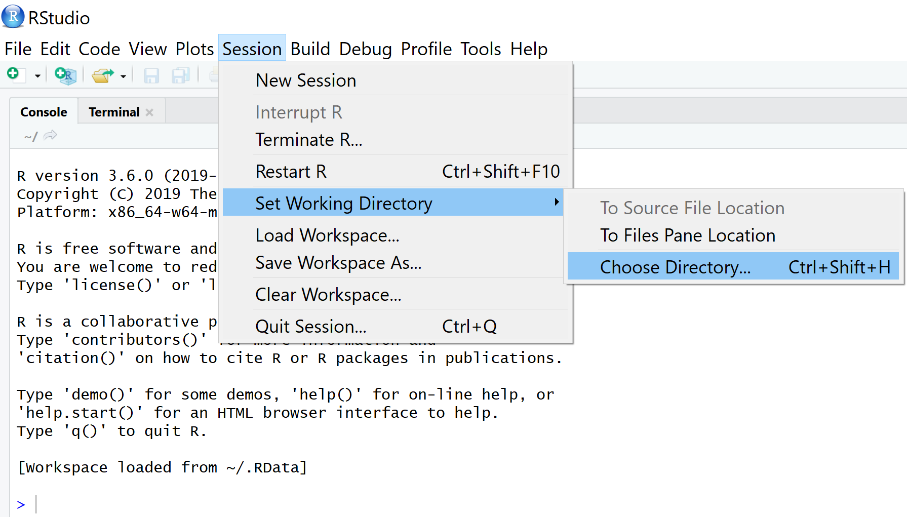
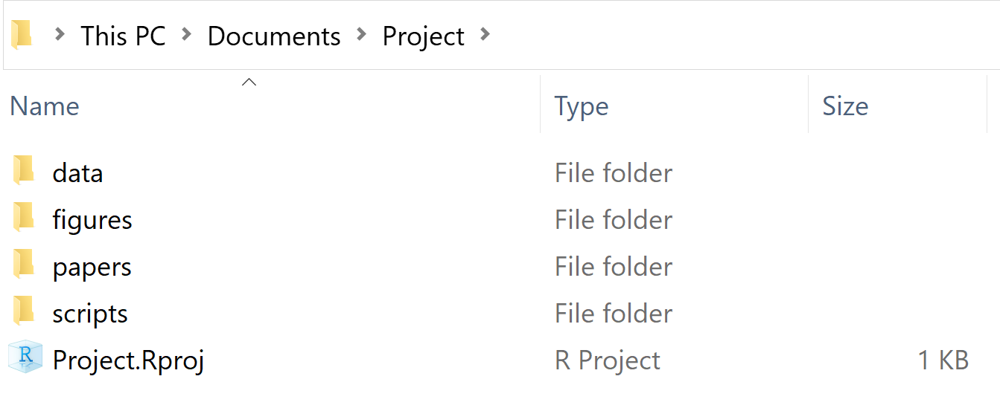
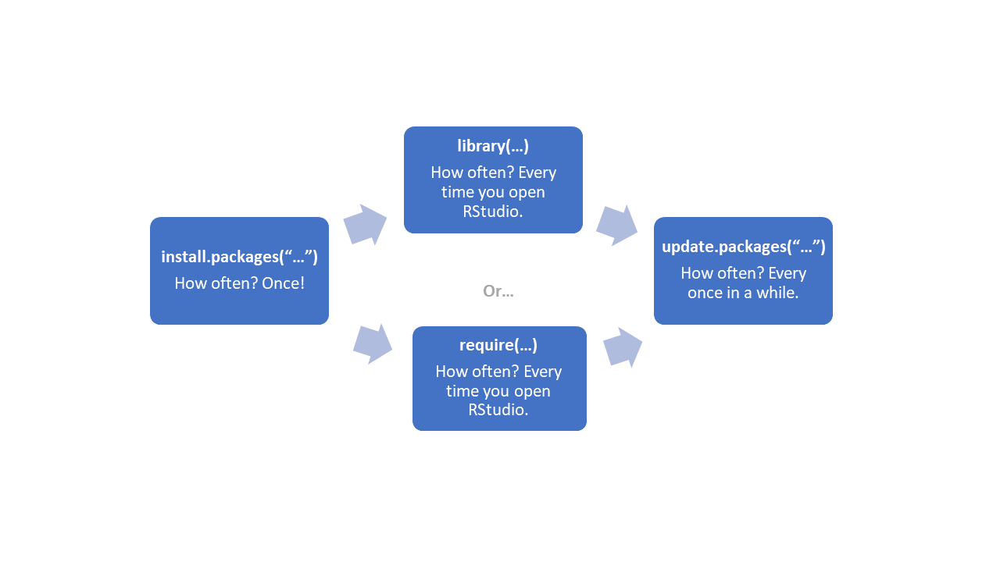

```{r setup, include=FALSE}
knitr::opts_chunk$set(echo = TRUE)

library(tidyverse)
library(learnr)
```


## Introduction

This is a somewhat bitty module. First we go through how to organize your folders and files. Although we've been fairly prescriptive here, think of it more as a default to get you started - you should vary from it as you think best. After that we go through using packages, which are collections of other people's code. And how to write code that is more helpful for other people (even if that person is just future-you) by writing meaningful comments. Finally, we cover how to import data. 

We got the sharks out of the pool - feel free to jump in!

<iframe width="560" height="315" src="https://www.youtube.com/embed/vSuPz7VYG1c" frameborder="0" allow="accelerometer; autoplay; clipboard-write; encrypted-media; gyroscope; picture-in-picture" allowfullscreen></iframe>


## R Projects and setwd()

Written by Isaac Ehrlich.


### Introduction

Whether you want to save a script, load data, or output graphs, RStudio needs to know which folder to look for on your computer. The folder path you use for any given analysis or project is called the **working directory**.   

In this section, you will learn how to set a working directory using the function `setwd()` as well as using **R Projects**, and why Projects may be better for organization and reproducibility.

Some key concepts and functions to keep in mind throughout the section: **working directory**, **R Projects**, `getwd()`, `setwd()`

### The Working Directory

The working directory is the folder path from which you can load or save files.
If say you are working on a project in R/RStudio, your working directory could be the folder containing all files and any  additional subfolders related to your project. Once you've let R know what this directory is, you could refer to (or call) various files contained in your working directory by simply providing the file name in your R script. This is true since the reference to each file is interpreted relative to the working directory. This, on the other hand, implies that files "living" outside this directory would need to be referenced using their full file path, otherwise you get an error. 

You can use the function `getwd()` to find your current working directory.

To change your working directory, you can use the function `setwd()` with the folder path of your new directory as the argument. For example, if I wanted to change my working directory to the folder `C:/Users/Documents/Scripts` I would use the command `setwd("C:/Users/Documents/Scripts")`. Alternatively, you can set the working directory through R's Toolbar and browsing on your computer as shown in the image below (If you choose to do this, note what happens on the R console once you select your folder from the folder menu; you should see the setwd() function executed with your chosen folder path).

```{r, echo = FALSE, out.width="90%"}

```

#### Drawbacks of `setwd()`

If you set your working directory manually in an R session (using either`setwd()` or through the toolbar), it is very likely that the folder path will be unique to your computer. In this case, if you or someone else was attempting to run your code on another device, they would first need to edit the folder path to which the working directory is set. While this is not necessarily critical, it does decreases the usability of your code and the reproducibility of your analysis. To avoid this issue, RStudio has a feature called R Projects, discussed next.

### R Projects

R Projects are a type of file, labelled `.Rproj`, which designate a working directory. When an R Project is open, the working directory is automatically set to the folder path of the Project. Now, the paths that you use to save and load files are all relative to the location of your R Project, rather than specific folder names on your computer. Therefore, instead of using `setwd()`, we encourage you to create an R Project at the beginning of any new project or assignment. This will improve your organization and reproducibility. The image below shows an example R Project setup. We will dicuss recommended folder setup in the following section.

```{r, echo = FALSE, out.width="90%"}

```


#### Creating and Opening R Projects

To create an R Project, go to File, and then select New Project. RStudio will then ask if you wish to create the project in a new or existing directory. If you have already created a folder on your computer, select existing directory. Otherwise, select New Directory/New Project, and then name the project and choose the location to store it on your computer.

To open an R project, you can go to File and select Open Project in RStudio. Alternatively, you can simply double click on the `.Rproj` file in your file explorer. Note, RStudio is capable of running multiple projects at the same time, but not within the same session. If you want to run multiple R Projects, you will need to open a new session.

### Common Mistakes & Errors

If you are using `setwd()`, make sure you are using proper syntax to define the folder path, and that the folder exists. Otherwise, you are likely to get the following error:

```{r, error = TRUE}
setwd("C:This/Folder/Doesnt/Exist")
```

The syntax may vary depending on the operating system of your device.

### Exercises

```{r repojq1, echo = FALSE}
question("R will automatically know where you want to save a file",
answer("True", message = "R might have a default, but it can't read your mind!"),
answer("False", correct = TRUE, message = "Correct! Don't forget about your working directory!"),
allow_retry = TRUE)
```

```{r repojq2, echo = FALSE}
question("If you are using an R Project, the working directory is set to",
answer("your desktop"),
answer("a random folder"),
answer("the folder containing the R Project", correct = TRUE),
allow_retry = TRUE)
```

```{r repojq3, echo = FALSE}
question("To specify the working directory, we recommend you use",
answer("setwd()"),
answer("an R Project", correct = TRUE),
answer("neither setwd() nor an R Project"),
answer("both setwd() and an R Project"),
allow_retry = TRUE)
```

### Key Takeaways & Next Steps

* In order to successfully read and save files, you need to specify a working directory
* Setting a working directory through `setwd()` makes it hard to share and reproduce your analysis
* R Projects are a helpful tool to define your working directory and easily organize your assignments 

In the following section, we will discuss how to set up and organize your folders for a project in R.


## Folder set-up

Written by Isaac Ehrlich.

### Introduction

In this lesson, we will discuss how to set up folders for assignments and projects in R. As the folder structure revolves around your R Projects, make sure you have gone through the section on R Projects as well.

Many assignments and analyses you complete will require multiple files, including data files, code, and written reports. To keep these organized, we recommend using a consistent folder structure system. This will make loading data into your R environment simpler, and will help keep your analyses organized.

### Folder set-up
After creating a folder with an R Project, you will want to create additional sub-folders to keep your materials organized. Ideally, you will have very few files (if any) in the same folder as your R Project - they should instead be stored in sub-folders as in the image below.

```{r, echo = FALSE, fig.height = 2}
knitr::include_graphics("images/folder-setup.png", dpi = 400)
```


We recommend using the following sub-folders:

#### Data/Input Folder
One of the folders you will want to create is the `data` folder. Here, you will want to keep the original and cleaned data files you use in your analysis.

#### Figure/Plot Folder
Whether you are creating your own plots or using pictures and figures from another source, a dedicated `figure` folder will help you keep any images you may want to use organized.

#### Results/Output Folder
If you create any new data sets or have output from your analysis, you will definitely want to keep track of the these. A `results` folder will help keep your output organized.

#### Code/Scripts Folder
If you are completing an assignment in R, you will certainly have written code and scripts you want to save. Whether for cleaning data or running complex analysis, be sure to save these files to a folder containing all of your code.

#### Other/Miscellaneous Folder (If Necessary)
On occasion you may find that you use have files that don't fit into the other folders. Rather than have these files float around your R Project, you may want to create an additional `other` folder and put those files in there.

### Key takeaways
* Sub-folders help keep your files and analysis organized.
* You will typically want to include folders for data, figures, results, and code.
* Remember these are just recommendations! Experiment and figure out what works best for you.

### Exercises
```{r q9, echo = FALSE}
question("You should keep your root directory clean and instead save files to specific sub-folders",
answer("True", correct = TRUE),
answer("False", message = "Remember you'll want to keep your projects organized!"),
allow_retry = TRUE)
```

```{r q10, echo = FALSE}
question("You must have the exact folders described in this section for all your projects",
answer("True", message = "We definitely recommend using them, but make sure to figure out what works best for you!"),
answer("False", correct = TRUE, message = "Remember to figure out what works for you!"),
allow_retry = TRUE)
```

### Next steps
You're well on your way to keeping an organized project! Next we'll talk about how you can use comments to keep your code readable and organized!


## Writing comments

Written by Isaac Ehrlich.

### Introduction

In this lesson, you will learn what a comment is, as well as how and when to write them.

#### What is a Comment?

Comments are lines of plain text written within code files. The general purpose of comments is to explain what is happening in your code and why. The following sections will outline how to write comments and when they should be used.

### Comments

#### Why Comment

When revisiting code you have previously written or when reviewing someone else's code, it is not always immediately clear what the code is doing or how it is working - especially if it is not commented. This makes code difficult to interpret, and hard to edit. By adding comments and explaining what is happening in the code, you make it easier to decipher and understand for when you inevitably return to it in the future.

#### How to Comment

In R, comments are written by adding a `#` before text, typically at the beginning of the line. This means that anything written after the `#` will not be interpreted as code by R, but rather as text. Comments also typically precede the code they are referring to.

```{r}
# Anything following the octothorp is a comment
# Writing code after an octothorp will have no effect, even if properly formatted
```

If you want to comment more than one line of code, you can select the desired lines and then use the shortcut **"ctrl + shift + C"**

#### When to Comment

Comments are typically used to improve the readability of code, either by partitioning code into sections, explaining the code, or providing links to additional resources. Not every line of code needs a corresponding comment, it is up to you to determine when you should write a comment. There are certain instances however that typically benefit from commenting.

1. Defining Code Sections

You can use comments to divide sections of you analysis. Often, you can split a single script into multiple sections, such as setting up the environment, writing functions, and sections of your analysis.

```{r}
# Load Packages
library(tidyverse)
library(learnr)

# Load Data

# Data Cleaning

# Functions

# And So On

```


2. Functions

When you write new functions, its common practice to explain the inputs, output, and purpose of each function

```{r, results = FALSE}
# Functions

addition <- function(x, y)
# The function addition takes numeric inputs 'x' and 'y' and outputs their sum
  sum <- x + y
return(sum)

subtraction <- function(x, y)
# The function subtraction takes numeric inputs 'x' and 'y' and outputs their difference
  diff <- x - y
return(diff)
```

3. Complex Code

While performing operations such as addition or subtraction typically won't require commenting, once your code begins to involve complex chunks and functions, it becomes important to explain what is going on so that you don't need to figure it out again in the future.

4. Providing Reasoning or Linking to Additional Resources

When performing analyses, you may make decisions based on reasoning that is not always evident. In these situations, it is helpful to include a comment explaining the decision you've made. If your code or reasoning also refers to some external source, it may be helpful to provide a link to the source.

### Preamble

Beyond commenting within your code, you may also want to begin each R script with a multi-line comment that provides general information about the contents of the script, also known as a preamble. This preamble may contain information such as the author, date, and purpose of the script.

```{r}
### Example Preamble ###
# Author: Your Name
# Date: The Date
# Contact: Your Email
# Prerequisites: Necessary Data of Folder Set-Up
# Links or Resources
# Purpose
```

### Exercises

```{r commentsq2, echo = FALSE}
question("Comments should be made when (select all that apply)",
answer("dividing code into sections", correct = TRUE),
answer("explaining complex code", correct = TRUE),
answer("explaining a function", correct = TRUE),
answer("linking to resources", correct = TRUE),
answer("describing a decision process", correct = TRUE),
allow_retry = TRUE)
```

```{r commentsq1, echo = FALSE}
question("I only need to comment when my professor asks me to. Comments do not help the author at all",
answer("True", message = "Remember you will need to look back and understand your code too! Comments are a crucial step in organizing and understanding code!"),
answer("False", correct = TRUE, message = "Make sure you comment thoroughly so you can understand your code when you look back on it!"),
allow_retry = TRUE)
```


### Key Takeaways

* Comments are an invaluable way to organize code and improve readability
* Comments are an effective way of explaining code and the decisions made when writing
* Comments help the author just as much as they help other readers!
* Simple commands and lines do not require comments, but make sure to always comment thoroughly where necessary!


## Installing packages from CRAN

Written by Haoluan Chen.

### Introduction

In this lesson, you will learn how to:

- Installing packages from CRAN

Prerequisite skills include:

- setup RStudio
- run R code in the console

Highlights:

- What is a package in R

- What is CRAN

- Install package from CRAN using **install.packages("package_name")** or **install.packages('package_name')**

- Install package in RStudio

### The content

#### What is a package?

R packages are collections of functions or datasets developed by the community. It is shared by the author and allows everyone to re-use. It increases and expands the tools we can use in R for various tasks, including graph generation, data manipulation, and statistical inference.

#### What is CRAN

CRAN stands for Comprehensive R Archive Network. It is the official repository where the packages are located, and you can install them on your computer. All the package in CRAN needs to pass several tests that ensure the package is following CRAN policies. As of June 2019, there were over 14,000 packages available on the CRAN. 

#### How to Install

To install a package from CRAN, you can either run `install.package("**package_name**")` or manually install it in RStudio. 


#### Using code

For example, you may want to install the ggplot2 package. (ggplot2 is a useful data visualization package in r you are likely to use them in the future)

To install, you run the following code in the r chunk or the console:

```{r eval = FALSE}
install.packages("ggplot2")
```


After running this code, you will receive some message on the console and it will start installing the package (this may take a few minutes depending on your system). Then it will tell you that you have successfully installed the package.

Note that for some package it may ask you to input something in the console to complete the installation. You will see this in the installing package from GitHub tutorial.

<iframe width="560" height="315" src="https://www.youtube.com/embed/c-8qOcLyxN4" frameborder="0" allow="accelerometer; autoplay; clipboard-write; encrypted-media; gyroscope; picture-in-picture" allowfullscreen></iframe>


#### In Rstudio 

<iframe width="560" height="315" src="https://www.youtube.com/embed/D8A3Em5WFwU" frameborder="0" allow="accelerometer; autoplay; clipboard-write; encrypted-media; gyroscope; picture-in-picture" allowfullscreen></iframe>

### Exercises

#### Exercise 1

```{r installCRANex1, echo = FALSE}
question("Which code can install the tidyverse package?",
          answer("packages(tidyverse)"),
          answer("install.packages(tidyverse)"),
          answer("install.packages('tidyverse')", correct = TRUE),
          answer("install.package('tidyverse')"),
          allow_retry = TRUE)

```


#### Exercise 2

Please install the tidyverse package on your computer.

<iframe width="560" height="315" src="https://www.youtube.com/embed/COFCB-MGaHw" frameborder="0" allow="accelerometer; autoplay; clipboard-write; encrypted-media; gyroscope; picture-in-picture" allowfullscreen></iframe>


### Common Mistakes & Errors

- You have misspelled the package name
- You missed the quotation mark around the package name
- You missed the s in the install_packages function


### Next Steps

For the next step, you can install the package from CRAN and start using them for your projects. 

Here is a list of useful packages you may be using:

- ggplot2 (create graphics)
- dplyr (data manipulation)
- readr (read data files)
- tidyverse (include packages you are likely to use everyday data analyses. Including all three packages above and more!)
- tidytext (text mining package)
- glmnet (Regularized generalized linear models)
- leanr (create interactive tutorial for R just like this one)

You can also create your own packages! 

CRAN website: https://cran.r-project.org/


## Installing packages from GitHub

Written by Haoluan Chen.


### Introduction

In this lesson, you will learn how to:

- Installing package from GitHub

Prerequisite skills include:

- setup RStudio
- run R code in the console
- Install package from CRAN

Highlights:

- Install packages from GitHub

### The content

#### What is GitHub?

GitHub is a popular repository for open source projects. Many developers can share and collaborate their work with the world. Sometimes, you may need to use the package from GitHub for a specific task.

Note: Unlike the packages from CRAN, there is no review process for Github packages, so you may encounter bugs or errors when using them.  


#### Install packages from GitHub

To install the package from GitHub, you will need the function install_github() in the **devtools** package. devtools contains tools for package developers to build and test their packages. 

So, you need to first install devtools package and load the package in order to use the install_github package. However, a faster way to do that is to run the following code in the r chunk or the console: devtools::install_github("developer name/package name"). The developer name and package name can be found on the top left side of the github repository

This code means that you want to call the devtools package and use the function install_github(). This way, you do not have to install and load the devtools package.

#### Example

https://github.com/sharlagelfand/dmc

The goal of dmc pacakge is to allow you to find the closest DMC embroidery floss colour(s) for a given colour, as well as access colour (hex, RGB) information about DMC colours.

You can run the following code on your console to install this package: 

```{r eval = FALSE}
devtools::install_github("sharlagelfand/dmc")
```


After running this code, you will receive some message on the console and it will start installing the package (this may take a few minutes depending on your system). Then it will tell you if you successfully installed the package.

Note: for some packages, it may ask you to input something in the console to complete the installation. For dmc package, you will see "These packages have more recent versions available. Which would you like to update?" and "Enter one or more numbers, or an empty line to skip updates:" 

<iframe width="560" height="315" src="https://www.youtube.com/embed/hDQKBBWu98k" frameborder="0" allow="accelerometer; autoplay; clipboard-write; encrypted-media; gyroscope; picture-in-picture" allowfullscreen></iframe>

### Exercises

#### Exercise 1

Please install the following package on your RStudio and answer the question

https://github.com/RohanAlexander/AustralianPoliticians


```{r ex1, echo = FALSE}
question("Which code can install above package?",
          answer("devtools::install_github('RohanAlexander/AustralianPoliticians')", correct = TRUE),
          answer("devtools::install('RohanAlexander/AustralianPoliticians')"),
          answer("install_github('RohanAlexander/AustralianPoliticians')"),
          answer("devtools::install_github('AustralianPoliticians')"),
          answer("devtools::install_github('RohanAlexander')"),
          allow_retry = TRUE)

```

<iframe width="560" height="315" src="https://www.youtube.com/embed/WlnawRIELzY" frameborder="0" allow="accelerometer; autoplay; clipboard-write; encrypted-media; gyroscope; picture-in-picture" allowfullscreen></iframe>

### Common Mistakes & Errors

- Pay attention to R console, it may ask you to input something
- Make sure the repository is a R package
- Make sure the spelling of the developer name and package name are correct
- Make sure spelling of the function is correctly called devtools::install_github("developer name/package name")

### Next Steps

For next step, you can install the package from GitHub and start using them for your projects!

In the future, you may want to build your own R package!

R Packages is a book that gives a comprehensive treatment of all common parts of package development and uses devtools throughout. The first edition is available at http://r-pkgs.had.co.nz, but note that it has grown somewhat out of sync with the current version of devtools.


## Loading packages

Written by Mariam Walaa.


### Introduction

In this lesson, you will learn how to:

- Load an R package with the correct syntax
- Understand R's output when you call a package
- Understand what R does when multiple packages use the same function name

Prerequisite skills include:

- Installing packages 

Highlights:

- An R package needs to be loaded in order to use its functions.
- An R package needs to be loaded using the appropriate syntax.
- R provides important details about a package when you load it.
- R has a way of handling packages using the same function name.

### Arguments

The `library()` function takes the following as arguments:

| Argument       | Parameter    | Details                                             |
|----------------|--------------|-----------------------------------------------------|
| package*       | package name | this takes package name in or not in quotations     |
| help           | package name | this displays the help for the specified package    |
| logical.return | Boolean      | this returns a Boolean on whether package is loaded |
| quietly        | Boolean      | this suppresses confirmations if set to True        |
| verbose        | Boolean      | this suppresses diagnostics if set to False         |

*This is a required argument.

If you would like more information about the arguments, please visit the R documentation
for this function
[here](https://www.rdocumentation.org/packages/base/versions/3.6.2/topics/library).

### Overview

Loading packages properly is a necessary aspect of running code in R. Loading a package is
needed in order to be able to use functions in that package.

Some functions are already provided in base R and do not belong to specific packages. You
will see in future tutorials that this is the case for functions such as `lm()` and
`summary()`.

Besides knowing how to load packages and which packages to load, it's important to 
understand what R does when multiple packages use the same function name. This may be the 
cause of many errors you have in your code. There are two common scenarios that may lead 
to errors related to this issue in your code:

1. You don't load a package you need to use a function, but the function name exists in
base R, so R tries to use the base R function but gets into issues since you
probably don't have the appropriate parameters for that function.

2. You load the package you need to use a function, but you load another package after,
and that package contains the same function name and masks* the initial package.

*When R _masks_ a package with another package for a specific function, it is deciding to
use the function belonging to the package that has masked the other package.

The best way to avoid running into this issue is to change the order in which you are
calling the packages so that the package whose functions you need is last, or to let R
know which package you want to use a function from. For example, if you want to use
`select()` from dplyr and not some other package, you can specify `dplyr::select()`.

Here is a visualization to help you understand how often to use the different 
package-related functions. Please note that it is a lot more common to use `library()` 
over `require()`. You can use `require()` if you want your code to continue running even
if the package did not load correctly.

```{r loading-packages, echo = FALSE, fig.height = 4, fig.width = 6}

```
Source: Mariam Walaa

### Exercises

#### Exercise 1

Inspect the output provided when loading `tidyverse` below.

```{r loading-packages-1}
library(tidyverse)
```

```{r loading-packages-exercise-1, echo = FALSE}
question("Which of these are true? Check all true statements.",
          answer(paste("Running `library(tidyverse)` prints out two sections: ",
          "Attaching packages and Conflicts."), correct = TRUE),
          answer(paste("Under `Attaching packages`, R lists the packages that get ",
          "attached (i.e., loaded) to your session when you load tidyverse."), 
          correct = TRUE),
          answer(paste("Under `Conflicts`, R lists any function names that are used",
          " in multiple packages."), correct = TRUE),
          answer(paste("Under `Conflicts`, R also tells you which package 'masks'",
          " another package. The masked package is the package that R uses whenever",
          " you call that function."), message = paste("The masked package is the ",
          "package that R does _not_ use whenever you call the function.", 
          " The package that masks another package is the package that R uses ",
          "when you call a function without specifying which package it comes from.")),
          allow_retry = TRUE)
```

#### Exercise 2

Inspect the output when loading `dplyr` below.

```{r loading-packages-2, include=FALSE}
detach("package:dplyr")
```
```{r loading-packages-3}
library(dplyr)
```

```{r loading-packages-exercise-2, echo = FALSE}
question("Which of these are true? Check all true statements.",
          answer(paste("Running `library(dplyr)` returned a list of function names ",
          "within each masked package."), correct = TRUE),
          answer(paste("The functions listed for a masked package (i.e., `stats`, ",
          "`base`) will not be used by R. R uses the functions from `dplyr` instead."),
          correct = TRUE),
          answer(paste("If the loaded package includes functions with the same ",
          "name as functions from another package, the output will list the name ",
          "of the package that shares those functions."), correct = TRUE),
          answer(paste("This output does not specify which packages have shared ",
          "function names."), message = paste("The output does specify the ",
          "functions that have the same name, along with the package they belong to.")),
          allow_retry = TRUE)
```

#### Exercise 3

Correct the code in order to successfully call the package: `library("tidyverse')`

```{r loading-packages-exercise-3, exercise = TRUE, exercise.eval = TRUE}

```

#### Exercise 4

Select all the true statements about the `library()` function and calling libraries.

```{r loading-packages-exercise-4, echo = FALSE}
question("Which of these are true? Check all true statements.",
       answer(paste("When using `library()`, we can pass the package name with or ",
       "without quotes and the function will work."), correct = TRUE),
       answer(paste("Calling `library(tidyverse)` will load all the packages associated ",
       "with it: `ggplot2`, `tibble`, `tidyr`, `readr`, `purrr`, `dplyr`, `stringr`",
       ", and `forcats`."), correct = TRUE),
       answer(paste("We need to load the `dplyr` package in addition to tidyverse if we ",
       "want to use it along with tidyverse."), message = paste("When we load tidyverse, ",
       "the dplyr package will be loaded along with tidyverse and we do not need to load ",
       "it if we have already loaded the tidyverse package.")),
       answer(paste("We can use functions from a library without loading the library ",
       "first, as long as we have already installed it."), message = paste("A library ",
       "needs to be installed and _then_ loaded in order to use its functions.")),
       answer(paste("We should only load libraries whose functions we'll need in our ",
       "code. Loading libraries we don't need wastes memory."), correct = TRUE),
       answer(paste("When we load a package into an R session, R will always provide ",
       "some output about the package."), message = paste("When we load a package into ",
       "an R session, R may not provide any output for some packages, which is fine. ",
       "The package will still have loaded.")),
       answer(paste("Even if we fail to load a library using `library()` while running a",
       " chunk of code, the remaining code chunk not associated with that library will ",
       "run successfully."), message = paste("If we fail to load a library using ",
       "`library()` while running a chunk of code, the code chunk will stop at that ",
       "line of code and nothing else will run. To run the remaining code even if we ",
       "fail to load a library, we can use `require()` instead.")),
       answer(paste("If we call a function with a name that exists in multiple packages, ",
       "R will assume you want to use the function in that package that you loaded."),
              correct = TRUE),
       allow_retry = TRUE,
       random_answer_order = TRUE)
```

### Video

<iframe width="560" height="315" src="https://www.youtube.com/embed/d_Ro31Ml5fM" frameborder="0" allow="accelerometer; autoplay; clipboard-write; encrypted-media; gyroscope; picture-in-picture" allowfullscreen></iframe>

### Common Mistakes & Errors

Here are some common mistakes and errors you may come across:

- You try to load a package that has not been installed yet.
- You try to use a function from a package that has not been loaded yet.
- You try to load a package but you receive the following error message: `Error in
library(...) : there is no package called ‘...’`. This is most likely due to a typo:
  * You have misspelled the package name (i.e. "tdyverse" instead of "tidyverse")
  * You have not used the correct casing (i.e. "Tidyverse" instead of "tidyverse")

If you run into other issues while trying to load packages, try to restart R, re-install
the package, and load the package again.

### Next Steps

If you would like to learn more about functions for packages, here are some additional
functions you may find helpful:

- You can run `search()` to see currently attached packages.
- You can run `library()` to see currently installed packages.
- You can run `library(help = 'package_name') ` to see package help in RStudio. 
  + This may be faster than searching it up and possibly more up-to-date with the most
  recent version of the package.
- You can run `detach("package:_")` with the package name to detach a package from session.

If you would like to read more about packages, here are some additional resources you may
find helpful:

- Hands-On Programming with R 
  * [Chapter 3: Packages and Help
  Pages](https://rstudio-education.github.io/hopr/packages.html)
  * [Appendix B: R
  Packages](https://rstudio-education.github.io/hopr/packages2.html#packages2)
- CRAN: An Introduction to R
  * [Packages](https://cran.r-project.org/doc/manuals/R-intro.html#Packages)


## Updating libraries

Written by Mariam Walaa.

### Introduction

In this lesson, you will learn how to:

- Update a package using `update.packages()`
- Understand what R outputs when you run `update.packages()`

Prerequisite skills include:

- Installing packages
- Loading packages

Highlights:

- Update packages to avoid running into bugs or missing out on updates.
- R updates all packages with new updates if no packages are specified.

### Arguments

The `update.packages()` function takes the following as arguments:

| Argument | Parameter     | Details                                                |
|----------|---------------|--------------------------------------------------------|
| oldPkgs  | packages      | this updates all packages if no packages are specified |

You can read more about `update.packages()` in the function documentation
[here](https://www.rdocumentation.org/packages/utils/versions/3.6.2/topics/update.packages).

### Overview 

It's important to update packages for the following reasons:

- Stay up-to-date with the most recent version of the package.
- Meet requirements of other packages we are installing.
- Avoid running into bugs or missing out on new features.

You can check if any packages need to be updated in two ways:

1. Go to Tools > Check for Package Updates
2. Run `update.packages()` to get a list of all the packages that have new versions
available.

When you run `update.packages()`, R will ask you if you want to update each of the
packages currently installed one-by-one. Once it's done going through all of your
packages, it will start updating the ones you asked to update. 

Here is a visualization to help you understand how often to use the different 
package-related functions. Please note that it is a lot more common to use `library()` 
over `require()`. You can use `require()` if you want your code to continue running even
if the package did not load correctly.

```{r updating-packages, echo = FALSE, fig.height = 4, fig.width = 6}

```
Source: Mariam Walaa

### Exercises

#### Exercise 1

Run this code in your own RStudio.

```{r updating-packages-exercise-1-output, eval = FALSE}
update.packages()
```

```{r updating-packages-exercise-1, echo = FALSE}
question("Which of these are true? Check all true statements.",
        answer(paste("When you run `update.packages()`, R lists the current version",
        "and the version available to update to."), correct = TRUE),
        answer(paste("R lets you know whether a package has been successfully",
                     "unpacked (i.e., updated)"), correct = TRUE),
        answer("The location of the downloaded packages is provided.",
               correct = TRUE),
        allow_retry = TRUE,
        random_answer_order = TRUE)
```

#### Exercise 2

```{r updating-packages-exercise-2, echo = FALSE}
question("Which is the correct way to update `dplyr` and `ggplot2`?",
         answer("`update.packages(c('dplyr', 'ggplot2'))`"),
         answer("`update.packages(oldPkgs = c('dplyr', 'ggplot2'))`",
                correct = TRUE),
         answer("`update.packages(dplyr, ggplot2)`"),
         allow_retry = TRUE,
         random_answer_order = TRUE
)
```

### Video

<iframe width="560" height="315" src="https://www.youtube.com/embed/AjJjL8Ih5A0" frameborder="0" allow="accelerometer; autoplay; clipboard-write; encrypted-media; gyroscope; picture-in-picture" allowfullscreen></iframe>

### Common Mistakes & Errors

Below are some common mistakes and errors that you may come across while updating packages:

- You try to update a list of packages without properly specifying that list of packages. 
  * Specifically, you try to pass `c("dplyr", "ggplot2")` to `update.packages()` without
  specifying that `c("dplyr", "ggplot2")` belongs to the argument `oldPkgs` explicitly.
  This needs to be done in order for R to know that this is a list of old packages that
  you want to update.
- You receive a pop-up from R asking you `Update?` and you forget to respond with `Yes`,
`No`, or `Cancel`.
- You try to use a function that has been recently changed in a package update and your
currently installed package is out-of-date.

### Next Steps

If you would like to learn more about updating packages in R, here are some additional
functions you may find helpful:

- You can run `old.packages()` to see which of the packages you have are currently out of date.


## Delimited data files with read_csv()

Written by Marija Pejcinovska.


### Introduction

In this lesson, you will learn how to:

- read-in comma-delimited data files using the `read_csv()` function in the `readr` package.

Prerequisite skills include:

- Installing packages, calling libraries.


### Delimited data files in R

Text and .csv files are common file formats for saving various types of data. R allows you to read in such delimited text files in a number of ways.    

In this tutorial we will focus specifically on the `read_csv()` function. 
The function is part of the `readr` package, which itself if part of the `tidyverse` ecosystem of packages. \n

Note: you can get the `readr` package by installing the whole `tidyverse` (install.packages("tidyverse")
) or by installing `readr` directly. To load the package you'll need to use `library(readr)`; alternatively it will be loaded automatically when you load the `tidyverse`. 

As the name suggest the `read_csv()` function is best suited for reading in `.csv` type files. \n 
"**csv**" stands for **c**omma-**s**eparated **v**alues, which means that data entries are separated (or delimited) by commas (in the case where values are separated by semicolons instead, use the function`read_csv2()`). Each row in a csv file is initiated by a newline (or rather a newline character `\n`).   

To begin, let's create our own small (csv looking) text data that we'll read in with the `read_csv()` function. We'll call this object `my_data`

```{r make-csv,echo=TRUE}

# Make sure that each row in the data starts on a new line

my_data <- c("studendID,test1,test2,grade 
         student1,90,85,A
         student2,30,46,F
         student3,70,80,B
         student4, NA,68,C
         student5,NA,NA,F") 


```

We'll read the data by putting `my_data`as an argument inside our function as shown below. 
If instead `my_data` was a `.csv` file somewhere on your computer you would need to provide the location (path) of your file which should look something like `read_csv("my_folder/my_subfolder/my_data_file.csv")`. Run the code below to get a quick sense of what the data looks like once we've called the `read_csv()` function.

```{r first_csv,  exercise=TRUE, exercise.lines=7}

# Read in my_data and save it as an object called my_first_csv_file
my_first_csv_file <- read_csv(my_data)
my_first_csv_file
```

### A closer look at `read_csv()`

To see all the arguments of `read_csv()` you can call `?read_csv()` from your console, and among the many things in the help file you'll notice the following usage description.  

| read_csv(  
|       file,  
|       col_names = TRUE,  
|       col_types = NULL,  
|       locale = default_locale(),  
|       na = c("", "NA"),  
|       quoted_na = TRUE,  
|       quote = "\"\",  
|       comment = "",  
|       trim_ws = TRUE,  
|       skip = 0,  
|       n_max = Inf,    
|       guess_max = min(1000, n_max),  
|       progress = show_progress(),  
|       skip_empty_rows = TRUE  
| )


Here we'll focus on a few of the arguments you are most likely to use:  

- `file`  
- `col_names` 
- `skip`
- `n_max` 
- `na`

### Arguments of `read_csv()`

The argument `file`, as one would expect, indicates the file name you are reading in. In our previous example this was the object `my_data`; we'll see a different example in the exercises.  

`col_names` can either take a logical value, TRUE or FALSE, or a character vector.   
Use TRUE/FALSE to indicate whether the file you are reading in contains column names or not.  

Let's see how this works.  

By default read_csv() sets `col_names = TRUE`, which works great for our particular example since in our data file `my_data` we specified column names.  
What happens if we set `col_names = FALSE` for our file?

```{r col-names1, echo=T, exercise=T}
read_csv(my_data, col_names = FALSE)  


```

You'll notice that R assigns generic variable names. In this case, the columns (or variables) are named `X1` through `X4`.   

But what else do you notice?  

R also assumed that our actual column names (i.e. the very first row of our data) were just part of the data, consequently making all variables of type *character* (since we now have a mix of character and numeric values - visit the tutorial on object types if you need a refresher on this). 
By now you are probably seeing that you should use `col_names` as a logical value only to indicate to R that the data you are reading in does not have a line of column names.  
If you data file does not contain variable names you could specify those using `col_names`, but instead of providing a logical value, you should provide a vector with the variable names; for example, `col_names = c("First Var Name, "Second Var Name")`. This, however, becomes cumbersome for data with too many variables and there might be better solution to manipulate the names. 

The argument `skip` can be used to indicate how many lines should be skipped before reading in data entries. For instance setting `skip = 4` will skip the first 4 lines of the file.  

The argument `n_max`, on the other hand, allows you to control the maximum number of lines read. For instance, setting `n_max=1` would indicate to R to only read a single line of the data file. Note, however, that if `col_names = TRUE` the header of the data file (i.e. the column names) are not counted towards the `n_max` total. For example, setting `n_max=0` will initiate a tibble(data frame) with no entries read, but with the names of the columns preserved. 

Let's see `skip` and `n_max` in action. 
Suppose we modified our `my_data` object and added a few irrelevant entries at the beginning and the end of the object.

```{r my_data_modfified, echo=T}

my_data_modified <- c("Hello, this text is, irrelevant
As is this line
studendID,test1,test2,grade 
student1,90,85,A
student2,30,46,F
student3,70,80,B
student4, NA,68,C
student5,NA,NA,F
student6,LWD,LWD,LWD")


```

Run the following code to read in the data by skipping the first 2 lines and the last (sixth) entry in `my_data_modified`

```{r my_data_modified_read, exercise=T}

read_csv(my_data_modified, skip = 2, n_max = 5)

```

Finally, the argument `na` allows you to indicate whether any special values have been used to encode NAs (i.e. missing values). By default, the function assumes that NAs are defined either by blank spaces or the string NA (see the help file for `?read_csv()`). However, if a data file you are reading in encodes missing values as `-99` or blank spaces, you could just specify that by setting `na=c("-99", "")` in the arguments of the function.


### Exercises


#### Exercise 1 

Let's try a slightly more complicated setting using a variation of our `my_data_modified` object. Suppose your data file has an extra line of records which may have been helpful in the data collection process but is not relevant to your data analysis. Consider the file `my_new_data` below where the additional clarification is provided for each variable but, unlike our earlier example, it is neither at the beginning nor the end of the data file. 

```{r my_data_modfified_2, echo=T}

my_new_data <- c("studendID,test1,test2,grade
(textID),(points out of 100),(points out of 100),(letter grade)
student1,90,85,A
student2,30,46,F
student3,70,80,B
student4, NA,68,C
student5,NA,NA,F")


```


How would you read in the data to retain everything other than the second line of entries? 
You might need to do this in a few steps. Follow the suggestions in the comments to finish the code below (make sure you uncomment the appropriate lines of code)

```{r csv_ex1, exercise=TRUE, exercise.eval=FALSE}
##  Start by isolating the column names using the function names()(to see what the function does . You can do this by reading in the my_new_data object and using the n_max argument.

#my_columns <- names(read_csv( , n_max=))

##  Then, finish the task by reading in the data using the appropriate skip= and col_names= arguments

#read_csv( , skip= , col_names = )


```

```{r csv_ex1-solution}

my_columns <- names(read_csv(my_new_data, n_max=0))

read_csv(my_new_data, skip=2, col_names = my_columns)

```


#### Exercise 2

Let's look at a another data file, this time one that lives online.  
Consider the following data about gifts given between 1999 and 2018 to U.S. federal employees from foreign government sources. The raw data can be found at https://raw.githubusercontent.com/tacookson/data/master/us-government-gifts/gifts.csv . We'll use the url to read it in. 


```{r real_data_read, exercise=TRUE, message = FALSE, warning=FALSE, exercise.timelimit=240}
read_csv("https://raw.githubusercontent.com/tacookson/data/master/us-government-gifts/gifts.csv")
```


**Part A**
Using the appropriate arguments, read in only the first 100 records of these data

```{r csv_ex2_gifts1, exercise=TRUE, message = FALSE, exercise.timelimit=240}

```


```{r csv_ex2_gifts1-solution, message = FALSE}
read_csv("https://raw.githubusercontent.com/tacookson/data/master/us-government-gifts/gifts.csv", n_max=100)
```

**PART B** 
Suppose we only want to read the records starting with the year 2000 and we know that the first 330 (not including column names) entries are from the 90s. Use the appropriate arguments to read in the data in this case. 

```{r csv_ex2_gifts2, exercise=TRUE, message = FALSE, exercise.timelimit=240}

```

```{r csv_ex2_gifts2-solution, message = FALSE}
my_cols <- names(read_csv("https://raw.githubusercontent.com/tacookson/data/master/us-government-gifts/gifts.csv", n_max=0))
read_csv("https://raw.githubusercontent.com/tacookson/data/master/us-government-gifts/gifts.csv", skip=331, col_names=my_cols)
```


### Common Mistakes & Errors

- When importing your data using `read_csv()` make sure that the path to the file to be read is correctly specified and that, in addition, no spelling mistakes have been made.  

- Make sure that the data file is really missing column names before you proceed to change the `col_names` argument. 


## Summary and next steps

Written by Rohan Alexander.

In this module, we covered a bunch of things that will be useful as you get more into it. You'll not need all of it immediately, but come back and revisit it from time to time.

Great work! In the next level we get stuck into the core functions of the tidyverse! Where are my pliers?


