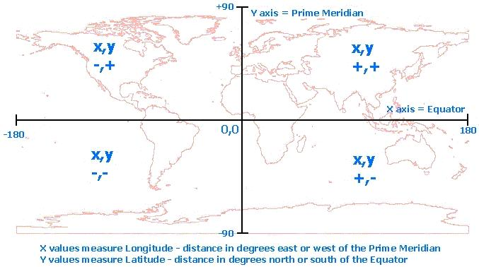
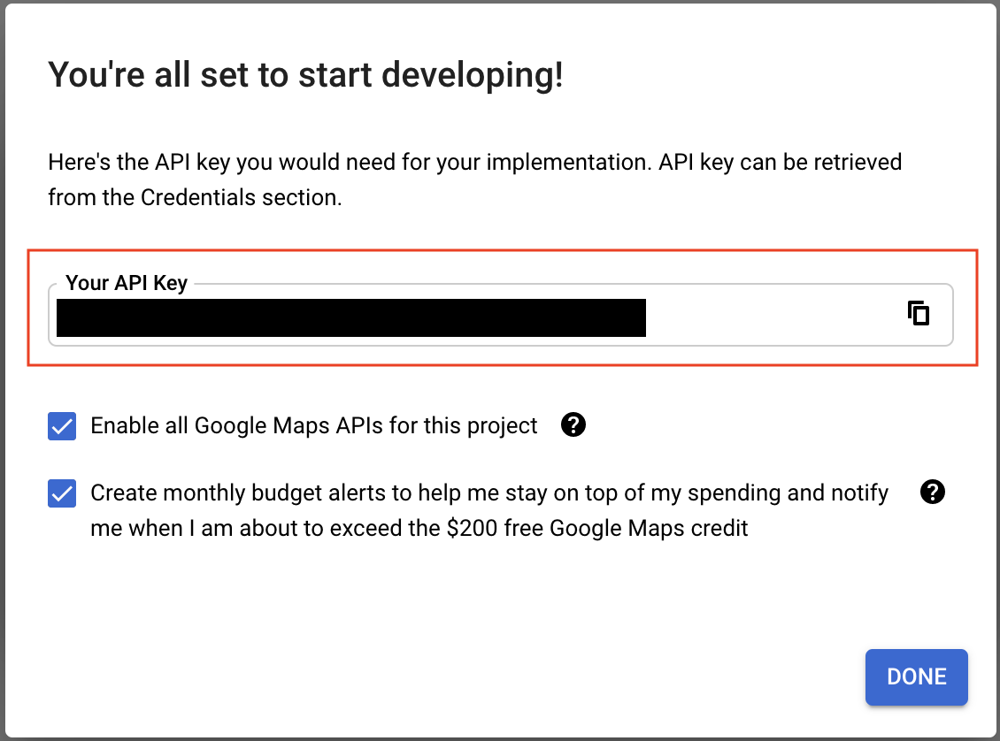
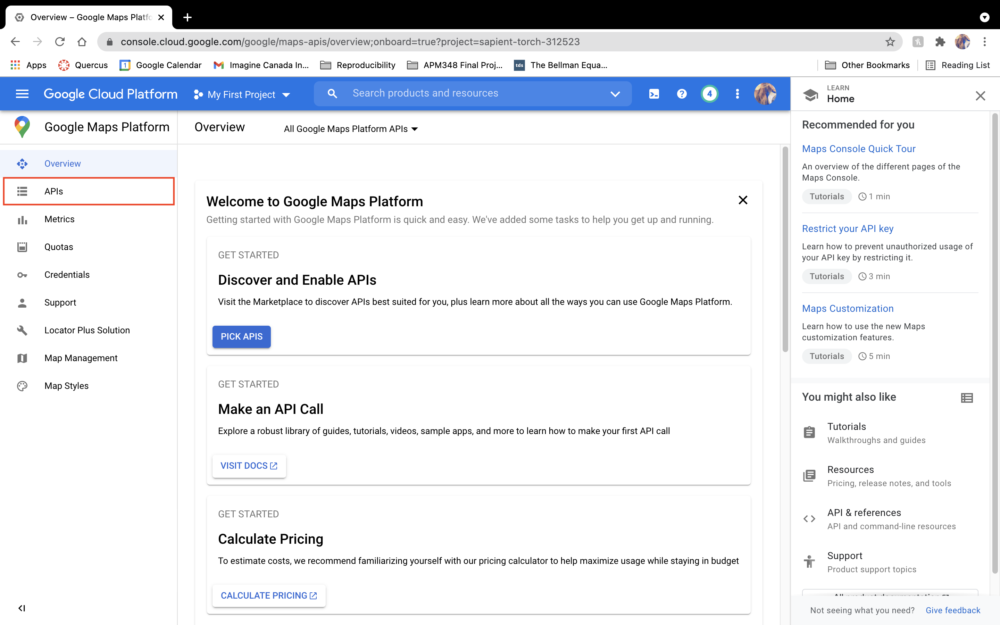
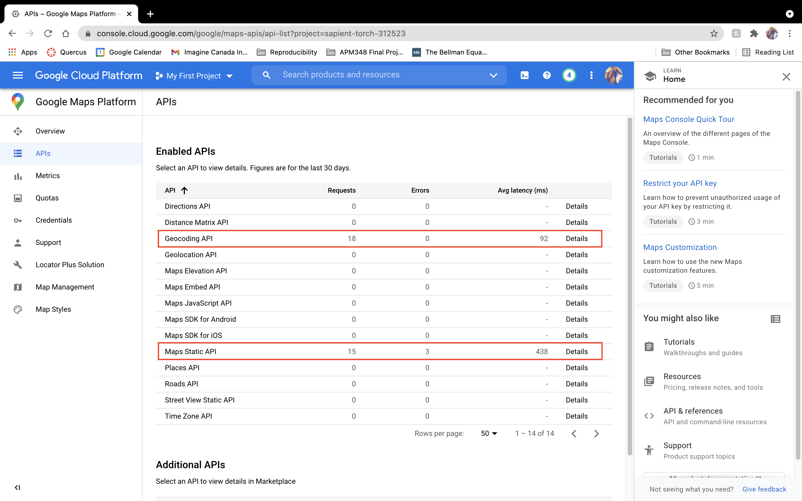
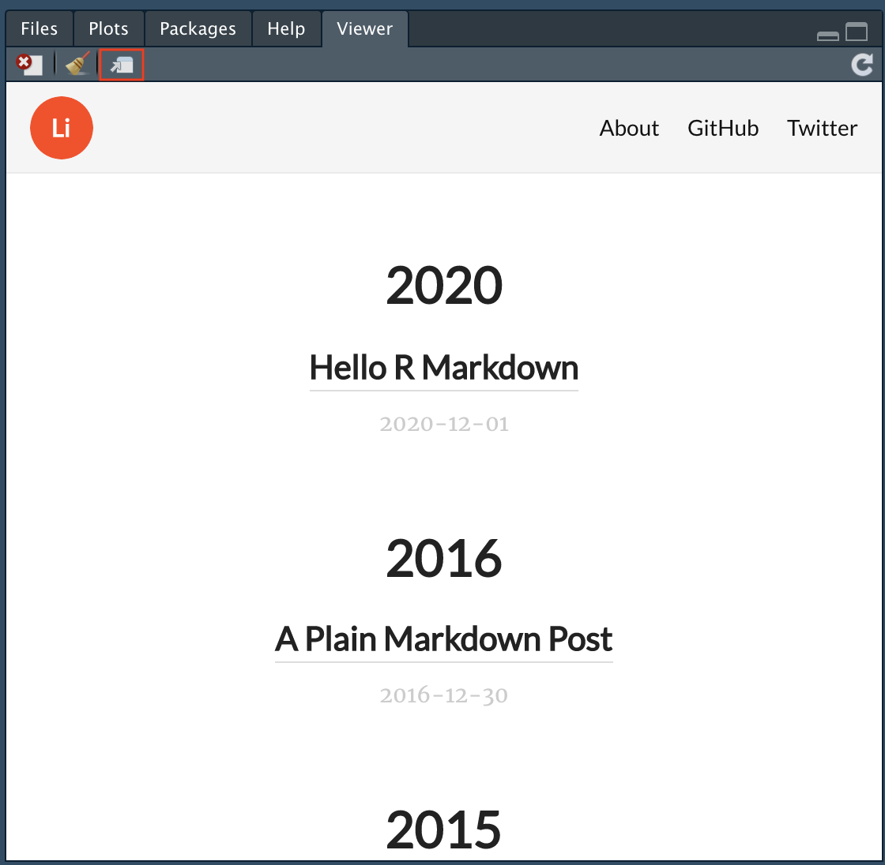
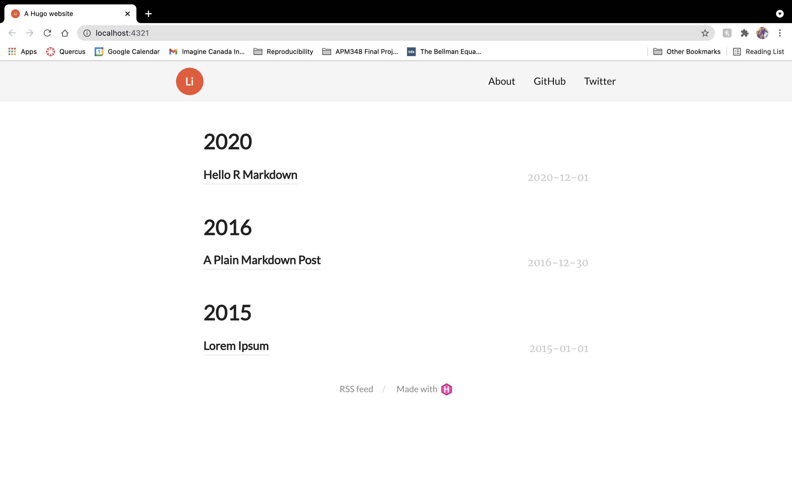
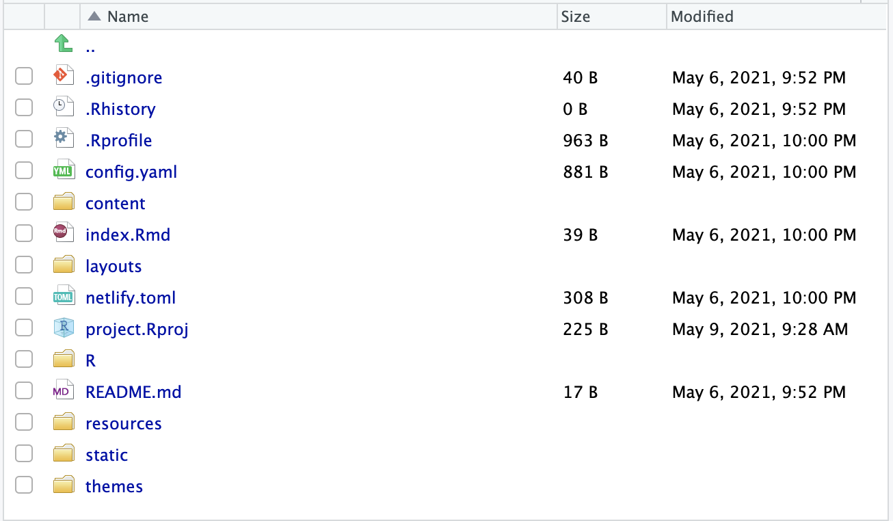
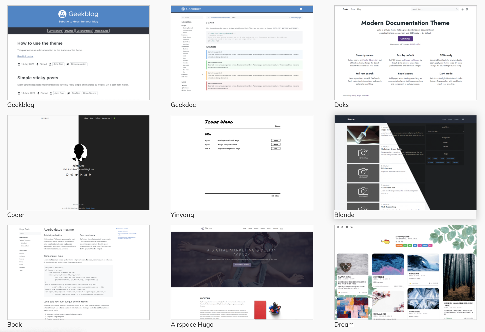

```{r setup, include=FALSE}
knitr::opts_chunk$set(echo = TRUE)

library(tidyverse)
library(learnr)
# tutorial_options(exercise.eval = FALSE)
library(flair)
library(gradethis)
library(sortable)
gradethis::gradethis_setup()
# library(palmerpenguins)
library(ggmap)
```


## Introduction

Written by Rohan Alexander.

In this module, we are going to go through various aspects that are, and there's no word for this other than, magical. We learn R because we're forced to for a class or work, or because we have some problem that a 'friend' says we should solve in R. Eventually we get better at it, but it's a slog. But when you get to this module, we start to see the power of the foundation that we've established.

We will be able to make websites using R! We will be able to make interactive applications using R. After using countless packages throughout these modules, we'll even be able to write out own packages! There are also a few aspects around style that are worth addressing at this point, and so there is also a lesson on that. 

For me, it was when I got to this type of content, that I started to really 'get' R. And I hope that you feel similarly.


## Coding style

Written by Marija Pejcinovska

By now you've probably worked through dozens of modules and are feeling a lot more comfortable coding in R. This is a good spot to spend a moment or two thinking about your coding style. A good style will help you keep your R scripts consistent and easy to read (and, of course, easier to navigate through when you revisit them at a later time). In this lesson we'll focus on the coding style used throughout the `tidyverse`. More specifically, we will highlight some naming conventions for objects and functions and discuss useful structures that will make your programs easier to write and read.


Prerequisite skills include:

- Some data manipulation
- The tidyverse
- Writing basic functions and conditional statements 


### Naming things: the tidy way

#### Naming files 

In a previous lesson you learned how to set up folders and organize files in your R projects. Here we'll talk about a few things you might want to keep in mind when naming your R files.  

  * Make sure your file have meaningful (though if possible also relatively short) names that end in `.R`. 
  * Try sticking to a specific capitalization. The tidyverse style recommends using lower case letters.
  * Avoid spaces and special characters. Consider separating words in a file name by using `_` or `-`. 


```{r file_names, echo=TRUE, eval=FALSE}

# A good example of file name

my_first_script.R

# And a few bad (and less than ideal) examples

my first script.R   # there should be no spaces
myfirstscript.R     # not a terrible file name but hard to read; 
my_first_script.r   # r should be capitalized
file1.R           # not descriptive enough
models&results.R          # contains special characters


```


#### Naming objects

Just like with file names, you should name your R objects using descriptive and informative names. Here are some guidelines to keep in mind:

  - Object and function names should start with a letter (and not a number)!
```{r, echo=T, eval=F}
# Good 
group_1
# or
group_one

# Bad 
1st_group
```
  
  - Names should include only letters, numbers, `_`, and `.`. Though, you should probably decide on a single separator; pick either `_` or `.` to be somewhat consistent and follow basic conventions.
  - Since classes and methods in the S3 object system use dots, to avoid confusion, it might be best to use `_` in your function names. 
  - In fact, the tidy style guide, in general, recommends using `_` to separate words both in function names and object names. Separating lowercase words with `_` is sometimes referred to as using *snake_case*.
  - To avoid errors, names should be kept as short as possible.
  - When naming your functions consider using active verbs 
  
```{r fun1, eval=FALSE}
# Okay function names
permute()
count_event()

# Less okay
permuatation()
event_counter()

```

  - Typos and cases matter; so, be careful when calling your objects and functions. Sometime errors in your code can be misspellings. 
  - Avoid re-using names of common R functions and variables. For instance, avoid naming objects `T` or `F` since R reserves these for `TRUE` and `FALSE`.
  

  
### Tidying up your "syntax"

#### Commas and spaces

Many of the syntax rules in the English language are applicable to R coding. Commas and spaces are a good example of this. 

  - Place spaces after commas, but not before them (just like you would when you write).
```{r, eval=FALSE}
# Good 

B[, 2]

# Not so good

B[,2]
B[ ,2]
B[ , 2]

```
  
  - Avoid putting space between your function name and the arguments in parenthesis when calling your function  
  
```{r, eval=FALSE}

# Do
sum(x)

# Don't

sum (x)
sum( x )
```
  

  - When using conditional (`if`, `for`, `while`) statements separate the condition expression in `()` by placing space around `()`
  
```{r, eval=FALSE}

# Good

while (i < 10) {
  print(i)
}

# Not so good

while(i<10){
  print(i)
}

```
  
  - *Infixed* operators (i.e. those placed between operands), such as `==`, `+`, `-`, `<-` and so on, **should always** be surrounded by spaces:
  
```{r, eval=FALSE}

# Good
my_var <- y + 24 + (x * 0.5)


# Not great

my_var<-y+24+(x*0.5)
```

  - There are, however, a few exceptions to the above rule. *Operators with high precedence*, such as those that access stuff in a namespace (`::`, `:::`), those used for extracting slots or components (`$`, `@`), those used for indexing (`[]`, `[[]]`), the exponentiation operator (`^`), or the sequence operator (`:`) *should not* be surrounded by space.
  
```{r, eval=FALSE}

# Good
x <- data$height
y <- 1:20
z <- x^2

# Bad
x <- data $ height
y <- 1 : 20
z <- x ^ 2

```
  
#### Curly braces and code hierarchies

  - When writing functions and conditional statements which are not short or simple you would need should be pacing your code in a block sectioned off by **curly braces**. Enclosing the "body" of your function or conditional statement inside curly braces allows one to more easily see the hierarchy of a piece of code. There are few things to keep in mind here: 
    + `{` should be the last character on a line. Once you open the left squiggly bracket start the actual body of the code in a new line. 
    + The code content inside the curly braces should be indented by two spaces. By skimming the left-hand margin, this way you'll be able to see the hierarchy of the code block more easily
    + When you are done with specifying the code that defines your function or conditional statement place the closing curly brace on a new line, so that it's the first character on the line. In fact, unless it is followed by `else {`, the closing curly brace should be on its own line.
    
```{r, eval=FALSE}
# Good
if (x < 3) {
  exp(x)
} else {
  x^3
}

if (i < 10){
  if (x > 0){
    y = log(x)
  } else {
    y = x
  }
} else {
  message("i is too large")
}


# Not so good
if (x < 3) {
  exp(x)
} 
else {
  x^3
}

if (i < 10){
  if (x > 0){
    y = log(x)
  } else {
    y = x
  }
} else {
  message("i is too large")
}


```
    


#### Few other notes on syntax

  - Avoid using semicolons (`;`) at the end of a line of code. 
  - Avoid putting multiple commands on one line; hence, avoid using semicolons to separate multiple commands on one line! 
  - You can use `<-` or `=` for assignment in R, however, the tidyverse style guide strongly advocates for consistently using `<-` for value assignment.
```{r}
# Do
my_var <- 7

# Maybe don't do
my_var = 7
```
  - The pipe operator,` %>% `, should be preceded by space and should usually be followed by a new line. Just like indentation in code blocks the code following a pipe should be indented by two spaces.
```{r, eval=FALSE}
# Good
data %>% 
  filter(x > 10) %>% 
  group_by(my_cat_var) %>% 
  summarize(my_sum = sum(my_other_var)) %>% 
  ungroup()

# Not so good
data %>% filter(x > 10) %>% group_by(my_cat_var) %>% summarize(my_sum = sum(my_other_var)) %>% 
  ungroup()

```
  


### Exercises

```{r style_q1, echo=FALSE}
question("Which one of these follows the tidy style?",
         answer("x<-3"),
         answer("x=3"),
         answer("x <- 3", correct = TRUE),
         answer("x < - 3"))
```


```{r style_q2, echo=FALSE}
question("Select the appropriately styled line of code?",
         answer("here::here(\"data/my_file.R\")", correct = TRUE),
         answer("here::here (\"data/my_file.R\")"),
         answer("here ::here(\"data/my_file.R\")")
)
```


### Next Steps

This tutorial is largely based on content in the tidyverse style guide. For more detailed information check out: https://style.tidyverse.org/


## Static maps using `ggmap`

Written by Annie Collins.

### Introduction

> `ggmap` is an R package that makes it easy to retrieve raster map tiles from popular online mapping services like Google Maps and Stamen Maps and plot them using the ggplot2 framework

Now that you're familiar with `ggplot2` and its plotting capabilities, we can start looking at some more advanced data visualization options. Next up: maps.

In this lesson, you will learn how to:  

- Use `ggmap` to plot geospatial data over maps; and
- Access Google Maps APIs to extend `ggmap`'s functions to Google Maps as well.

Prerequisite skills include:

- Familiarity with `ggplot2` and its plotting functions, specifically `geom_point()` and `stat_density2d()`.

### Package

Unless you have worked with `ggmap` before, you will likely have to install the package from GitHub (it is also available from CRAN, but GitHub contains the most up-to-date version which is important in this case given that the package works with external APIs).

```{r, eval=FALSE}

devtools::install_github("dkahle/ggmap")
library(ggmap)

```

### Backgrounds

Much like the way you build a plot in `ggplot2`, `ggmap` plots are constructed by adding to your plot feature by feature, starting with a map background. `ggmap` allows you to use map backgrounds from two different sources: Google Maps and Stamen. Both offer several options for aesthetics and customization and are fairly similar in their use. Google Maps requires access to Google APIs (see *Google Maps API* below) while Stamen Maps authentication is built into the package, so we will focus on Stamen backgrounds for the purpose of this lesson.

For a Stamen Map background, we use the function `get_stamenmap()`. This function takes several arguments that allow you to customize the appearance and format of your map, but most importantly you must state the boundaries, scale, and type of your map. The object produced by `get_stamenmap()` then gets passed to the `ggmap()` function which allows you to view the map in the "Plots" tab as well as display data on top of it.

| Argument | Parameter | Details |
| -------- | --------- | ---------------------|
| bbox | vector | A vector stating the locations of the corners of your desired map in the format c(lower left longitude, lower left latitude, upper right longitude, upper right latitude) |
| zoom | numeric | Level of zoom into focus area |
| maptype | string | Aesthetic of map produced. Options are: "terrain", "terrain-background", "terrain-labels", "terrain-lines", "toner", "toner-2010", "toner-2011", "toner-background", "toner-hybrid", "toner-labels", "toner-lines", "toner-lite", and "watercolor". |

See `?get_stamenmap` for additional arguments and details.

```{r stamen-map-1, message=FALSE, warning= FALSE, exercise = TRUE}
# Houston, Texas
# Also try the additional maptypes listed above
map <- get_stamenmap(c(-95.39681, 29.73631, -95.34188, 29.78400), zoom = 15, maptype = "toner")

ggmap(map)
```

**Tip**: If you don't know the exact coordinates of the map you wish to use as a background, clicking anywhere on [Google Maps](https://www.google.com/) will give you the longitude and latitude of the selected location.

One thing that is important to know is that when loading map backgrounds we are working with longitude and latitude coordinates in **decimal degree** format. It is important to take note of the relative values of coordinates when defining map boundaries, and these will change depending on which hemisphere you're in. In North America (the northern and western hemispheres), the lower left hand corner of the map will always be the smaller longitude value (farthest west) and the smaller latitude value (farthest south). The image below might help you to visualize the relationship between coordinate values.

```{r, out.width="75%", echo=FALSE, fig.cap="Source: Esri"}

```

### Plotting Data

Now we can start to visualize some data on top using our familiar `ggplot2` functions. We will be using the data set `crime` that is built into the `ggmap` package. Any data used with `ggmap` must have variables for longitude and latitude coordinates in decimal degree format for each observation, as these serve as the x and y coordinates when graphing on top of a map background.

A useful way to visualize data in this context is a scatterplot using `geom_point()`.

```{r 64-crime-scatter, message = FALSE}
# Filter out data points that fall outside of our mapped area, and thefts (which we will look at separately later)
local_crime <- ggmap::crime %>% filter(-95.39681 <= lon & lon <= -95.34188, 29.73631 <= lat & lat <=  29.78400, offense != "theft")

map <- get_stamenmap(c(-95.39681, 29.73631, -95.34188, 29.78400), zoom = 15, maptype = "toner")

ggmap(map) + geom_point(data = local_crime, aes(x=lon, y=lat, colour = offense)) + 
  ggtitle("Crimes Reported in Houston, Texas, 2010") +
  xlab("Longitude") +
  ylab("Latitude")
```

For crimes that appear very frequently in the data set, it might be more useful to use a heat map to track density instead of individual reports. We can see what this looks like using the thefts from the `crime` data set.

```{r 64-crime-density}
# Filter out data points that fall outside of our mapped area, and all offenses except theft
local_theft <- crime %>% filter(-95.39681 <= lon & lon <= -95.34188, 29.73631 <= lat & lat <=  29.78400, offense == "theft")

ggmap(map) + stat_density2d(data = local_theft, aes(x=lon, y=lat, fill = ..level.., alpha = 0.5), geom = "polygon") + 
  scale_fill_gradient2(name = "Thefts") +
  ggtitle("Density of Thefts Reported in Houston, Texas, 2010") +
  xlab("Longitude") +
  ylab("Latitude")

```

Like `ggplot2`, `ggmap` also works with `facet_wrap()`. Suppose we want to compare aggravated assaults and auto theft in Houston.

```{r 64-crime-density-facet}
assault_auto <- crime %>% filter(-95.39681 <= lon & lon <= -95.34188, 29.73631 <= lat & lat <=  29.78400, offense == "aggravated assault" | offense == "auto theft")

ggmap(map) + stat_density2d(data = assault_auto, aes(x=lon, y=lat, fill = ..level.., alpha = 0.4), geom = "polygon") + 
  scale_fill_gradient2(name = "Reports") +
  ggtitle("Density of Crimes Reported in Houston, Texas, 2010") +
  xlab("Longitude") +
  ylab("Latitude") +
  facet_wrap(~ offense)

```

### Exercises

To get you comfortable working with `ggmap`'s syntax and plotting capabilities, you're now going to build a map of COVID-19 testing locations in Toronto from the data set `covid_testing_locations` which has columns *long* and *lat*.

```{r, include=FALSE}
covid_testing_locations <- read_csv("64-covid-testing-locations.csv")
```
```{r}
head(covid_testing_locations)
```

#### Exercise 1

Your first task is to load the background of the map. The key to doing so correctly is to establish the correct boundaries for the map in terms of longitude and latitude coordinates, then load a map from Stamen Maps and save it under the name `toronto_map`. Complete the code below to create a background map of Toronto that will appropriately display the data (use zoom 10 and maptype "terrain").

```{r ggmap-exercise-1, exercise=TRUE, message=FALSE}
toronto_map <- ...

ggmap(toronto_map)
```
```{r ggmap-exercise-1-hint-1}
# Use the max() and min() functions to determine the farthest north, south, east, and west of the coordinates in the data
max(covid_testing_locations$long) # Farthest east
min(covid_testing_locations$long) # Farthest west
max(covid_testing_locations$lat)  # Farthest north
min(covid_testing_locations$lat)  # Farthest south
```
```{r ggmap-exercise-1-hint-2}
# Solution
toronto_map <- get_stamenmap(c(-79.82364, 43.52281, -78.85145, 44.09669), zoom=10, maptype="terrain")
```
```{r, include=FALSE}
toronto_map <- get_stamenmap(c(-79.82364, 43.52281, -78.85145, 44.09669), zoom=10, maptype="terrain")
```


#### Exercise 2

Using `toronto_map` as defined above and your knowledge of `ggplot2`, complete the code below to construct a map that shows each COVID-19 testing location as a dot, with the dots coloured according to the type of assessment center they are.

```{r ggmap-exercise-2, exercise=TRUE, message=FALSE, warning=FALSE}
ggmap(toronto_map) + ...
```
```{r ggmap-exercise-2-hint-1}
ggmap(toronto_map) + geom_point(data=covid_testing_locations, aes(...))
```
```{r ggmap-exercise-2-hint-2}
# Solution
ggmap(toronto_map) + geom_point(data=covid_testing_locations, aes(x=long, y=lat, color=locationType))
```

#### Exercise 3

Finally, display several maps comparing the *density* of different types of testing locations. Title your plot "COVID-19 Testing Centers in Toronto, Ontario".

```{r ggmap-exercise-3, exercise=TRUE, message=FALSE, warning=FALSE}
ggmap(toronto_map) + ...
```
```{r ggmap-exercise-3-hint-1}
ggmap(toronto_map) + stat_density2d(...) + ...
```
```{r ggmap-exercise-3-hint-2}
ggmap(toronto_map) + stat_density2d(...) + facet_wrap(...)
```
```{r ggmap-exercise-3-solution}
# Solution
ggmap(toronto_map) +stat_density2d(data=covid_testing_locations, aes(x=long, y=lat, fill=..level.., alpha=0.5), geom="polygon") + 
  facet_wrap(~locationType) +
  ggtitle("COVID-19 Testing Centers in Toronto, Ontario")
```


### Google Maps APIs

In addition to Stamen Maps, `ggmap` can draw on Google Maps APIs for its Google Maps backgrounds, and in order to do this you must first register with Google. This involves creating an account if you do not already have a Google account, as well as registering a valid credit card (it will not be charged unless you select an account upgrade that requires payment).

To begin, go to the Google Maps Platform [website](https://cloud.google.com/maps-platform/). Follow the instructions to register an account and a payment method (credit card), and you will receive an **API key**. This is important! You need to register this within R and RStudio using the following code:

```{r, echo=FALSE, out.width="50%"}

```

```{r-enter-API-code}
register_google(key = "[your key]", write = TRUE)    # Copy and paste your API key in quotations
```

You also want to make sure that you don't share this key with anyone since it is private and personal to each user, so keep this in mind if you're sharing your code anywhere.

Once you've gained access to the Google Maps Platform you will need to enable the relevant APIs: Geocoding and Maps Static. These are the APIs that work with the functions in `ggmap`, specifically `get_googlemap()` (analogous to `get_stamenmap()`), `geocode()`, and `revgeocode()`. These functions cannot be demonstrated within this module until you have access to the appropriate APIs, but the [ggmap repository README](https://github.com/dkahle/ggmap) contains some examples and resources for using Google Maps with `ggmap`.

```{r, echo=FALSE, out.width="100%"}

```
```{r, echo=FALSE, out.width="100%"}

```


### Next Steps

- Once you have the Google Maps APIs working on your system, repeat the above exercises using `get_googlemap()` in place of `get_stamenmap()`;
- Use `ggimage` to create more complex icon maps (check out this [tutorial](https://www.littlemissdata.com/blog/iconmap) from R user and data scientist Laura Ellis);
- Check out the `usmaps` package for more mapping functions specific to the United States.


## Writing R Packages

Written by Matthew Wankiewicz.

### Introduction

While working on projects, you may get to the point where you want to create your own package in R. This package could be as simple as containing a temperature converter between Fahrenheit to Celsius or could contain a web-scraper which helps you get data you would like to analyze. This lesson will help go over the basics of creating a package in R.

Before we begin, be sure to have the `devtools` and `roxygen2` packages installed as they are very useful when creating packages. 

While there are a few different ways to create package in R, the method we will look at in this lesson is great for getting started.

### Steps for Making a Package in R

1. After you have installed `devtools` and `roxygen2`, create a new R project, then click new directory and then R package. Here you will name your R package and include any files to the creation of the package. Once you have selected any files, click "Create Package" to make the package. 

2. Now that the package has been created, there will be files located in the lower right-hand corner. The files include: "DESCRIPTION", "man" and "R". "DESCRIPTION" is where you can tell users about your package, including the name, description, and author. Next, the "man" folder is where you describe the functions in your package. These files are saved as ".Rd" files which stands for R documentation. The descriptions include the name, usage, description and a few examples of the functions. Lastly, the "R" folder will contain R scripts where you will write your functions. 
    - You can create as many functions as you want, just make sure that there is a ".Rd" file for each of the functions you have created.
    - You don't need to edit the .Rd files on your own. The `roxygen` package can create this documentation based off of your functions. This is shown in the video later on. 
  
3. Once you have written your functions, you can install your package to your R by using Cmd + Shift + B for Mac or Ctrl + Shift + B for Windows. Once the package has been installed, you can test out your functions to make sure they are working properly. If your functions work fine, you have successfully created a package in R! Now you can either upload the code to GitHub for others to look at or you can continue building onto your package.
    - If you plan to add functions from other packages into your package, make a new heading in "DESCRIPTION" called "Imports" and list the functions you are adding in. 

4. There are other ways to create packages which are more advanced than the steps I have detailed, more information about these steps will be included in the "Further Reading" Section.

### Each Section of Packages in depth

**Description**: The description file will look similar to the one below:


Filling it out is fairly simple and when you first enter this file, it will tell you what you should enter for each heading. For the license you can pick whichever one you want (located [here](https://choosealicense.com/licenses/)), the most common ones are MIT and Apache.

**Man folder:** The "man" folder will look similar to the one below:
{width=70%}

For each `\topic{}` you should fill out the corresponding topic of your package in the {}. In `\usage` you should enter in how to use the function you're describing. In `\arguments` enter in the arguments and a brief description of the argument, each argument should be separated by `\itemn` where n is the number of the argument. `\examples` includes examples of your function in action. While you can fill this out on your own, `roxygen` can do this automatically. 

**R folder:** The R folder is where you place your functions. Each function will be contained in separate R files. You can keep all of your functions in one R file, it just helps to keep things organized if you have a file for each function. 

The inside of the files will look like the image below:


For `@title` you should write the title of the function, `@description` is where the description goes, `@param` is where your parameters go, `@return` is what your function returns and `@examples` are examples of how to use the function. Below that part is where you write out your entire function. This should be repeated for every function you plan to include in your package. 

**NAMESPACE:** The NAMESPACE file is a more advanced file for making R packages. From the R Packages book from Hadley Wickham, it says that this file is "not that important if you’re only developing packages for yourself. However, understanding namespaces is vital if you plan to submit your package to CRAN". NAMESPACE files can also be created automatically from `roxygen`. 


#### After you have filled out each file

Once you have filled out each file with your functions you are now ready to build your package. To do this, go to your menu bar and select "Build" and then "Configure Build tools...". Once you have selected this there will be a new window that opens which includes options for the package. Check off the box that says "Create documentation with Roxygen" then select all checkboxes and click "OK" if another window appears. You can also type in "-–as-cran" into "Check Package", this will let R conduct tests to simulate your package being checked/tested in CRAN. 

  - Creating documentation with Roxygen takes information from your functions and creates documentation from it. It is also able to create a NAMESPACE file. In order to do this, make sure you have your NAMESPACE file deleted so Roxygen can make a new one and don't make any R documentation for your functions, Roxygen can do it for you. 

Now you can go back to "Build" and then click "Clean and Rebuild". This will restart your R session and load in your package to R. Now you can test out your functions to make sure they are working properly. If your functions work without error, you have successfully created your package!

#### Sharing Your Package

If you would like other people to use your function and want to share it, there are two main options. The first option (and easiest) would be to upload your package to GitHub. To do this, create a GitHub repository and upload your files to the repository. Once the files are on GitHub, it can be installed using `remotes::install_github`.

You can also select Git when creating your package. After you have created and edited your functions & files, you can use the `usethis::use_github` to create a repository for your package. If you haven't done this before, the function will give you steps in creating a key to connect to your GitHub and will also tell you how to store it. Once you have done this, you can re-run the function and it should upload your files to GitHub. 

As you get more advanced with creating packages in R, you can send it to CRAN to try to get it verified there. Having your package verified by CRAN means that the package can be installed using `install.packages`. To get the package CRAN verified, you would need to submit your source package to https://cran.r-project.org/submit.html. To create a source package, go to "Build" then "Build Source Package". R will then create a ".tar.gz" file which can be uploaded to the CRAN website. 

### Live Coding

Video displaying live coding of an R package:

<iframe width="560" height="315" src="https://www.youtube.com/embed/wLGRLCXIAYA" frameborder="0" allow="accelerometer; autoplay; clipboard-write; encrypted-media; gyroscope; picture-in-picture" allowfullscreen></iframe>

To get your access token from GitHub use `usethis::browse_github_token`, it will open up a new page and you can access a token from GitHub there. It will also tell you how to store your token after running the function. (This is also covered in the GitHub lessons.)

### Exercises

```{r making-packages-q1, echo=F}
question("Which packages are very important to the creation of R packages? (Select all that apply)",
         answer("`devtools`", correct = T),
         answer("`roxygen2`", correct = T),
         answer("`dplyr`"),
         answer("`rvest`"),
         random_answer_order = T,
         allow_retry = T)
```

```{r making-packages-q2, echo=F}
question("What is the importance of the 'man' folder when making a package?",
         answer("This folder contains the R scripts for the functions in the package"),
         answer("This folder contains documentation for the functions in the package",
                correct = T),
         answer("This folder contains code for GitHub"),
         answer("This folder is not important"),
         allow_retry = T)
```

```{r making-packages-q3, echo=F}
question("Where do the R scripts for your functions go?",
         answer("The R folder", correct = T),
         answer("The 'man' folder"),
         answer("The NAMESPACE file"),
         answer("The DESCRIPTION file"),
         random_answer_order = T,
         allow_retry = T)
```

```{r making-packages-q4, echo=F}
question("What is in the DESCRIPTION file?",
         answer("Information about the package, including your contact information.", 
                correct = T),
         answer("Descriptions of each function."),
         answer("The code behind each of the functions"),
         answer("The combination of all code and text in your package"),
         random_answer_order = T,
         allow_retry = T)
```

```{r making-packages-q5, echo=F}
question("What are the best ways to let anyone access your package? (Select all that apply)",
         answer("Upload your package files to GitHub", correct = T),
         answer("Submission and approval by CRAN for your package", correct = T),
         answer("Packages you create cannot be shared"),
         answer("Once you make a package anyone can use it, even if it's not on CRAN or GitHub"),
         random_answer_order = T,
         allow_retry = T)
```

```{r package-questions-6, echo=F}
question("True or False: You can only have one function in an entire package?",
         answer("True"),
         answer("False", correct = T),
         allow_retry = T)
```

```{r package-questions-7, echo=F}
question("What does the 'Install and Restart' button do?",
         answer("Installs your package into R and lets you use it", correct = T),
         answer("Refreshes your package to the last save"),
         answer("Installs your package into R but does **not** let you use it"),
         answer("Restarts your R session to let you work on a new package"),
         random_answer_order = T,
         allow_retry = T)
```

```{r creating-packages-steps, echo=F}
order <- c("Select 'New Project' in RStudio", "Select 'New Directory'",
           "Select 'R Package' and Name your package", "Edit the files",
           "Configure Build Tools... create documentation with `roxygen`",
           "Clean and Rebuild", "Share the Package with others!")

question_rank("What is the correct order in making a new R package in RStudio?",
              answer(order, correct = T),
              answer(rev(order), message = "Wrong direction"),
         allow_retry = T)
```


### Next Steps

Some next steps for making packages include:

- The R packages book by Hadley Wickham and Jenny Bryan: https://r-pkgs.org/
- The CRAN documents on writing packages: https://cran.r-project.org/doc/manuals/r-release/R-exts.html


## Getting started with Blogdown

Written by Annie Collins.

### Introduction

`blogdown` is an R package that allows you to create websites and blogs using your knowledge of R Markdown. If you have never made a website before, `blogdown` is a simple way to get started. Even if you are experienced in building websites, `blogdown`'s R and R Markdown compatibility makes it highly tailored to presenting statistical work, including equations, visualizations, and modelling. It is also highly adaptable, allowing you to easily convert your work to other supported formats like PDF.

Websites can be a key tool for showcasing your work to future employers or educational institutions, which is why working with `blogdown` is becoming more and more of a key skill set for R users.

In this lesson, you will learn how to:

- Create a website using GitHub and `blogdown`;
- Edit and update your website's content and design; and,
- Make your website publicly available on the internet.

Prerequisite skills include:

- GitHub account and general familiarity.
- Knowledge of R Markdown.

### Set Up

Before getting started with `blogdown` specifically, you will need to set up GitHub and an R project to facilitate your new website. To do so, create a [GitHub account](https://github.com/join?ref_cta=Sign+up&ref_loc=header+logged+out&ref_page=%2F&source=header-home) (if you don't already have one), create a new repository, and set up an R project using Git version control. There are previous lessons on all of these steps to help you get started.

Now that you're in RStudio, you will likely need to install `blogdown`. You can do so in the same way as other packages from CRAN, by using the code below.

```{r, eval=FALSE}
install.packages("blogdown")
library(blogdown)
```

Next, you must install Hugo. [Hugo](https://gohugo.io/) is an open-source static website generator upon which `blogdown` depends. You can think of it as a way to translate simple R Markdown files into nice looking and functional websites. Installing Hugo is easy and there is a built-in `blogdown` function to help you do so.

```{r, eval=FALSE}
blogdown::install_hugo()
```

Once you have both `blogdown` and Hugo installed, you are ready to create a website!

### Creating a new site

The command to create a new website in `blogdown` is `new_site()` which takes several arguments. It is important to execute this command in a new and empty repository/directory since it will create a set of files that work together to produce your website, as well as all its different pages. We are going to start with using the default values for all `new_site()` arguments.

```{r, eval=FALSE}
new_site(
  dir = ".",
  force = NA,
  install_hugo = TRUE,
  format = "yaml",
  sample = TRUE,
  theme = "yihui/hugo-lithium",
  hostname = "github.com",
  theme_example = TRUE,
  empty_dirs = FALSE,
  to_yaml = TRUE,
  netlify = TRUE,
  .Rprofile = TRUE,
  serve = if (interactive()) "ask" else FALSE
)
```

If you execute `new_site()` using the default arguments (exactly as shown above), you will be able to view something like the below image in the *Viewer* tab in RStudio.

```{r, echo=FALSE, out.width = "50%", fig.align="center"}

```

You can then click the button in the upper left hand corner of the visualization to view your website in a browser. This isn't yet a live website, simply a local visualization of what your website will look like once it's hosted.

```{r, out.width = "75%", echo=FALSE, fig.align="center"}

```

### Initial Configurations and File Structure

In the *Files* tab, you should see something like the below image. Exact files and configurations may change depending on the theme chosen when executing `new_site()`.

```{r, out.width = "75%", echo=FALSE, fig.align="center"}

```

In `config.yaml` (`config.toml` if you switch to `format = "toml"`), you will find several parameters that dictate aspects of your website's overall appearance. Some of the basic ones you may want to update initially are (from top to bottom): *title*, *menu > main > name* and *url* (to update the menu in the header), and *logo*. A *logo* image can be stored under **main directory/themes/hugo-lithium/static/images** and then referred to by its file name in the `config.yaml` file.

The main content of your website (in this case, blog posts linked from the main page) is found under **main directory/content**. This is where you can update the *About* section and add any markdown files you wish to showcase on your website.

This is the most simple version of a `blogdown` site, built using the *hugo-lithium* theme. For full documentation on the default site's set up and customization, see the official `blogdown` [book](https://bookdown.org/yihui/blogdown/themes.html). 

Another theme that might be useful to those working in an academic context is *hugo-academic*. You can create a `blogdown` site using this theme by using `theme = "gcushen/hugo-academic"` when calling `blogdown::new_site()` for the first time (along side any other desired arguments). If you're looking to switch to this theme after trying the default theme originally, you will have to remove all of the old website's files from your directory first and then call `new_site()` (you can delete anything you don't wish to transition to the new site, and simply move any content you wish to keep to a different directory until the new site is set up).

*hugo-academic* is a website template built specifically for showcasing yourself and your work as an academic, such as a professional headshot, publications, experience (CV), contact info, and any other work that contributes to your portfolio. You can view an example [here](https://themes.gohugo.io//theme/academic/). Much of the initial configuration and file structure is similar, but slightly more complex than the default *hugo-lithium*. I find the best way to get to know a new template is to play around with the files yourself as much as possible. Remember, as of right now, your website it only hosted locally so there are no repercussions if a file gets messed up or some of your code does not execute properly.


### Making your website public

Once you are happy with your `blogdown` website as it appears in RStudio and the browser preview, you can set it up to be hosted publicly on the internet. There are several ways to do this, but we will look at one (free) way to do so using Netlify.

#### GitHub

The first step is to commit your changes to the GitHub repo you created for your website R project. This can be done via the command line or the *Git* tab in RStudio. It is important to capture your `blogdown` code in an online repository so it can be accessed by Netlify (along with all the other benefits of storing your code in a repo).

#### Netlify

Then, go to the [Netlify website](https://www.netlify.com/) and create an account or log in with your GitHub account. Netlify connects directly to your website's GitHub repo in order to deploy your website, which makes it very simple to create and update your website. To do so, click the button that says **New site from Git**. You will be prompted to choose a Git provider (select **GitHub**), then choose your website's repository, and finally choose some settings for your new public site. Once you've completed these steps, click **Deploy site**, and your website will be public!

You can now play around with certain features like domain name and security, and any features or updates you push to your GitHub repo should be automatically reflected on your public site thanks to Netlify's GitHub link.


### Next Steps

Themes play a rather significant role in the functionality of a `blogdown` site. If neither *hugo-lithium* nor *hugo-academic* seem appropriate for your purposes, try some of the other themes available from Hugo that can be found [here](https://themes.gohugo.io/) (not every Hugo theme has been tested with `blogdown`, so be sure to double check that your site is functioning as intended).

```{r, out.width = "75%", echo=FALSE, fig.align="center", fig.cap="Source: Hugo"}

```


As mentioned previously, the best way to get to know your `blogdown` website is to play around with different files and configurations to discover what goes where and which set-up works best for you. As you build your website and try different themes, be sure to explore your *Files* tab and `config.yaml` file to get the most out of your new website.

For a more in-depth look at all things `blogdown`, check out the `blogdown` [online book](https://bookdown.org/yihui/blogdown/) authored by Yihui Xie, Amber Thomas, and Alison Presmanes Hill outlining several more aspects of creating, updating, and maintaining `blogdown` websites.


## Getting started with Shiny

Written by Matthew Wankiewicz.

### About

Shiny apps are a great way to show the characteristics of a dataset interactively. Shiny apps are easy to create and can exist as a standalone website, or can be included in R Markdown documents as well. Shiny apps can also be used to demonstrate how statistical processes work and can be used for teaching.

Some amazing examples of Shiny apps include:

- https://danielrivera1.shinyapps.io/Regression2/?_ga=2.5896307.1991017896.1618937285-2097610576.1597102858
    - This app looks at the steps at running linear regression on data collected from Colombia. The app goes step-by-step and then includes a quiz at the end.
  
- https://cjteeter.shinyapps.io/MastersGolf/?_ga=2.1308913.1991017896.1618937285-2097610576.1597102858
  - This app collected data from the Masters golf tournament and shows the different scores players received over the years, along with a tab that looks at a player's individual performance.
  
- More examples of Shiny apps can be found at: https://shiny.rstudio.com/gallery/

### The Parts

The process for creating Shiny apps is fairly simple. First, you will want to install the `shiny` package in R, this package allows you to create your apps.

Next, you can go to the top left in your RStudio window (same applies for RStudio cloud) and click on the blank page with a plus on it. After doing this, go down to "Shiny Web App..." and click on it. This will create a new folder where your Shiny App will be stored. This new file will already contain a default Shiny App which is a simple example of an app. 

- The same can also be done by creating a new R project for a Shiny app.

### Making the App

Shiny apps have three main sections for code. We will briefly look at them now and then go more in depth in the next section.

1. **`ui`**:
   - The `ui` section will control what the person using your Shiny app will see. This includes things like what the title is, how many tabs will be included on the page and what type of inputs your app will include (sliders, dropdown menus, etc.)

2. **`server`**:
    - The `server` section will control what the viewer cannot see. The server section can be used to create predictions, plots or other calculations. You can also use the server section to include a text write-up below a plot. 
  
3. **Other things**:
    - You can also write code before the `ui` and `server` sections. This can be used to create models, do data cleaning or call in other datasets after you have cleaned them in other R scripts. 
  
After you have completed the three sections, you can run your app by either clicking the "Run App" in the top right corner or running the `shinyApp` function at the bottom of your R script.  

### Arguments

**`ui`:**

Your `ui` section will be usually be contained in the `fluidPage` function. This is where you will include things like your title, the headers for different tabs on the page and any filters or sliders you want to include on your page.

- To create a title, you can use the `titlePanel` function, you can simply write the function and then your title on the inside, for example: `titlePanel("My Shiny App")`.

- Next, you will want to work on the main parts of the page, you can either use the `tabPanel` function if you plan on having multiple tabs, or the `sidebarPanel` function if you plan on having one tab/page. 

  - If you plan on having multiple tabs, the `tabPanel` function can be used with `sidebarPanel` to make your pages. The function's arguments include a title and then you can move on to customizing the sidebar.
  - To customize the sidebar, first call the `sidebarLayout` function, this will allow you to include side and main panels.
- Next, call `sidebarPanel` and include anything you want to filter your data by or anything you want to calculate. This can include picking teams to make a prediction of which team will win or picking a range of values to see what will fit into the option.
    - The different options for filtering include slider inputs so the user can pick a range of values to include, numeric inputs so the user can pick an exact value, dropdown menus to select a specific option, checkboxes and many more!
  - After you have edited the sidebar to your liking, you can add in the placeholder for the main panel, this will include things like tables, plots, text or maps that will change depending on what happens in the sidebar. 
    - If you want to create a changing text box in your main panel, use the `textOutput` function to do so. Inside the function, write in a keyword that will be used in the server section to change the plot.
    - If you want to create a table, use the `tableOutput` function and for plots use the `plotOutput` function. 

**`server`:** 

As we saw in the earlier section, the server part of a Shiny app will be used to write code that will change the app, but the viewer will not see it. When making the server, it will be written as `server <- function(input, output) {}`. With your code being written inside the {}. The code written in this function will depend on what you want to show the viewer and what you have defined in `ui`.

- If you decided to include a text box in your Shiny app, you will need to use the `renderText` function. This is where you can write sentences and change them depending on what is selected in the sidebar. For example, if you wanted to say which animal was selected out of a list, your function will look like: `output$sentence <- renderText({paste("you have selected", input$animal)})`
  - A few things to note, you must save each textbox, table or plot under output$keyword, where the keyword is the one you defined in the ui phase. Also, the use of `animal` after input was to represent what was selected in the sidebar.
  
- The same idea goes for plots and tables, this time you will use the `renderPlot` and `renderTable` functions to create the outputs. 

### Live Coding

- Example 1:

<iframe width="560" height="315" src="https://www.youtube.com/embed/KlSG5y1zF04" frameborder="0" allow="accelerometer; autoplay; clipboard-write; encrypted-media; gyroscope; picture-in-picture" allowfullscreen></iframe>

- Example 2:

<iframe width="560" height="315" src="https://www.youtube.com/embed/D5jAkxl8d5o" frameborder="0" allow="accelerometer; autoplay; clipboard-write; encrypted-media; gyroscope; picture-in-picture" allowfullscreen></iframe>

To get your access token from GitHub use `usethis::browse_github_token`, it will open up a new page and you can access a token from GitHub there. It will also tell you how to store your token after running the function. (This is also covered in the GitHub lessons.)


### After you code your app

Once your code is completed and everything works properly, you can publish your app. Publishing the app requires an account but is free to do. To publish your app, click on the blue circle beside the "Run App" button on the header of app's code. You will want to create your app using shinyapps.io, this is the free version of publishing your app. Once you do this you will likely have to create your shinyapp account and enter in your secret key for your account. After you've done this, your account should be connected and you can publish your app. The url for the app will likely be `username.shinyapps.io/file_name`. After your app is published you can share it with others.

A video explaining how to publish your Shiny app can be found [here.](https://www.youtube.com/watch?v=g-BxlLF3XwU)

### Testing Your Understanding

```{r shiny-test-understanding-1, echo=FALSE}
question("What are the two fundamental parts of a Shiny app?",
         answer("ui", correct = T),
         answer("ggplot"),
         answer("server", correct = T),
         answer("GitHub"),
         allow_retry = T)
```

```{r shiny-test-understanding-2, echo=FALSE}
question("What function should be used to output a table?",
         answer("`renderText`"),
         answer("`renderPlot`"),
         answer("`renderTab`"),
         answer("`renderTable`", correct = T),
         allow_retry = T)
```


```{r shiny-test-understanding-3, echo=FALSE}
question("Which function allows you to use multiple tabs on a Shiny app?",
         answer("`tabPanel`", correct = T),
         answer("`sidebarPanel`"),
         answer("`createTabs`"),
         answer("`insertTab`"),
         allow_retry = T)
```


The next two questions will use the Shiny app located at: https://yhejazi.shinyapps.io/tutorial/

{width=70%}

```{r shiny-test-understanding-4, echo=FALSE}
question("Which code chunk would reproduce the Sidebar panel? (ui section)",
         answer("sidebar_content <- sidebarPanel(
         selectInput('y_var',
         label = 'Y Variable',
         choices = select_values,
         ))", correct = TRUE),
         answer("sidebar_content <- sidebarPanel(
         checkboxInput('y_var',
         label = 'Y Variable',
         choices = select_values,
         ))"),
         answer("sidebar_content <- tabPanel(
         checkboxInput('y_var',
         label = 'Y Variable',
         choices = select_values,
         ))"),
         answer("sidebar_content <- tabPanel(
         radioInput('y_var',
         label = 'Speed Variable',
         choices = select_values,
         ))"),
         allow_retry = T)
```

```{r shiny-test-understanding-5, echo=FALSE}
question("What code was used to create the plot? (server section)",
         answer("function(input, output) {output$plot <- renderPlot({
         ggplot(data=characters, 
         aes_string(x='Character', y=y_var, fill='Class'))
         + geom_bar()})"), 
         answer("function(input, output) {output$plot <- renderPlot({
         ggplot(data=characters, 
         aes_string(x='Character', y=input$y_var, fill='Class'))
         + geom_point()})"),
         answer("ggplot(data=characters, 
         aes_string(x='Character', y=input$y_var, fill='Class'))
         + geom_point()"),
         answer("function(input, output) {output$plot <- renderPlot({
         ggplot(data=characters, 
         aes_string(x='Character', y=input$y_var, fill='Class'))
         + geom_bar()})", correct = TRUE),
         allow_retry = T
         )
```

### Common Mistakes & Errors

One of the tough parts about Shiny apps is that after you compile the code into the app, there can still be errors which appear, but only after you test different combinations in your app. For example, if your app has a dropdown menu to filter options, there may be errors that occur for certain choices that you won't see until the app has been made. The best way to test for errors in Shiny apps is to test out different combinations in your app once it has been made. 

Here are some common issues that occur when making Shiny apps.

**Plots or Tables not Showing up**

- If you have a plot/table not showing up, one of the first things you should do is make sure that your `output$keyword` in the server section matches your `keyword` defined in the ui section. If you place a keyword which does not exist in the server section, R will not create any plots for that keyword. To fix this, check to make sure your keyword exists and matches the one defined in the ui section.

- This error can also occur if you try to reference an input which does not exist. Again, the fix for this is to make sure the keyword you are using exists and matches the one defined in `ui`.

**Problem with `filter()` input `..1`**

- Errors like this will usually occur in the spot where your table or plot will be located. These errors are not exclusive to the `filter` function but can appear for any function. When these errors occur, it is usually because the function is being used incorrectly. For example, trying to filter data from a variable that doesn't exist or using a `ggplot` argument which does not make sense. 

Some other common issues which can occur include:

  - Missing/extra commas or brackets when defining different inputs on the `ui` section. 
    - Usually shown by "argument is missing, with no default".
  - Not using the proper `render` function to display your data. For example, using `renderPlot` when trying to display a table. 
    - If you try to `ggplot` with `renderTable` you will get a "cannot coerce class ‘c("gg", "ggplot")’ to a data.frame" error.
    - If you try to display a table with `renderPlot` you will an error saying "invalid quartz() device size".
    
A helpful link for debugging any issues that occur when making Shiny apps is https://shiny.rstudio.com/articles/debugging.html. This website goes through things like debugging and finding where your errors are happening. 

  
### Next Steps

Some helpful links for creating Shiny apps include:

- The Shiny website. This includes both written and video tutorials on creating Shiny apps. https://shiny.rstudio.com/tutorial/

- Mastering Shiny by Hadley Wickham. Similar to the Shiny website this online book teaches readers how to create Shiny apps and also shows the code used to create these apps. https://mastering-shiny.org/index.html

- The Shiny cheat sheet created by R. https://shiny.rstudio.com/images/shiny-cheatsheet.pdf


## Summary, and next steps

Written by Rohan Alexander.

At this point, you've covered the essentials of R. Chances are that you've been doing this toward some project or class and I hope that this has gone well for you.

There are a bunch of next steps, but it really depends on what you want to do. For me, I found that the way that all of this came together for me was having to teach it. If you're able to start giving talks about your work, or being a TA for a class then that's probably a great way to go. 
