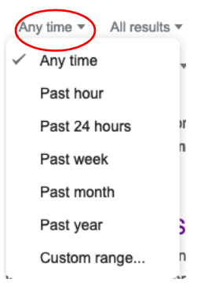
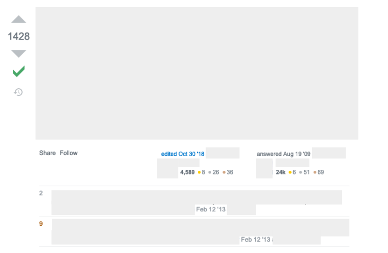
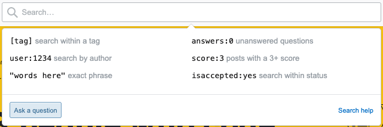
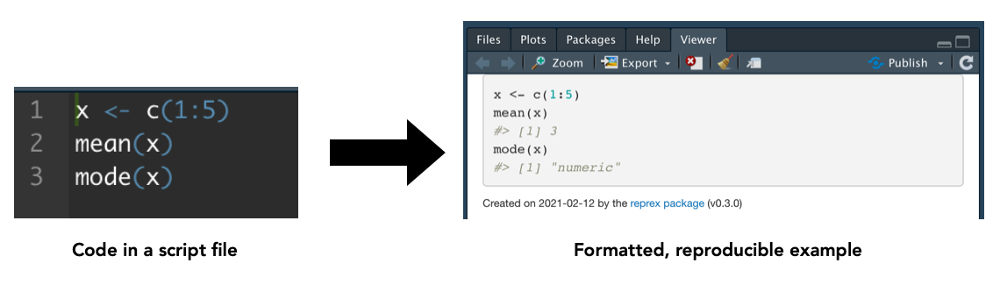
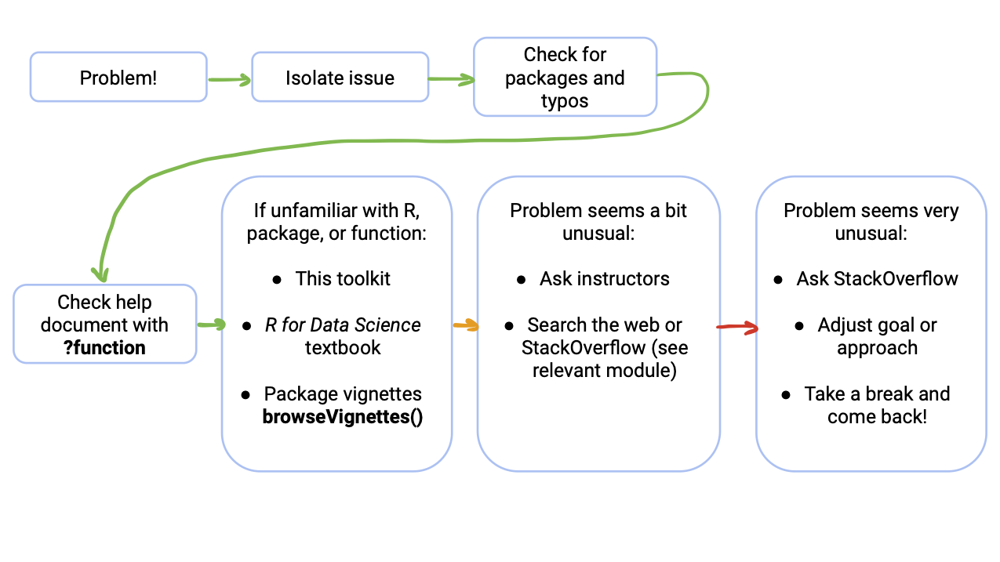

```{r setup, include=FALSE}
knitr::opts_chunk$set(echo = TRUE)

library(tidyverse)
library(learnr)
# tutorial_options(exercise.eval = FALSE)
# library(flair)
library(gradethis)
gradethis::gradethis_setup()
# library(palmerpenguins)
```


## Introduction

Written by Rohan Alexander.

Welcome to a module about getting help. While it may seem odd to start with this, one of the key skills when using R is being able to work yourself out of problems.

The good news is that after you spend time learning R those problems that you had at the start go away. The bad news is that they are replaced with new problems. It's not just you - everyone's code is always full of errors.

<iframe width="560" height="315" src="https://www.youtube.com/embed/82ogkkY7qeQ" frameborder="0" allow="accelerometer; autoplay; clipboard-write; encrypted-media; gyroscope; picture-in-picture" allowfullscreen></iframe>


## Getting help is normal! -- Learning to learn R

Written by Michael Chong.

### Introduction

This section is to act as a reminder that running into problems is expected! Learning R (or any programming language) can be difficult. Everyone gets stumped at some point. When this happens, looking for solutions from peers, mentors, and the Internet is a normal (and very frequent) part of programming! 

In this lesson, you will learn:

- that for nearly everyone, programming it doesn't look like it does in the movies

Prerequisite skills include:

- None!

### Learning R 

Learning a programming language really is like learning a new language! Here are some ways I think that they're similar:

1. **Learn by using.** We've tried to make this resource rich with examples, but combining all this knowledge of functions and libraries to achieve your intended task will be a unique challenge! It's also easier to learn concepts in the context of your specific goal, rather than learning them in the abstract.

2. **Frequent and regular practice really helps!** If you've ever tried to speak a new language, you'll know that it's an uphill climb if you're not using it frequently. 

3. **Everyone's learning experience is different.** Some people are really quick at picking up languages, but most of us aren't. Take it at your own pace. 

4. **Knowing one language can make it easier to learn others.** There are a lot of similarities between programming languages, especially if they're similarly designed and used for similar goals.

5. **Perfection is the enemy (and unnecessary!).** You don't need to know everything about a language to say what you want to say! Similarly, you don't need to know everything about R to accomplish your goal. Think about what you want to do, and look stuff up along the way.

6. **Learning alone is miserable!** Just as you need to talk with others to *really* learn a language, learning R is also a social experience! Asking for help and looking for resources will be part of learning and using R.

```{r, echo = FALSE, out.width="90%"}
knitr::include_graphics("images/06_arrival-1.png", dpi = 400)
knitr::include_graphics("images/06_arrival-2.png", dpi = 400)
```

Amy Adams in *Arrival* (2016).

### Next Steps

Make use of the advice above, and go forth in your R journey! 

In the part of the toolkit, you'll learn troubleshooting strategies that take you from trying to solve the problem on your own, looking for further resources, and effectively asking for help from others.


## Using Google and Stack Overflow

Written by Michael Chong.

### Introduction

In this lesson, you will learn how to:

- search the web for help

Prerequisite skills include:

- knowing how Web searches fit into the troubleshooting process

Highlights:

- the date on web resources is very important!
- you can modify your Google search to give exact matches, specific date ranges, and specific websites
- Stack Overflow and Stack Exchange are a great place to look, but see how the 

### Wait! Before you search the web...

Did you try other, more reliable resources first? Answers you find "in the wild" might be out of date, or not be the best way to accomplish your task. 

Look to the **When your code doesn't work** lesson on the left on where to look before you look on the Internet. In short, you might want to try:

1. the function's help document (`?function_name`)
2. looking in this toolkit
3. [*R for Data Science* by Hadley Wickham](https://r4ds.had.co.nz/)

### Googling

Googling (or searching with another search engine) is a key part of programming! The Internet collectively knows more about using R than any single person or resource. You just need to know how to search efficiently and effectively, and be careful with what solutions you use! Not every solution is reliable.

You probably know how to use a search engine like Google or Bing. This subsection will teach you some tips (in Google) to narrow your search to get more relevant results.

#### Include "r" in your search!

Make sure you're not getting other programming languages or software in your search. For example, search:

```
how to import data in R
```
instead of: 
```
how to import data
```

#### Include `tidyverse` or the package name in your search

Because there are so many R packages, there are often several ways to do the same thing. We're usually going to try using a `tidyverse` implementation to complete our tasks. So, for example, if we want to learn to "combine strings in R", try:

```
combining strings in R tidyverse
```
instead of:
```
combining strings in R
```

The second search will bring up valid ways to combine strings, but usually with older syntax which may not be as fast, may not be compatible with newer functions, or with clunkier syntax that requires more memorization.

#### Exact matching

Google results include things that are related to your search, but may not contain *exactly* what you're looking for. This can be frustrating if you're looking for something specific. Use quotation marks `""` to force exact matching. Then, the returned search results will include the phrase that you've quoted.

For example, if you're looking for help on `left_join()` 


#### Searching a specific site

If you want results from a specific website (e.g. StackExchange/StackOverflow) then you can use the `site:` modifier with your search. For example, if you want to search for how to deal with `dates` in the R for Data Science textbook, one way to do it is:

```
dates site:r4ds.had.co.nz
```

#### Date range

The R community moves fast! The `tidyverse` evolves quickly and is relatively new, so older results might no longer be relevant, or there might be better ways to do what you want to do.

Personally, I would be a bit suspicious of results before approximately 2014(ish) if the solution seems more difficult than what you expect. Of course, this varies from case to case, but it's something to keep in mind when you're browsing!

To narrow the date range on a Google search, use the "Tools" button:

```{r, echo = FALSE, out.width="90%"}
## screenshot of tools button

```

then choose your date range:

```{r, echo = FALSE, out.width="40%"}
## screenshot of date range selection

```


### What are Stack Overflow and Stack Exchange?

These are online Q&A communities focused around programming or other domain-specific knowledge. Chances are that, for most common problems, someone has asked about it on Stack Exchange!

Some things to pay attention to in the answer:

```{r, echo = FALSE, out.width="90%"}
## sample screenshot of answer

```

1. **Answer score** (left side). Users can "upvote" or "downvote" responses to the question. Higher scores generally mean better answers. 

2. **Answer accepted** (indicated by green checkmark). The person who asked the question can mark a specific answer indicating that this solved their problem. This might not be the same as the answer with the highest score!

3. **Date and time** (after each post and comment). The date is **very important!** How people use R has changed dramatically over the past several years, and so there are often newer, better ways to do things. As a loose rule of thumb, I would consider solutions before 2014 as probably out of date. The solution still might work, but there may be an easier way to do it now. 

4. **Comments** (following post). This is a good place to look for potential issues with the answer, or how to extend it to a related use case.

5. **Author reputation** (bottom right corner of answer). As users ask and answer more questions, they accumulate reputation from people voting on their answers. You can loosely think of people with higher scores being more trustworthy. 


### Questions

```{r 07q1, exercise = FALSE, echo = FALSE}
question(
  "Who can contribute solutions on Stack Exchange and Stack Overflow?",
  answer("anyone who makes an account.", correct = TRUE),
  answer("only certified programming experts and instructors"),
  answer("primarily Internet trolls and inexperienced users"),
  correct = "Correct! These are used by a wide range of people -- it can be a great resource, but be careful!",
  allow_retry = TRUE
)
```


```{r 07q2, exercise = FALSE, echo = FALSE}
question(
  "Scenario: You've found two ways to do the same task. An answer from 2008, and an answer from 2018. They use different packages and functions. Which one should you use? ",
  answer("Old solutions are usually just as good as new solutions. Newer packages are usually unreliable."),
  answer("It's usually preferable to look for new(ish) solutions, since R packages are improved on frequently.", correct = TRUE),
  answer("Newer solutions are better if I'm doing something advanced, but for simple tasks it doesn't matter."),
  correct = "Since R is evolving so quickly, it's safer to go with newer resources if everything else is comparable. If you're trying something you haven't seen before, try to pick the package(s) that are better documented.",
  allow_retry = TRUE
)
```

### Next Steps

* If you're troubleshooting, consider where would be most appropriate to look for help for your problem. A quick Google search rarely hurts, as long as you stay critical about what the information that's out there.
* Continue with the lessons in this section to learn how to ask for help effectively!


## Stack Overflow

Written by Annie Collins.

### Introduction

```{r so-logo, out.width = "30%", fig.align='left', echo = FALSE}
knitr::include_graphics("images/69_logo_stackoverflow.png")
```

> Founded in 2008, Stack Overflow’s public platform is used by nearly everyone who codes to learn, share their knowledge, collaborate, and build their careers.

Are you having an issue (or many issues) with your R code? Need some help, but nothing in your learning materials seems to be working? Stack Overflow may be your new best friend.

Stack Overflow serves a few purposes, but your main interactions with the site will likely be in searching for help when you come across problems in your coding process.


### Use Cases

When someone posts a question to Stack Overflow, they are able to receive answers from a community of developers and other R users. These answers can then be up or down voted by the community, and ultimately the person who originally posted the question can decide to "accept" a single answer as the most correct or most useful. 

Below are some ways you might use Stack Overflow to help overcome issues while you are coding. It is always a good idea to search through others' posts before making your own — if you are struggling with something, it is likely someone has had a similar issue in the past!

- **Ambiguous errors**: R is known for its ambiguous error messages, and if you have questions about an error you are receiving, there are questions and answers covering a large variety of messages.
- **Unexpected output**: Sometimes you expect one outcome and get another. Stack Overflow users can often help explain function inputs and outputs in greater depth or a more user friendly manner than original R documentation, or provide an extra set of eyes to look over the structure of your code for inconsistencies. If you make a post with your code, make sure it is comprehensive and **reproducible** (see *Tips for Asking & Searching*).
- **"What function/code will help me do ________?"**: R Documentation in the RStudio Help tab can only get you so far, especially when you don't know which function(s) to start with. Searching for keywords or functions that are similar to your desired outcome, or posting a description of your task and some code you've already tried can be a great way to fill in knowledge gaps or make your code more efficient.

Feel free to refer back to the lesson on *Using Google and Stack Overflow* for details on the specific features of a Stack Overflow question.


### Tips for Asking & Searching

- **Descriptive titles**: "ggplot problem" doesn't tell users anything about what your issue might be. "How can I change the colour of my geom_point() plot?" immediately lets a reader know the function you are using and what your desired outcome is.
- **Example code and/or data**: If you are asking for help in fixing an error in your code, it is important to let other users know what you have so far instead of just describing your issue. Similarly, an issue might be caused by the type or structure of your data, and it is important to indicate this when you ask for help (include simple, example data sets instead of large data sets that require a lot of explanation and may contain private information). Make sure all your examples are **reproducible** (see below).
- **Avoid asking subjective or broad questions**: Stack Overflow is not a discussion board; it is a place for you to ask a direct question and (hopefully) get a direct answer. Make sure you're asking questions that would ideally lead to a singular explanation or suggestion. Similarly, don't post 100 lines of code that won't run and expect an appropriate response. Reduce your questions to a specific few lines or functions.
- **Make sure you're looking at R code**: This will get easier as you gain experience in R and/or other coding languages, but there are some names, concepts, and functions that R shares with other languages and it can sometimes be hard to determine what exactly you're looking at if you're new to coding. If you find search results relating to your question, **make sure the responses apply to R and RStudio.** If you're unsure, you can check the tags at the bottom of the question for `r` or `rstudio`, or include [r] or [rstudio] in your search.
- **Refine your search**: Try the following criteria when searching within Stack Overflow:

```{r so-search, out.width = "75%", fig.align='center', echo = FALSE}

```

As a member of the Stack Overflow community, you have the opportunity to build a [reputation](https://stackoverflow.com/help/whats-reputation) through asking good questions and engaging with others on the site, so these tips are not just important for getting your own questions answered.


#### Reproducible Examples

A reproducible example is a snippet of code that is self contained — it includes all necessary libraries, data, functions, and outputs that will allow another individual to look at your code, run it themselves, and understand any questions you have. R has a package called **reprex** that will help make this task easy (reprex also part of the tidyverse, so if you already have the tidyverse installed you're good to go!). The reprex package allows you to copy some code, run the command `reprex()` , and then paste a formatted, reproducible example into a site like Stack Overflow. For more details on creating a reproducible resource in R, see the [reprex documentation](https://reprex.tidyverse.org/) or view [Jenny Bryan's webinar](https://reprex.tidyverse.org/articles/articles/learn-reprex.html) on the topic.

```{r reprex-image, out.width = "85%", fig.align='center', echo = FALSE}

```


### Next Steps

- Once you've gotten the hang of coding in R, you can apply your new skills by helping others in the Stack Overflow community. Be sure to adhere to the same standards as above: be direct, use provided code and data, or provide your own where appropriate. Remember, your answer can be up or down voted by the community which will impact your credibility and reputation on the site.
- If you're ready to take your coding skills to the next level, Stack Overflow also hosts a job board advertising software, data science, and programming-related positions around the world.
- For any more specific questions, see the [Help Center](https://stackoverflow.com/help/) maintained by Stack Overflow or look at their introductory [tour](https://stackoverflow.com/tour).


## When your code doesn't work

Written by Michael Chong.

### Introduction

This lesson contains:

- suggestions on how to avoid big problems in R
- possible ways to troubleshoot your R code

Prerequisite skills include:

- None!

Highlights:


```{r fig1, out.width = "85%", fig.align='center', echo = FALSE}

```


### Avoiding (big) issues 

#### Use common packages where possible

There are *a lot* of R packages, collectively written by *a lot* of authors, and this inevitably means some packages may interfere with each other and some packages may not be well-documented. Because of this, as you're starting out, it's best to stick with packages that are well-maintained and widely used.

Most of the functions in this toolkit are from the `tidyverse` suite of packages, which fit these criteria. Try to stick with these functions, because they behave predictably together and help is easier to find because of their wide use. 

#### Check results as you go

It's easier to fix a small problem than a big problem. Whenever you're writing or editing an R file, here are some good practices that I follow:

1. test your code in your console before making the change in the file
2. check that the result of your code is what you expect it to be
3. every once in a while, clear your R environment, run your entire script or document, and check the results again

The third step is really important, because you want to make sure your script or document is *self-contained*. You want the script to be able to reproduce the results on its own when you come back to it later.

### Dealing with issues on your own

#### Isolate the issue

Run your code bit by bit until you know which functions are making the problem. In the RStudio editor, you can do this by highlighting a portion of your code, and hitting `CTRL/CMD` + `Enter`. 

At each point, check that you're getting what you expect! For example, if your code changing an object over and over:

```{r, eval = FALSE}
my_number <- 23
my_number <- my_number * 2
my_number <- my_number - 12
```

then it can help to print the object after every time you change it:

```{r}
my_number <- 23
print(my_number)

my_number <- my_number * 2
print(my_number)

my_number <- my_number - 12
print(my_number)
```

#### Check that you have the right packages loaded

Did you forget to use `library()` on the package you need? If you forgot, you probably get the error `could not find function`. For example, the `read_excel()` function comes from the `readxl` package. If you try to use it without loading the package, we get the following error:

```{r, missing-package, error = TRUE}
read_excel("some_file_name.xlsx")
```

#### Check for typos

Seems obvious, but make sure you're using the variables and functions that you're intending to use! 

#### Check the built-in help

R and RStudio have great built-in references. To access the help document for a function, use `?function_name`. For example, if you want to access the help document for the `read_csv()` function, type `?read_csv` in the RStudio console, which brings up this help page. Equivalently, you can type `help(read_csv)`. 

### Escalating the issue

#### Make a minimal example

Simplify the problem so it's easier to see what's going on! There are a couple ways you can do this:

* try it on a smaller, similar data set
* make up some fictional in the same format 

There's more on this in [another section]

#### "General" Resources 

These can be good places to start if you're not familiar with the function or package you're using.

* **this toolkit!**
* [**R for Data Science** by Hadley Wickham](https://r4ds.had.co.nz/): the definitive online textbook resource for getting started in the `tidyverse`
* **package vignettes**: Some packages have *vignettes*, which are like user tutorials for the package written by the package authors. You can check for package vignettes using `browseVignettes("package_name")`

#### Informal resources

If you know what that what you want to do is a bit unconventional or more complicated than usual, you can try:

* consult TAs, instructors, or other friendly experienced users
* search the web! More on this in [another section] 
* ask StackOverflow! More on this in [another section]

### Still stuck?

#### Ask: "do I have other options?"

Some tasks are just *really*, **really** time-consuming or difficult to accomplish in R. Or there are just a lot of tools you would need to know before you can do what you want!

It's okay to adjust your goal or approach based on what's feasible! Some ways to do this:

* break your goal down into smaller parts
* write "pseudocode" first: write down what you want to do in plain words first, then translate to R code
* look for packages that al


#### Remember to take a break!

It can be easy to get stuck thinking about a problem, and become consumed in an endless cycle of Googling and copying and pasting. Take a break and come back.

### Exercises

```{r q1, exercise = FALSE, echo = FALSE}
question(
  "Scenario: Reading over someone's code, and you don't know what `mutate()` does. How can you bring up the help document for `mutate()`? There are two multiple correct answers.",
  answer("Type `mutate?`"),
  answer("Type `?mutate`", correct = TRUE),
  answer("Type `what_is(mutate)`", correct = TRUE),
  answer("Type `help(mutate)`"),
  allow_retry = TRUE
)
```

```{r q2, exercise = FALSE, echo = FALSE}
question(
  "When writing code, it's best to:",
  answer("write all the code first, and check for errors when finished"),
  answer("check for errors frequently (every couple of lines)", correct = TRUE),
  correct = "Yes! Checking often makes it easier to find where problems are.",
  allow_retry = TRUE
)
```

```{r q3, exercise = FALSE, echo = FALSE}
question(
  "You can bring up the vignettes for a package using the `browseVignettes()` function. What are vignettes?",
  answer("User guides for the package written by package authors.", correct = TRUE),
  answer("Instructions from the package authors on how to cite the package."),
  answer("Technical stuff behind the package that's not worth worrying about."),
  answer("Online forums discussing the package."),
  correct = "Correct! These are a good place to go for help!",
  allow_retry = TRUE
)
```

### Next Steps

* Asking for help? Learn how to make a minimal example in the **Making reproducible examples** lesson.
* Having trouble finding what you want on the web? See the lesson **Using Google and Stack Overflow** and **Even more on Stack Overflow** for tips on using these tools more effectively!


## Making Reproducible Examples

Written by Marija Pejcinovska.

### Introduction

In this lesson you will:

- learn about using reproducible examples to solve R issues
- learn how to create reproducible examples 
- get introduced to packages that ease the pain of making reproducible examples

Prerequisite skills include:

- Installing packages, troubleshooting, and asking for help

Highlights:

- Making good reproducible examples is essential for getting online help with your R issues (be it on Stack Overflow, R Studio Communities, Slack,..).
- Good reproducible examples are minimal and self-contained.
- R packages like `reprex` are there to help you ask for help the right way!

### Seeking help the helpful way

At this point in the toolkit you have probably picked up a troubleshooting trick or two. 

In fact, you may have already googled how to code up something in R or have come across useful discussions on Stack Exchange or Stack Overflow. 


Most of the time, you are likely to face issues many R users have grappled with before. In a way, this is nice. It means it should be much easier to find a solution to your problem online, usually with only a few google searches. Other times though, you might come across a more challenging problem and the solution might not be as readily available online. 
In such a situation, assuming you've exhausted all other debugging and troubleshooting options, it's possible that you would need to ask for some help online! Fortunately, as you've been making your way through this toolkit, you have probably already learned where to turn for help when needed.


At this stage, knowing how to create a **repr**oducible **ex**ample (or **reprex** for short) would come in handy. The idea of a reprex is exactly what you might expect: it is a minimal illustrative example that will reproduce the issue you are facing, so that others could help you solve it more easily.


Not all reprexes are created equal, however. In order for you to engage productively with the R community and get the help you need,  you should help the reader understand your problem with as little effort on their part as possible. This means that a reprex needs to be minimal and self-contained, so that those helping you can simply copy and paste your R code, reproduce the error and understand your issue... and hopefully help you solve it, of course.

### Elements of a reprex
So, what does a reprex look like?  

All reproducible examples have these few elements in common:  

 - a **minimal data set** on which the code can be run and the error reproduced. 
 - a **minimal, runnable** piece of **code** that is **well formatted** and produces the same error when run on the supplied minimal data set.  
 - call to any necessary **R packages** + any relevant pieces of **information about your R environment** when the issue was encountered. 

### Creating a data set for a reprex

You should always provide some data along with your reproducible example, so that you can easily illustrate your issue. It might not always be possible to share the actual data you've been working on. In fact, it is probably more practical to create a "toy" data set which will produce the same error or issue you've been dealing with.  

There are a few of ways of doing this. 

 - You could **create your own data** by using functions such as those in the `tibble` package. As an example, consider the data frame below. Here we've used the `tibble()` function to create a very small data frame with 4 variables (x, y, z, and w) each with 4 observations (Note: `tibble()` in the tidyverse is similar to the `data.frame()` function in base R). An alternative way of creating a data frame is through the  `tribble()` function, where **tribble** is simply short for **tr**ansposed **tibble**, the syntax for which is visually easier but a little less common (call `?tribble` at the R prompt)
 
```{r make_toy_data1, echo=TRUE}


first_toy_data <- tibble (
  x = 1:4,
  y = c("a", "b", "c", "d"),
  z = x + x^2,
  w = c("yes", "no", "yes", "yes")
)
first_toy_data

```
 

- Alternatively, you could consider using some of the **built-in R data sets**. To see the available data sets, try typing  `data()` at the prompt in your R console.  As you keep learning R you'll notice many examples that feature, say, the *mtcars* or *iris* data sets. These data sets do get a little boring over time, but you shouldn't really worry about the dullness of your data when making a reprex. In fact, feel free to bore your helpers with you choices. If you do end up using built in data, you might want to consider using only a subset of the data set (do this by making use of the `head()` or `sample()` functions.)

 - Finally, whatever data you are sharing you might find the `dput()` function helpful. The function will write a text representation of your data which others can then copy-and-paste into their own R scripts to get your data. `dput` essentially generates the R code necessary to recreate your data. The output from `dput` would look something like this:
 
```{r dput_toy}

dput(first_toy_data)

```

Running the output from `dput()` will create exactly the data object `first_toy_data` we created above. This is, indeed, the behavior we want. Run the code below to see for yourself.
 
```{r dputex1, exercise = TRUE}

structure(list(x = 1:4, y = c("a", "b", "c", "d"), z = c(2, 6, 
12, 20), w = c("yes", "no", "yes", "yes")), row.names = c(NA, 
-4L), class = c("tbl_df", "tbl", "data.frame"))


```
 


### Adding code 

The code in your reprex should be easy to understand and stripped down to the most bare version that would allow those helping you to replicate your errors.

Here are a few tips you might want to keep in mind as you are readying code for a reprex: 

 - Make sure you only include necessary code!! This simply means including only enough code to reproduce your problem; and not everything that is in your R script.
 - Try to format the code properly. This will make it easier for people to read and understand it. If you are unsure of the recommended formatting styles check out the following tidyverse style guide by Hadley Whickham (https://style.tidyverse.org/).
 - Comment your code if necessary (recall that we use `#` to begin a comment in an R code chunk).  
 - Don't copy and paste code from the console!! Console output contains characters that would make it difficult for folks to re-run your code without doing additional work. This might be an even bigger problem if you post your copied console output to an online forum. The special characters in the console output might be interpreted as special formatting symbols which can render your post unreadable!  
 - If the code that created your data uses any random generation of values (e.g. `sample()`, `rnorm()`, `runif()` etc.) you need to use the `set.seed()` function. This will fix the starting number used in generating a sequence of random values, making your data easy to replicate exactly.  
 
 - Always test your code in a new, empty R session! This means that before you upload any code and ask for help on Stack Overflow or Slack or RStudio community forums you should make sure that the code runs outside of the R environment where it was created.
 

A useful tool for making reproducible example is the `reprex` package. We'll see reprex in action shortly. 
 
 
 
### Packages and any other relevant information

Along with the data and code, when asking for help you should always remember to add the relevant packages at the top of your script. If you use certain functions or package-specific data sets you need to specify the required package (by adding `library(package_name)` at the top of your code snippet), otherwise your code will not be exactly reproducible.   

In certain situations, it might be useful to add a bit more information. 
If you are reporting on an unusual error or believe to have come across a bug in some function or feature of a package, you might need to report the version of R you are using and possibly the operating system. In most cases this would be sufficient, but sometimes you may need to also share the output of `sessionInfo()`.  Note that while packages are absolutely essential, sharing your version of R or a specific package might not be always necessary. 


### A closer look at the reprex package

Making reproducible examples is not always easy. Fortunately, there is an R package which makes some of that work a little bit easier.  

Below is a quick overview of how you can create a reproducible example with `reprex`.

 - Start by installing the `reprex` package 
  (i) We can do this by  installing  from CRAN: 
```{r, eval=FALSE, echo=TRUE}
install.packages("reprex")

```
  (ii) or, by fetching the development version from GitHub
```{r, eval=FALSE, echo=TRUE}
devtools::install_github("tidyverse/reprex")

```
    
 - In an R script write your code, including the data and all necessary calls to packages. For instance, suppose the code in your script is just as the one below.

```{r, eval=FALSE, message=FALSE}
library(tidyverse)
mpg %>% 
  ggplot(aes(x=displ, y=hwy)) %>% 
  geom_point(aes(color=class)) %>% 
  geom_smooth()

```

 - Highlight the code (including the library statement) and copy it to your clipboard  
 
 - In your console type `reprex()` and press Enter (you'll need to wait a second or two for R to render your reproducible example).  
 - Once the reprex has been rendered, it is automatically stored on your clipboard and you could simply paste it online and share it with others.  
 - To see what R actually generates once reprex() has been called in the console we'll paste the content of the clipboard below. 
 
``` r
library(tidyverse)
mpg %>% 
  ggplot(aes(x=displ, y=hwy)) %>% 
  geom_point(aes(color=class)) %>% 
  geom_smooth()
#> Error: `mapping` must be created by `aes()`
#> Did you use %>% instead of +?
```

<sup>Created on 2021-01-18 by the [reprex package](https://reprex.tidyverse.org) (v0.3.0)</sup>


### Exercises

#### Exercise 1

Suppose you are interested in seeking help from the online RStudio community for an error you get based on the code below.
```{r ex1setup, eval=FALSE}

tibble(
  group = c("trtmnt", "control", "control", "control", "trtmnt", "control", "trtmnt", "trtmnt", "trtmnt", "control"),
  msrmnt = rnorm(10,5, 0.5), ## rnorm(10,5,1.5) generates 10 random normal variables centered at 5 with sd of 1.5
                             ## use ?rnorm to check out the function's arguments
  improvement = c("yes", "no", "no", "no", "no", "no", "yes", "no", "no", "yes")
) %>% 
  mutate(new_var1 = msrmnt + improvement)

```

**PART A**  

```{r ex1reprexp1, echo=FALSE}
  question("As it is written, is the above snippet of code a viable reproducible example?",
           answer("Yes"), 
           answer("No", correct = TRUE)
           )


```

**PART B**  

How might you fix it? Add any missing pieces and turn the code chunk below into a usable reprex.

```{r ex1reprexp2, exercise=TRUE, exercise.eval = FALSE}
tibble(
  group = c("trtmnt", "control", "control", "control", "trtmnt", "control", "trtmnt", "trtmnt", "trtmnt", "control"),
  msrmnt = rnorm(10,5, 0.5), ## rnorm(10,5,1.5) generates 10 random normal variables centered at 5 with sd of 1.5
                             ## use ?rnorm to check out the function's arguments
  improvement = c("yes", "no", "no", "no", "no", "no", "yes", "no", "no", "yes")
) %>% 
  mutate(new_var1 = msrmnt + improvement, new_var2=2*msrmnt)

```

**PART C**  

The error you should be getting should involve the `mutate()` function. Specifically the error message should be:

```{r, echo=F}
cat("Error: Problem with `mutate()` input `new_var1`. 
x non-numeric argument to binary operator 
ℹ Input `new_var1` is `msrmnt + improvement`.")
```


Use the `reprex()` function in the code chunk below to check whether you've correctly modified the code in Part B. You can do this by copying and pasting the correct code inside the curly brackets provided in the `reprex` function. See what happens.

```{r ex1reprexp3, exercise=TRUE, exercise.lines=15}

reprex::reprex({
  
  }
)

```

```{r ex1reprexp3-solution}

reprex::reprex({
  set.seed(789)
  library(tidyverse)
  tibble(
  group = c("trtmnt", "control", "control", "control", "trtmnt", "control", "trtmnt", "trtmnt", "trtmnt", "control"),
  msrmnt = rnorm(10,5, 0.5), ## rnorm(10,5,1.5) generates 10 random normal variables centered at 5 with sd of 1.5
                             ## use ?rnorm to check out the function's arguments
  improvement = c("yes", "no", "no", "no", "no", "no", "yes", "no", "no", "yes")
) %>% 
  mutate(new_var1 = msrmnt + improvement, new_var2=2*msrmnt)}
)

```

### Next Steps

In this lesson you learned the basics of making a reproducible example. If you are interested in some additional resources, consider the following list of do's and don'ts from the folks that made the `reprex` package: https://reprex.tidyverse.org/articles/reprex-dos-and-donts.html  

For even more information on `reprex`, check out Jenny Bryan webinar on creating reproducible examples with reprex:  https://reprex.tidyverse.org/articles/articles/learn-reprex.html


## How to make the most of R's cryptic error messages

Written by Shirley Deng.

### Decrypting the cryptic

More often than not, R will spit out errors that give us very little information on *what* they actually are.

We have two options here:

1. Try to ***get rid of*** the error
2. Try to ***fix*** the error

While getting rid of error messages can bring us momentary relief, we're likely to encounter more issues along the way using hastily developed "solutions".

#### Shootin' the troubles

#####  Package inputenc Error

While TAing an introductory data science course, one of the most common errors students encountered while working with R Markdown looked like this:

###### Example 1

```
! Package inputenc Error: Unicode character μ (U+03BC)
(inputenc)                not set up for use with LaTeX.

Try other LaTeX engines instead (e.g., xelatex) if you are using pdflatex. See https://bookdown.org/yihui/rmarkdown-cookbook/latex-unicode.html

Error: LaTeX failed to compile ProblemSet.tex. See https://yihui.org/tinytex/r/#debugging for debugging tips. See ProblemSet.log for more info.
Execution halted
```

One way to get around this error would be to follow the suggestion and use `xelatex` as our LaTeX engine. For a PDF document, this would mean using the following in the header chunk:

```
output:
  pdf_document:
    latex_engine: xelatex
```

But what if we need to use a different LaTeX engine? What if using `xelatex` doesn't get rid of the `Package inputenc Error`? Are there other ways to deal with this error? 

One student suggested that we make an exemption for the `μ` character by adding the following to the header chunk:

```
header-includes:
  - \DeclareUnicodeCharacter{03BC}{μ}
```

Now, another common error was this here:

###### Example 2

```
! Package inputenc Error: Unicode character ， (U+FF0C)
(inputenc)                not set up for use with LaTeX.

Try other LaTeX engines instead (e.g., xelatex) if you are using pdflatex. See https://bookdown.org/yihui/rmarkdown-cookbook/latex-unicode.html
```

This is the the same *type* of error as Example 1, but with a different character specified - the Chinese full-width comma.

If we simply made an exemption for the `μ` character as the student suggested, then we'd still encounter the same error for other characters, like the `，`.

Recall that LaTeX is *designed* to use commands to generate symbols.

We notice that this error specifically tells us that there may be an issue with a given unicode character. In the Example 1, ` μ`. 

So we can try searching the document to see where `μ` may appear. If we find any `μ`'s, great! Then we just need to avoid using `μ` in order to get our document to knit. 

Then one fix for this error would be to replace all occurences of `μ` with `\mu`, the laTeX command for the character.

In Example 2, we could try replacing all occurences of `，` with `,`, a regular degular comma generated by an English language keyboard, to allow us to knit our document.

But is there a way for us to ***prevent*** errors like these from popping up again?

After all of our trials and tribulations, we find that LaTeX probably doesn't like when we generate the symbols ourselves. After all, there are only a handful of symbols that don't need an escape or any sort of special handling to ensure that they show up properly in our knitted document.

Moving forward, it may be a good idea to try to **use LaTeX commands for special characters or symbols whenever possible**.

Ultimately, this was the solution that allowed most students to knit their R Markdown documents!

##### It's one thing to get our code to *work*, but another thing to make sure we don't have to work our code.

For the rest of this section on R's *cryptic* error messages, we'll be going over some common errors and how we can get around them.

### Knitting makes a great pastime

The best way to minimize dealing with R Markdown errors in the first place is to knit often.

If we knit periodically as we work, then if or when we encounter an error, we'll know which bit of code it came from. 

Often times, one "mistake" can cause multiple error messages. In the case of Example 1, the `μ` character not only caused R to spit out `! Package inputenc Error`, but `Error: LaTeX failed to compile` as well.

It's much easier to deal with errors one by one than to deal with them all at once in a tangled mess. 

#### Parm for your copypasta?

This also applies when we need to copy and paste bits into our documents.

As we saw in Example 2, it's not easy to spot the difference between `，` and `,`. This is especially the case when we have a whole wall of text written up (i.e., the entire R Markdown document) to look through.

When copying and pasting, it's best to **copy small sections at a time, knitting in between each**. This will allow us to isolate any issues like the *Package inputenc Error*.

#### Code

When it comes to code, we can run code *without* knitting the entire file, be it R or R Markdown.

This is especially handy when our R code uses a lot of memory and takes a long time to compile or knit. Rather than having to run the entire document, including all the bits we already know work, we can just test run an isolated part.

Simply select the desired code, and use the appropriate keyboard shortcut to run:

* `Cmd+Return` on Mac
* `Ctrl+Enter` on Windows and Linux

##### Note: A list of RStudio keyboard shortcuts can be found [here](https://support.rstudio.com/hc/en-us/articles/200711853-Keyboard-Shortcuts)

#### Knitting's not for me

A fair amount of students have encountered the following error:

```
Error in contrib.url(repos, type) : 
  trying to use CRAN without setting a mirror
```

If we do a little search...

```{r errors-contrib, exercise=TRUE}
?contrib.url
```

We get the impression that we had some issues installing a package.

Keep in mind that we install packages for our R sessions, but only need to load them when we knit our R Markdown documents.

In other words, don't use `install.packages()` in any of your R Markdown document code chunks!

Instead, you can either:

- click on the "Install" button in the yellow bar near the RStudio toolbar,
- or run `install.packages()` in the console instead.

### Have you tried turning it off and on again?

This may sound like we're trying to **get rid of** the error instead of **fixing** it, but rest assured, we'll see how it can be quite insightful at times.

#### Time waits for no man

To make debugging easier, some instructors may choose to have their students use RStudio on [JupyterHub](https://jupyter.org/hub) or [RStudio Cloud](https://rstudio.cloud/), instead of a local installation.

JupyterHub and RStudio Cloud will automtically use the latest versions of R and RStudio available, so we don't have to manually update our local installations.

*This is great for when we need to use packages that aren't configured for our OS. Hem hem, I'm speaking to you, `rstan` and `brms` on macOS.*

However, using RStudio on the cloud often brings about a new problem: `Status code 403 returned`.

This often happens due to long (or sometimes even short) periods of inactivity. [The RStudio team has not found a best solution for it yet](https://community.rstudio.com/t/status-code-403/16110), but the old *turn it off and back on* trick seems to fix it.

Some people suggest [logging out and logging back in](https://community.rstudio.com/t/status-code-403-tonight-08-05/75540/4), while others suggest [refreshing the page](https://community.rstudio.com/t/status-code-403/16110/4).


##### Note: Keep in mind that you have to install packages again *each time you start a new RStudio session on JupyterHub*.

#### Getting back on track when we run

Remember that note up there about installing packages for every new RStudio session on JupyterHub? Yes, the one three lines above this.

A number of students posted on their course discussion board about getting a `Could not find function "glimpse"` error.

Why would R not be able to find `glimpse()`?

Recall that `glimpse()`, like the pipe `%>%` and like `tibble()`, aren't base R. Rather, we can access them by installing and loading the `dlpyr` or `tidyverse` packages.

If we don't load the package, we can't use the function.

Sometimes we might forget whether a line's been run or not, or that we restarted a new R session, and mistakenly forget to install or load a package before attempting to run our code.

##### Example 4

Suppose we mistakenly run the same line of code it twice.

Try running the following code and see what happens:

```{r errors-select, exercise=TRUE}
mtcars <- mtcars %>% select(-mpg)
mtcars <- mtcars %>% select(-mpg)
```

We get an error! `Error: Must subset columns with a valid subscript vector.`

Now, this error message doesn't give us much information about what's wrong with our code.

But, when we restart our R session it works fine again:

```{r errors-selectagain, exercise=TRUE}
.rs.restartR()
mtcars <- mtcars %>% select(-mpg)
```

Let's take a closer look at what the line `mtcars <- mtcars %>% select(-mpg)` is doing, and why running it twice causes us issues.

```{r errors-glimpse, exercise=TRUE}
.rs.restartR()
glimpse(mtcars)
mtcars <- mtcars %>% select(-mpg)
glimpse(mtcars)
```

We see that the line `.mtcars <- mtcars %>% select(-mpg)` removes the variable `mpg` from `mtcars`. Hence, if we run it once, there is no `mpg` left to be removed the second time.

Sometimes we just have code that won't work if we run it more than once, and this is a situation where  the old *turn it off and back on* trick helps us **solve** our problems, rather than just get rid of them.

Similarly, sometimes we run code in the console but *don't* have it written in any chunks of our R Markdown document - maybe it was accidentally removed. If you were able to run the code before knitting, these are plausible situations. As a result, we may run into errors when R tries to knit our document. 

All in all, when in doubt, you can start fresh by [quitting and restarting your R session](https://stackoverflow.com/questions/6313079/quit-and-restart-a-clean-r-session-from-within-r).

##### Note: This can especially be an issue if we've used `set.seed()`. Forgetting to set a seed when creating simulations of random objects can drastically change our results!

##### Note: If there are any helper files left behind from a R Markdown document that couldn't knit, like `.aux`, delete them before trying to knit again.

### Clopening

Encounter something like `! Package amsmath Error: \hat allowed only in math mode.`?

This can be a little cryptic if we only have `\hat{\beta}` in our R Markdown document, and it appears fine as \(\hat{\beta}\) before knitting. It shows up, so we must be in math mode. What's the problem?

It's likely that there are open brackets, braces, parantheses, etc. - i.e. an extra one was either added or removed.

So whenever you use one of these... | make sure it comes with one of these
----------------------------------|-----------------------------------------
`\(`                              | `\)`
`\[`                              | `\]`
`$$`                              | `$$`
`\begin{aligned}`                 | `\end{aligned}`
`{`                               | `}`

### Warnings, not errors

Sometimes we see some scary red text after knitting or compiling, and we worry that we have some cumbersome errors to deal with. However, red text is not always indicative of errors.

R also colours their **warnings** in red, too.

#### Example 5

Run the following code, and see what R tells us in response.

```{r errors-summarise, exercise=TRUE}
mtcars %>%
   group_by(gear) %>%
   summarise(qs = quantile(disp, c(0.25, 0.75)), prob = c(0.25, 0.75))
```

We see that we get the following:

```
`summarise()` has grouped output by 'gear'. You can override using the `.groups` argument.
```

This is not an error, but a warning.

If we want to get rid of warnings for just one code chunk, we can put `warning=FALSE` or `warning=F` in the little knitr chunk options, like this:


\`\`\`\{r, warning=FALSE\}  
\## your code here  
\`\`\`


Alternatively, if we want to "turn off" warnings for our *entire* document, we can put this at the beginning of our R Markdown document, right after the YAML header chunk:

\`\`\`\{r, include=FALSE\}  
knitr::opts_chunk$set(warning = FALSE)  
\`\`\`

###### Note: More information on chunk options can be found [here](https://rstudio.com/wp-content/uploads/2015/03/rmarkdown-reference.pdf)

With that said, this specific warning can be resolved exactly as it suggests: using the `.groups` argument, as below.

```{r errors-summariseFixed, exercise=TRUE}
mtcars %>%
   group_by(gear) %>%
   summarise(qs = quantile(disp, c(0.25, 0.75)), prob = c(0.25, 0.75), 
             .groups = "drop")
```

### Resources and references

- [JupyterHub](https://jupyter.org/hub)
- [RStudio Cloud](https://rstudio.cloud/)
- `Status code 403 returned`
  - [Refreshing the page](https://community.rstudio.com/t/status-code-403/16110)
  - [Logging out and in](https://community.rstudio.com/t/status-code-403-tonight-08-05/75540/4)
- [RStudio keyboard shortcuts](https://support.rstudio.com/hc/en-us/articles/200711853-Keyboard-Shortcuts)
- [Quit and restart a clean R session from within R](https://stackoverflow.com/questions/6313079/quit-and-restart-a-clean-r-session-from-within-r)
- [knitr code chunk options](https://rstudio.com/wp-content/uploads/2015/03/rmarkdown-reference.pdf)


## Summary and next steps

Written by Rohan Alexander.


Well done on picking up these essential skills. 

You can start the next lesson by running:

```{r, eval = FALSE}
learnr::run_tutorial("holding_the_chaos_at_bay", package = "DoSStoolkit")
```


