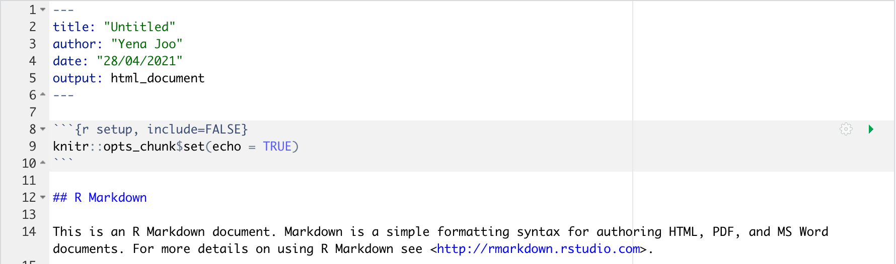

```{r setup, include=FALSE}
knitr::opts_chunk$set(echo = TRUE)

library(tidyverse)
library(learnr)
library(flair)
library(gradethis)
gradethis::gradethis_setup()
library(here)
```


## Introduction

In this module, we are going to go through R Markdown. R Markdown is an incredibly powerful way of combining text and code, and you can produce html, pdf, word and many other outputs. Most of us learn it as a great way to write class assignments, but these days it's used for everything from making textbooks, websites, and is even the foundation on which these tutorials are based.


## Introduction to R Markdown

Written by Shirley Deng.

Have you ever found yourself typing up a report in Microsoft Word and tried to insert code, code output, images or math? It can be pretty cumbersome! 

But it's *not a problem anymore*...

R Markdown documents allow you to not only type up reports, as you would in a Word document, but allow you to embed R, Python and SQL code with (hopefully) a little less fuss.

#### Why use R Markdown?

R Markdown allows for our files to be reproducible - if you or someone else finds an error in your code, or there's a figure you want to fix, or there's just a typo with a symbol - there's no need to remake a new document from scratch. 

Instead, you can edit the .Rmd file and "knit" (or compile) it to make your new html, .pdf or Word document. You can think of R Markdown as writing reports with code.

### Creating a R Markdown file

To start a .Rmd file in RStudio, click *File*, then *New File*, and select *R Markdown...*

From there, we can select if we want our report to be in the form of an **HTML page**, **pdf**, or **Word document**, and give our report a title and author name.

RStudio will then generate a .Rmd file with a little template for us

#### YAML Header Chunk

We notice that the template starts off with something like the following chunk:

```
---
title: "A Good, Creative Title"
author: "Shirley Deng"
date: "01/01/2021"
output: pdf_document
---
```

As you might guess, this creates a header for your report with the title, author and date specified.

We can also change the output option if we have a change of heart and would prefer an HTML page or Word document:

* `output: pdf_document`
* `output: word_document`

### Markdown

Following the header chunk, we see a little section on R Markdown.

Markdown is a way for us to format our report text, and the sections below will outline how to use it.

#### Sections

The two pound signs, `#`, in front of *R Markdown* indicate that that line of text will be a header.

Whenever we use the pound sign to denote a header, this also creates a section in our final report document. We can view these sections by toggling the document outline with the following keyboard shortcuts:

* `Cmd+Shift+O` on Mac
* `Ctrl+Shift+O` on Windows and Linux

For each `#`, the smaller the header. We can use smaller headers to denote subsections.

#### Paragraphs

To indicate a new paragraph, place two spaces at the end of the line.

For example, this line ends with two spaces...`  `  
And this text follows it.
    
##### Note

Pressing the tabulator key, `Tab` on your keyboard, will *not* indent a paragraph!

#### Bold Text

We can bold text by putting a pair of asterisks, `**`, around it.

For example, we can write **bold** with `**bold**`.

#### Italicized Text

We can make text italicized by either using a single asterisk, `*`, around it.

Alternatively, we can also use an underscore, `_`, instead of the asterisk.

For example, we can write *italics* with `*italics*` or `_italics_`.

#### Superscript

We can make superscript by using a caret, `^`, around it. 

For example, we can write this s^uperscript^ with `s^uperscript^`.

#### Subscript

We can make subscript the same way we make superscript, except with a tilde, `~`, instead of a caret.

For example, we can write this s~ubscript~ with `s~ubscript~`.

#### Lists

We can make lists by either using thr asterisk, `*`, dash, `-`, or plus sign, `+`, as bullets.

For example...

```
* this
* would
* make
```

the following list:

* this
* would
* make

And, 

```
- this  
- also   
- makes
```

this list:

- this
- also
- makes

And,

```
+ so  
+ does  
+ this
```

this list:

+ so  
+ does  
+ this

#### Sublists

We can also use an indent to create a sublist.

For example,

```
- this
  - makes a sublist
```

like so:

- this
  - makes a sublist
  
#### Ordered lists

We can also makew numbered lists, simply by numbering each item.

For example,

```
1. this
2. is
3. numbered
```

Like this:

1. this
2. is
3. numbered

#### Hyperlinks

We can make a hyperlink by using the syntax `[text here](link url here)`

For example, 

```
[this makes a link to the RStudio website](https://www.rstudio.com/)
```

like this:

[this makes a link to the RStudio website](https://www.rstudio.com/)

#### Images

We can embed images (with caption!) similar to how we make hyperlinks.

We just add an exclaimation point, `!`, in front of the hyperlink syntax.

For example, 

```

```

like this:


#### Hyperlinked images

If you want to get *real* fancy, we can hyperlink images using a combination of the syntax we introduced above.

For example,

```
[](https://d33wubrfki0l68.cloudfront.net/521a038ed009b97bf73eb0a653b1cb7e66645231/8e3fd/assets/img/rstudio-icon.png)
```

[](https://d33wubrfki0l68.cloudfront.net/521a038ed009b97bf73eb0a653b1cb7e66645231/8e3fd/assets/img/rstudio-icon.png)
  
#### Escapes

There are some special characters that need an **escape** (a backslash, `\`), in order to display properly.

In order to write this... | we'd have to write this
------------------------- | -------------------------
\$                        | `\$`
\&                        | `\&`
\%                        | `\%`
\##                        | `\#`
\_                        | `\_`
\{                        | `\{`

### Math environments

Writing math in R Markdown is probably one of its best features. To do so, we use another format - LaTeX.

Like how R Markdown can be likened to writing reports with code, we can liken LaTeX to writing mathematical equations with code.

#### Delimiters

Say we wanted to write the Pythagorean theorem, \(x^2 + y^2 = z^2 \).

We need to work in a math environment, or **math mode**, in order to write math using LaTeX.

##### Inline

Sometimes we want to write a little bit of math in the middle of some text. In this case, we'd want our math *in line* with the rest of our text.

If we want our Pythagorean theorem inline, like above, we can write it as this:  `\(x^2 + y^2 = z^2 \)`

to get this: \( x^2 + y^2 = z^2 \)

##### Centred Display

But sometimes we want to showcase our math. Say, in the case we're introducing an important equation.

If we have some math we'd like on its own line and centred, we can write this: ` \[ x^2 + y^2 = z^2 \] `

to get this: \[ x^2 + y^2 = z^2 \]

Alternatively, we can also write this: ` $$ x^2 + y^2 = z^2 $$ `

to get this too: $$ x^2 + y^2 = z^2 $$

##### Aligned

What if we have multiple lines of math that we want to showcase? Like this:

\begin{aligned}
a = 1 \\  
b = 2
\end{aligned}

It would be pretty inconvenient to type \$\$ around every line:

```
$$ a = 1 $$  
$$ b = 2 $$
```

Instead, we can use the `aligned` delimiters around our math, using `\\` to end each line.

```
\begin{aligned}
a = 1 \\  
b = 2
\end{aligned}
```

However, it's not neccessary to end the last line with `\\`. 

This:

```
\begin{aligned}
a = 1 \\  
b = 2 \\
\end{aligned}  
```

Can yield this:  
\begin{aligned}
a = 1 \\  
b = 2 \\
\end{aligned}  
Too. 

#### Superscript

Recall from our Markdown section that we use carets, `^`, for superscript. 

For example, we can write this s^uperscript^ with `s^uperscript^`.

We also use carets when we want superscript **in math environments**, albeit *slightly* differently.

Instead of wrapping the superscripted text with the carets, we use a single caret, followed with the text wrapped in curly brackets, `{}`.

For example, let's try using the inline delimiters `\(\)` to write \(s^{uperscript}\):

`\(s^{uperscript}\)` yields \( s^{uperscript} \)

##### Note: Remember to use the curly brackets! 

Notice that `\( s^uperscript \)` yields \( s^uperscript \).

Without curly brackets, only the **first character** that follows the caret is superscripted.

#### Subscript

The same way superscripts and subscripts are paralled in Markdown applies to math environments.

For example, `\(s_{uperscript}\)` yields \( s_{uperscript} \),

And without curly brackets, `\( s_uperscript \)` yields \( s_uperscript \)

#### Math escapes: brackets and dolla dolla bill \$ignz

What happens when we want to use brackets *in* math environments?

In order to write this... | we'd have to write this
------------------------- | -------------------------
\( \$ \)                  | ` \$ `
\( \& \)                  | ` \& `
\( \% \)                  | ` \% `
\( \## \)                  | ` \## `
\( \_ \)                  | ` \_ `
\( \{ \)                  | ` \{ `

For example, we can write a spicy \( \$pi\_c \) by using `\( \$pi\_c \)`.

##### Exceptions? 

What are some circumstances we *shouldn't* use an escape?

In order to write this... | we can just write this
------------------------- | -------------------------
\( [ \)                   | ` [ `
\( ( \)                   | ` ( `

#### Other syntax

There's specific syntax for a lot of the more complex mathematical symbols we might find ourselves using!

##### Note: For the rest of the *Math environments* section, we will be making use of the inline delimiters `\( \)` **unless** otherwise specified.

##### Fractions:

We can use ` \frac{numerator}{denominator} ` to get \( \frac{numerator}{denominator} \).

##### Binomials:

We often see \( {n \choose k} \) when working in combinatorics or probability.

Similar to the fraction syntax, we can use ` \binom{top}{bottom} ` to get \( \binom{top}{bottom} \).

Alternatively, we can use ` {top \choose bottom} ` to get \( {top \choose bottom} \) as well.

##### Integrals

###### Indefinite

To get a plain Jane, indefinite integral, we can simply use ` \int ` to get \( \int \).

If we have multiple integrals, we just add an `i` for each additional one, as so:

In order to write this... | we can write this        
------------------------- | -------------------------
\( \int \)                | ` \int `                 
\( \iint \)               | ` \iint `                
\( \iiint \)              | ` \iiint `
\( \iiiint \)             | ` \iiiint `

What if we wanted more space between our integrals? Then simply use `\int` multiple times.

For example, `\int\int` would give us \(\int\int\).

###### Definite

We can make use of the superscript and subscript syntax in order to make our indefinite integrals into definite integrals.

For example, `\int_a^b` would give us \( \int_a^b \).

What if we had something more complex, like \( \int_{a+b}^{c-d} \)? We could use curly brackets, like so: `\int_{a+b}^{c-d}`

##### Sums 

Like with integrals, we can get *just* the sigma for summation, \(\sum \), with `\sum`.

To get the indices, once again we make use of the syntax we've learned already.

For example, `\sum_{i=1}^{n}` would give us \( \sum_{i=1}^{n}\).

##### Limits

This is getting repetitive!

To get \( \lim_{n \rightarrow \infty} \), we can use `\lim_{n \rightarrow \infty}`

##### Note: More resources on LaTeX math syntax can be found in the *Resources and references* section :\^)

#### Spaces

Spaces created by pressing the space bar don't really work in math mode!

Instead, we have several options for writing spaces in math environments.

We see that this...       | will give us this
------------------------- | -------------------------
` poo poo `               | \( poo poo \)
` poo \; poo `            | \( poo \; poo \)
` poo \: poo `            | \( poo \: poo \)
` poo \, poo `            | \( poo \, poo \)
` poo \! poo `            | \( poo \! poo \)

### Code

Another handy feature of R Markdown is that we can **display and run** code in its own *code-y* font.

#### Displaying

##### Inline

Say we just want to indicate that something is code, without actually providing the full section it came from, let alone run it. 

To display a bit of code inline with the rest of our text, we can wrap the code with a pair of backticks, ` `` `.

For example, we can write `this` with \`this\`

##### Blocks

But what if we have a whole block of code we want to show?

We can wrap the code using **three or more** backticks instead.

For example:

```
this is a whole lot of code
```

created with,

    ```
    this is a whole lot of code
    ``` 

###### Readability

While we could write this all in a single line, like this:

    ``` this is a whole lot of code ```

It's much easier on the eyes to keep the backticks on their own lines.


#### Running

To *run* R code in our R Markdown file, we need to insert a code chunk.

We can do so with the following keyboard shortcuts:

* `Cmd+Option+I` on Mac
* `Ctrl+Alt+I` on Windows and Linux

From there, we can fill the code chunk with our code.

For example,

This:

\`\`\`\{r\}  
x <- 1  
\`\`\`

Yields this:

```{r}
x <- 1
```


#### Chunk options

There are some commong chunk options we make use of to adjust what we want to happen when we compile, or *knit*, our R Markdown documents.

By default, any output from our code chunks will be shown in the document once knit. What if we *don't* want the code itself to show, only the output? Then we can use the `echo` option.

For example, this:

\`\`\`\{r\, echo=F}  
x <- 1  
x  
\`\`\`

Yields this:

```{r, echo=F}
x <- 1
x
```

We can also have *only* the code show, but no output, using the `eval` option.

For example, this:

\`\`\`\{r\, eval=F}  
x <- 1  
x  
\`\`\`

Yields this:

```{r, eval=F}
x <- 1
x
```

More code chunk options can be found [here](https://rmarkdown.rstudio.com/lesson-3.html).

### Resources and references

#### Introductory

##### From RStudio

* [Introductory R Markdown guide](https://rmarkdown.rstudio.com/lesson-1.html)
* [R Markdown quick reference guide PDF](https://rstudio.com/wp-content/uploads/2015/03/rmarkdown-reference.pdf)
* [R Markdown **cheatsheet**](https://rstudio.com/wp-content/uploads/2015/02/rmarkdown-cheatsheet.pdf)
* [R Markdown **keyboard shortcuts**](https://support.rstudio.com/hc/en-us/articles/200711853-Keyboard-Shortcuts)
* [**R Markdown: The Definitive Guide**](https://bookdown.org/yihui/rmarkdown/)

##### From other sources

* [Karl Broman's "Reproducible reports with R Markdown" guide](https://kbroman.org/datacarpentry_R_2018-06-04/04-rmarkdown.html)
* [Our Coding Club's "Getting Started with R Markdown" guide](https://ourcodingclub.github.io/tutorials/rmarkdown/)
* [University of Kansas' "R Markdown Basics" guide](https://cran.r-project.org/web/packages/stationery/vignettes/Rmarkdown.pdf)

#### LaTeX 

* [Overleaf guides](https://www.overleaf.com/learn)
* ["Introduction to LaTeX: 2. Typing Math" guide from the University of Illinois at Urbana-Champaign](https://faculty.math.illinois.edu/~hildebr/tex/course/intro2.html)
* [More on integrals](https://math.meta.stackexchange.com/questions/4497/how-to-show-the-integral-symbol-on-this-site/)
* [Spacing](http://www.emerson.emory.edu/services/latex/latex_119.html)
* [Escape character](https://tex.stackexchange.com/questions/34580/escape-character-in-latex)


## Top Matter: Title, Date, Author, Abstract

Written by Yena Joo.


### Introduction

When writing a formal paper or an essay using R, you are going to be writing in RMarkdown, and the first page of the paper should include a good title, date, author, and a neat abstract. Using latex in Markdown, it would be simple and easy to create a good first page of your essay. 

Prerequisite skills include:   

- nothing much, just the topic of your own choice and functions we have learned so far which could be a good asset to your essay!

Highlights:   

- Format of a paper  
- YAML metadata  
- Abstract  

### Title, Date, Author

When you create a new R Markdown file, this is going to be a default latex template the Markdown creates as follows: 
{width=80%}


The template creates the default title, author, date, and output type for you. All you need to do is to change the green coloured texts into whatever you would like. Also, most of the formal research papers are created in pdf documents. If you need to write in pdf, you could change the output type to `output: pdf_document`, instead of `hmtl_document`.    

For example:    

```
---
title: "How to create a perfect essay"
author: "Your Name"
date: "April 28, 2021"
output: pdf_document
---
```
  
If you are starting from a blank R Notebook file, you can just copy and paste this chunk of code above and get started. 

### Abstract

The abstract of a research paper is a part that implies/summarizes only the most important points of the paper. You should include: 

1. The purpose/goal of the study and the research problem
2. Design of the study and how it was conducted/analyzed
3. Major findings and results of the study/analysis that you conclude with

You should write the abstract after you have finished writing the entire paper. The abstract is usually in one paragraph that readers could know the broad content of the paper just by reading it.  

Also, try not to use every detail of your paper, or numeric references to the bibliography or sections of your paper, since readers would not have access to the full paper, and they would not have enough time to go over the entire paper to look for the references. Make sure to focus on the core contents.  

To create an abstract, you would first need a header:  

```
## Abstract 
```
Then, get started on the abstract once you finished writing your entire paper.  

### Exercises

#### Question 1  
```{r q1_topmatter, echo=F}
question_checkbox(
  "To create a pdf document from your R Markdown document, what do you have to put in the YAML metadata of your document?",
  answer("output: html_document", correct = F),
  answer("output_style: pdf_document", correct = F),
  answer("output: pdf_document", correct = T),
  answer("pdf_document", correct = F),
  allow_retry = T,
  random_answer_order = T,
  incorrect = "Try again. You got this!"
)
```

```{r q2_topmatter, echo=F}
question_checkbox(
  "What do you have to include in your abstract? Select all that apply.",
  answer("The purpose/goal of the study", correct = T),
  answer("Major findings and results", correct = T),
  answer("Design of the study and how it was conducted", correct = T),
  answer("numeric references to bibliography or sections", correct = F),
  answer("complex mathematical notations", correct = F),
  allow_retry = T,
  random_answer_order = T,
  incorrect = "Try again. You got this!"
)
```

### Common Mistakes & Errors
There is not much space to make a mistake here, but take your time to write your abstract. Do not include too much information in your abstract. Think of your abstract as an appetizer of the meal, it is to show the readers a big picture of your paper.  

### Next Steps
You can now create a well-formatted first page of your paper. Try adding Introduction, Method, Analysis, Visualization, Discussion, and Conclusion parts to your paper, and have fun! In the next lecture, you will learn how to create a nice table that could be presented in papers. 


## Tables: kable, kableextra, gt

Written by Yena Joo.


### Introduction
In the research papers, tables are used all the time. However, the dataframe itself looks unorganized and latex-y when the R file is converted into PDF or HTML. To make nice and beautiful tables, we are going to learn how to use `kable` and `kableextra`.  


In this lesson, you will learn how to:  

- Create Tables In LaTeX, HTML, Markdown   
- build common complex tables and manipulate table styles using `kableExtra`  


Prerequisite skills include:  

- manipulate dataset  
- You don't need much prerequisite for this chapter :)  
 
 
Highlights:  

- How to create tables for HTML and PDF.  
- `kable`, `kableExtra`, `gt`  


#### Packages  
Packages `knitr` and `kableExtra` are needed. For the gt Table, `gt` package is needed.  
```{r, warning = F, message = F}
library(knitr)
library(kableExtra)
library(gt)
```


### Kable()

`kable()` function in `knitr` package is a table generator.  
  
#### Arguments of `kable()`
```
kable(x, format, digits = getOption("digits"), row.names = NA, 
  col.names = NA, align, caption = NULL, label = NULL, 
  format.args = list(), escape = TRUE, ...)
``` 
  
Here are some important arguments of `kable()`:   

- `x`: put the data frame of your choice.   
- `format`: possible values are "latex", "html", "simple", "pipe", "rst".   
- `digit`: maximum number of digits for numeric columns.  
- `row.names` & `col.names`: column names and row names.      

If you want the full descriptions of each argument, click [here](https://www.rdocumentation.org/packages/knitr/versions/1.33/topics/kable) or type `help("kable")` into your console.   

First, let's use a built-in dataset `mtcars` as an example. We simply put the dataset name as the argument x of the function `kbl` or `kable`. Then, it creates the most basic table output as follows. Note that for R Markdown documents, the function uses the format "pipe" by default.        

```{r}
kable(x = head(mtcars))
```
  

#### Formatting of `kable`  

There are several arguments you can customize the tables.  
For example, you can set the format of the table using `format = "html"`.
You can also add a title to the table using `caption = ""` argument. 
`digits = ` allows you to round and format the numbers in the table.   


Let's try to create an HTML table with a caption. 

```{r}
dt <- head(mtcars[1:3,])
kable(x = dt, format = "html", caption = "Title of the table")
```
  
However, the basic HTML output of `kable` does not look so pretty, since it is just a plain HTML table without any styling.     
  
We can also change the column names or row names using `col.names` or `row.names`. Let's customize the table above into the format "simple", as well as with changed column names.  

```{r}
kable(x = dt, format = "simple", caption = "Title of the table", col.names = c("1", "2", "3", "4", "5", "6", "7", "8", "9", "10", "11"))
```
  
Note that only the `pipe` and `simple` formats work in any output document format. Formats such as `latex` or `html` only work on the specific format of the document output.   

### `kableExtra`
The `kableExtra` package allows you to add a lot more features and options to your simple table you made using the function `kable()`. The package features the pipe operator, `%>%`, so you can pipe the table to add more features.  

#### `kable_styling()`  

To make the plain HTML table we just created look prettier, you can always apply themes using `kable_styling()` from the package `kableExtra` to make the tables look more fancy and neat. 

The function has the following arguments:  
```
kable_styling(
  kable_input,
  bootstrap_options = "basic",
  latex_options = "basic",
  full_width = NULL,
  position = "center",
  font_size = NULL,....
```  
Details of the arguments can be found [here](https://www.rdocumentation.org/packages/kableExtra/versions/1.3.4/topics/kable_styling).  

First, let's just try using the function without any argument. `kable_styling()` will automatically apply Twitter bootstrap theme to the table.  

```{r}
kable(x = head(mtcars[1:3,]))  %>%
  kable_styling()
```
  
As you can see, it creates a nice and simple table.  

Using `kable_styling`, you can also adjust the size and position of the table, font sizes, etc. as the following:   

```{r}
kable(x = dt, format = "html") %>%
  kable_styling(bootstrap_options = "striped", full_width = F, position = "left", font_size = 10)
```
  
You can try various options using the function `kable_styling`. [Here](https://cran.r-project.org/web/packages/kableExtra/vignettes/awesome_table_in_html.html) are some more nice and detailed examples for a reference.   

#### How to put multiple tables side by side
You can pass a list of dataframes to `kable()` which generates side-by-side tables. 
Here, I will split `mtcars` dataset into two tables, and put them side by side using `kable(list(datasets))`.  
```{r}
data1 <- head(mtcars[1:3, 1:3])
data2 <- head(mtcars[, 4:7])
knitr::kable(
  x = list(data1, data2), format = "html",
  caption = 'Tables side by side.',
  booktabs = TRUE, valign = 't'
) %>% kable_styling(bootstrap_options = "striped")
```
This feature only works for html and pdf output. 

Another way to put tables side by side is to use `kables()`. 
```{r}
kables(list(
  kable(data1, caption = "first table") %>% kable_styling(bootstrap_options = "striped"), 
  kable(data2, caption= "second table") %>% kable_styling(bootstrap_options = "striped"))) 
```
By using `kables` function, you can pass the list of `kable()` objects to it. You can also set different titles for each table.   


### GT Table
The gt package is used to produce nice-looking display tables. Here, we distinguish between data tables(tibbles, dataframes, etc) and the display tables easily found in articles, and web pages. 

In order to produce the gt table, gt package is needed.  
```{r}
library("gt")
```

Given that `data` is a tibble which we have a suitable input for gt.

We use `gt()` function. If we pass the tibble to the gt() function, we’ll get a gt Table as an output.  

```{r}
mt = tibble(head(mtcars))
mt_table = gt(data = mt)

## Show the gt Table
mt_table
```

  
#### Add parts to the gt Table
You can add titles and labels for various levels on the gt Tables.
The picture below shows the parts you can put the title/labels at.  

  

To add a title, you used the `tab_header` function to add labels or titles.  
```{r}
mt_table <- 
mt_table %>%
  tab_header(
    title = "This is a title",
    subtitle = "This is a subtitle"
  ) 
mt_table
```

### Exercises

#### Question 1
Create a table that has a title "This is a table", bootstrap options being `stripe`, and having full width, with a `right` position, using the dataset `data`. 
```{r q1_kable, exercise.eval = TRUE, exercise=TRUE}
data <- head(mtcars)
```

```{r q1_kable-solution}
data <- head(mtcars)
kable(x = data, caption = "This is a table", position = "right", full_width = T)
```

#### Question 2
Now, use `kable_styling()` to create the same table, but with `striped` bootstrap option.  

```{r q2_kable, exercise.eval = TRUE, exercise=TRUE}
data <- head(mtcars)
```

```{r q2_kable-solution}
data <- head(mtcars)
kable(x = data, caption = "This is a table", position = "right", full_width = T) %>% kable_styling(bootstrap_options = 'striped')
```

#### Question 3

Put the following data frames side by side, with the title "Tables are side by side". Drop the decimal places using the argument `digits`. 
```{r q3_kable, exercise.eval = TRUE, exercise=TRUE}
data_1 <- head(mtcars[1:2, 1:2])
data_2 <- head(mtcars[, 5:7])

```

```{r q3_kable-solution}
kable(
  x = list(data_1, data_2),
  caption = 'Tables are side by side.', digits = 0
)
```

### Common Mistakes & Errors  

You might get the following error message sometimes:  
```
Error in dimnames(x) <- dn : length of 'dimnames' [2] not equal to array extent
```
This error message will pop up if you are trying to change the column names with different length of the vector than the number of columns. Make sure the length of the vector in your `col.names` argument matches the number of the columns in the dataset.  

Also, make sure to choose the right format of kable that matches the format of the document. If you choose to put `format = "pdf"` in a HTML document output, you will get the following error:  
```
could not find function "kable_pdf"
```  
So be careful not to make these mistakes.  


### Next Steps
Create some fancy tables using kable & kableExtra :)

### Reference  

- [advanced information on kableextra()](https://cran.r-project.org/web/packages/kableExtra/vignettes/awesome_table_in_html.html)   
- [kableextra()](https://bookdown.org/yihui/rmarkdown-cookbook/kableextra.html)  
- [more information on kable()](https://bookdown.org/yihui/rmarkdown-cookbook/kable.html)  
- [more information on gt Tables](https://gt.rstudio.com/articles/intro-creating-gt-tables.html)


## References and Bibtex

Written by Yena Joo.


### Introduction

Citation is very important to include in your paper to provide a proper credit to the authors, and to avoid plagiarisms when it is publicly published. Of course we can manually cite and reference using citation maker online and copy and paste them, but we can also use some functions in R Markdown and use BibTeX to cite!    

In this lesson, you will learn how to:   

- cite the references!


Highlights:  

- BibTeX  
- `citation()`  


### Bibliographies

#### BIB file? 
`.bib` file is a text document created by a LaTeX program that contains a list of bibliographic citations in BibTeX formatting. By using this file, it enables bibliographies to be searched and published in your paper.  

By using BibTex, you would need to type each reference only once, and the citations will be automatically formatted consistently. You would first need to use the `bibliography` metadata field in YAML. 

```
---
title: "Title"
author: "Author"
date: "Feb 7, 2021"
output: html_document
bibliography: references.bib
--- 
```

A BibTeX database is a plain text file with an extension `.bib`.          

The manual BibTex database for the citation should look like this: 
```
@Manual{this string is a label when you cite this,
  title = {Title of the reference},
  author = {Author of the literature},
  organization = {Organization},
  address = {address},
  year = {published year (2020)},
  url = {https://www.the website url},
}
```

Here is an example of the citation of a book:  
```
@book{label,
   author = {},
   year = {},
   title = {},
   publisher = {},
   address = {}
}
```
Note that citation of a book must include `author`, `year`, `title`, and `publisher` fields.  

The following is an example of an article citation:   
```
@article{label,
   author = {},
   title = {},
   journal = {},
   volume = {},
   year = {},
   pages = {}
}
```
Note that the citation of an article requires `author`, `title`, `journal`, and `year` fields.  

Also, the order of the fields is not important, and you can create `bib` files that you end up don't use because BibTex will put in the list of references only the ones you used at the end of your paper.   

It might be confusing first, but the BibTex format could be easily converted using various websites and tools available on the internet.  

#### Placement
you will want to end your document with an appropriate header:  

```
## Reference
``` 


#### Citing R packages using `citation()` function

Not only citing websites or literature you have used for the paper, but you also would want to cite your R packages from a reproducibility perspective, or to acknowledge the work that people spent to create packages. If you choose to cite R packages as well, here is how.  

You need to cite the packages using the `citation("package name")` function. The function returns both text version and a BibTeX entry for it, if a package has more than one reference then only the text versions are shown. You can get the citation information for R packages like this: 

```{r}
print(citation("knitr"))
```


### Reference

- [Using BibTeX: a short guide](https://www.economics.utoronto.ca/osborne/latex/BIBTEX.HTM)  
- [Bibliographics and Citations](https://rmarkdown.rstudio.com/authoring_bibliographies_and_citations.html)  
- [another good resource](https://bookdown.org/yihui/rmarkdown-cookbook/bibliography.html)  


## PDF outputs

Written by Yena Joo.

### Introduction
So far, we learned almost everything to write a proper paper, and the content should be exported into pdf document. In this lecture, we are going to learn how to produce a PDF in R Markdown.   

*Note that PDF output requires an installation of LaTeX.*


Prerequisite skills include:  

- You should know how to use RMarkdown. 

Highlights:  

- Use of YAML metadata

### PDF outputs
You have to use R Notebook or R Markdown to produce a PDF. When you open the Notebook, you specify the pdf_document output format in the YAML metadata. To have a PDF format, the Rmd file should look something like this:  

This is the original format of the R Markdown metadata, when you first create a new markdown document. 
```
---
title: "Title"
author: "Author"
date: "Feb 7, 2021"
output: html_document
---
```

Since we want the pdf output, change the `html_document` to `pdf_document`. 

```
---
title: "Title"
author: "Author"
date: "Feb 7, 2021"
output: pdf_document
---
```

Under `output`:  
- You can add a table of contents by writing `toc: true`.   
- You can also specify the depth of headers that it applies to using `toc_depth`.   
- You can add section numbering to headers using `number_sections`.   

``` 
---
title: "Title"
author: "Author"
date: "Feb 7, 2021"
output:
  pdf_document:
    toc: true
    number_sections: true
---
```


You can enhance the default display of data frames using `df_print`. 

```
---
title: "Title"
author: "Author"
date: "Feb 7, 2021"
output:
  pdf_document:
    df_print: kable
--- 
```

Also, there are various LaTex packages that may not be built in the template, but you can still include them to the YAML. 
Here is another example of including a package using `header-includes:`.  

```
---
title: "Title"
author: "Me"
header-includes:
   - \usepackage{LaTex pacakge of your choice }
output:
    pdf_document
---
```

You can find LaTeX packages on [CTAN(The Comprehensive TeX Archive Network) subpage](https://www.ctan.org/pkg/).  

  
### Exercises

#### Question 1
```{r q1_pdf, echo=F}
question_checkbox(
  "What is the correct command to create table of contents? ",
  answer("toc: false", correct = F),
  answer("toc: 1", correct = F),
  answer("toc_depth: true ", correct = F),
  answer("toc: true", correct = T),
  answer("toc_depth: 2", correct = F),
  allow_retry = T,
  random_answer_order = T,
  incorrect = "Try again. You got this!"
)
```


#### Question 2
modify the metadata so it changes into the pdf document with table of contents with depth of the header being 3, and add numbering to the header section. 
```{r q2_pdf, exercise.eval = F, exercise=TRUE, eval = F}
---
title: "Title"
author: "Author"
date: "Feb 7, 2021"
output: html_document
---
```
```{r q2_pdf-solution, eval= F}
---
title: "Title"
author: "Author"
date: "Feb 7, 2021"
output:
  pdf_document:
    toc: true
    toc_depth: 3
    number_sections: true
---
```


### Next Steps
Using all the functions we learned so far, try to write a paper of your interest, cite the sources, and knit to PDF to create a perfect professional paper. 


## here::here() and filepaths

Written by Matthew Wankiewicz.


### Introduction

In this lesson, you will learn how about:

- Filepaths and the `here` package

Highlights:

- `here` allows you to reference filepaths in a more replicable way.
- If you have the option to use `file.path` vs `here`, `here` is generally the better option to use. 

### The content

When working on projects using R, filepaths are going to be an important part of calling datasets or saving files. Filepaths are important because when working in R projects, you will likely have multiple folders which contain both R scripts for cleaning or collecting data and also R markdown files or Shiny files to display your data. This section will look at how to properly use filepaths in R and will also introduce the `here` package which makes it easier to find your files. 

#### Filepaths

Filepaths for files like .csv's in R will look like `../data/file.csv`. The second part will change depending on what your data folder is named and the file name will change depending on what you have named your file. Filepaths can be typed out but the process can be shortened by using the `file.path()` function. This function takes in strings for arguments and will create a file path using those strings. 

For example, if I have a .csv called '2021data' in a folder called 'data', if I write `file.path("data", "2021data.csv")` the function will create the file path `data/2021data.csv`. This file path can then be used to read in the file to bring the data into the file currently being worked on. This function will also work for other data types like .rds or .txt. 

#### Here

The `here` package was created to make the finding of filepaths simpler. The main function in the package is `here()`, and is meant to be used as a replacement for the `file.path()` function we discussed earlier. `here` is good to use because it creates these filepaths relative to the project you are currently working in, helping you avoid any errors. 

Using the `here` function is identical to the use of `file.path`. Simply enter the name of the folder(s) and file you are trying to reach and the function will create a filepath through your current project to get to the desired file. This function can also be used to see what your current directory is. 

Another benefit to the `here` package is that the filepaths it creates are accessible for people using different operating systems. This means that if I use the function on a Mac, someone using a PC will be able to get the same result. `here` is also helpful because when working with R projects, you may run into issues where R cannot find a file in a directory you wrote out, but after using `here`, R will be able to find those files.

### Arguments

- `file.path:` This function just takes strings which it then turns into a file path for you.
- `here:` Like `file.path`, the only argument you need is the path you want to take. 

The `here` library also contains another function called `i_am`. This function tells the `here` function where to start the file path from. For example, if you are working in an R project and want `here` to run from a specific folder, it will tell it to start at that folder.
- When using `i_am` be sure to call it on an existing file or you will end up with an error.

### Examples

If we are working on a project which contains a folder called "Output" and a file called "Data_Analysis", we will find that `file.path` and `here` will return different paths. 

Firstly, with `file.path` we will get:
```{r file-path-example}
file.path("Output", "Data_Analysis")
```

Next, when we use `here` we will get:
```{r here-example-1}
here("Output", "Data_Analysis")
```

Both function do the same thing, but `here` just goes a little bit farther in making the path. This is extremely useful when creating projects because it will allow your work to be much more reproducible. 

Looking at `here::i_am`, we can say that we are working in a file called "filepaths.Rmd" and let `here` decide where to start the filepath from.
```{r i-am-example}
## here::i_am("filepaths.Rmd")
```
The chunk above will return a string saying "here() starts at /Users/name/folder", depending on the file path your computer takes to get to the file. 

### Exercises

To get used to `file.path`, create the path `Users/DoSS/Toolkit` using `file.path`

```{r file-path-exercise, exercise = TRUE}

```

```{r file-path-exercise-solution}
file.path("Users", "DoSS", "Toolkit")
```

Now, try entering in the same argument with `here`. Don't worry if the filenames get repeated.

```{r here-example-exercise, exercise = TRUE}

```

```{r here-example-exercise-solution}
here("Users", "DoSS", "Toolkit")
```


```{r here-mult-choice1, echo=FALSE}
question("Which function makes more extending file paths",
         answer("makepath"),
         answer("here", correct = T),
         answer("file.path"),
         answer("i_am"),
         allow_retry = T)
```


```{r here-mult-choice2, echo=FALSE}
question("When using `i_am`, can you use any file as the argument?",
         answer("Yes"),
         answer("No", correct = T, 
                message = "The file must be contained an existing file in the project."),
         allow_retry = T)
```

```{r here-mult-choice3, echo=FALSE}
question("What are the benefits of using functions like `here` or `file.path` (Select all that apply)?",
         answer("Usable over different OS's", correct = T),
         answer("There are no benefits"),
         answer("Can help avoid errors when calling for files", correct = T),
         answer("It allows your work to be more replicable", correct = T),
         allow_retry = T)
```

```{r here-mult-choice4, echo=FALSE}
question("True or False, can `here` be used inside functions like `read_csv` to read in files?",
         answer("True", correct = T),
         answer("False"),
         allow_retry = T)
```


### Common Mistakes & Errors

- One common issue highlighted in this lesson was using `i_am` on files that aren't in your current project. This can happen from typing a file name wrong but if it didn't, make sure the file you're referencing is in your project/directory.
  - An example of this is the error saying: "Could not find associated project in working directory or any parent directory"
  
- One of the only errors which occurs with `here` is "Error in UseMethod". This only happens when you accidentally reference a function inside your `here` call. 

### Next Steps

Some more information on filepaths and `here` include:

- The website for the `here` package: https://here.r-lib.org/
- This blog post by Malcolm Barrett about the `here` package and why it is useful: https://malco.io/2018/11/05/why-should-i-use-the-here-package-when-i-m-already-using-projects/


## Summary, and next steps


In this level, we touched on some useful data manipulation methods that you'll come across fairly often.


You can start the next lesson by running:

```{r, eval = FALSE}
learnr::run_tutorial("git_outta_here", package = "DoSStoolkit")
```


